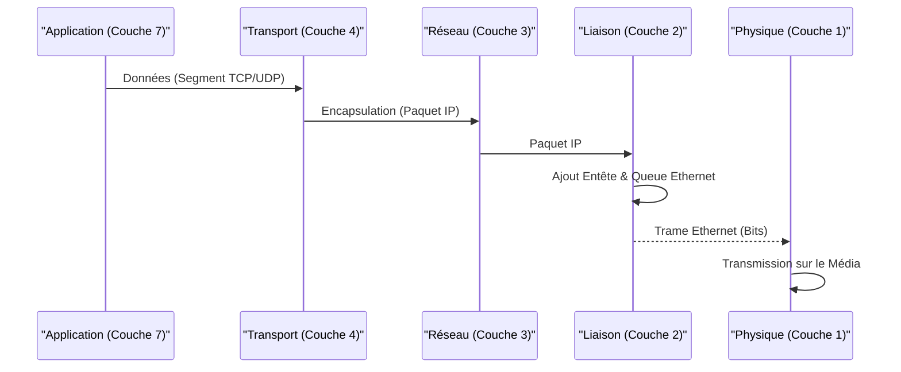

---
aliases:
  - Trame Ethernet
  - Ethernet Frame
  - IEEE 802.3 Frame
  - 802.3 Frame
archetype: concept-reseau
couche_osi:
  - "Couche 2 - Liaison"
technologie:
  - Ethernet
cssclasses:
  - max
tags:
  - protocole/ethernet
  - reseau/trame
  - modele-osi/couche-2
  - reseau/adressage/mac
  - mecanisme/encapsulation
  - reseau/vlan
  - reseau/lan
  - synchronisation/horloge
  - protocole/ethernet/preamble
  - protocole/ethernet/sfd
  - protocole/ip
  - protocole/arp
  - communication/controle-erreur
  - checksum
  - norme/ieee-802.3
---

# Ethernet Frame

> [!abstract] Définition
> Une **trame Ethernet** est l'unité de données de la **couche Liaison de Données (Couche 2 du modèle OSI)** qui transporte les paquets IP (et autres protocoles de la couche Réseau) sur un support physique Ethernet. Elle encapsule les données de la couche supérieure avec des informations d'adressage (adresses MAC) et de contrôle d'erreur nécessaires pour une transmission fiable sur le réseau local.

## ⚙️ Mécanisme & Fonctionnement
Le fonctionnement de la trame Ethernet est au cœur de la communication sur les réseaux locaux. Elle définit comment les données sont formatées et transmises sur le média partagé (câble, fibre optique). Le format IEEE 802.3 est la norme prédominante pour Ethernet.

La structure typique d'une trame Ethernet IEEE 802.3 est la suivante :

*   **Préambule (Preamble)** : 7 octets. Composé d'une séquence alternée de 0 et 1 (10101010) qui permet aux dispositifs récepteurs de synchroniser leurs horloges avec le signal entrant.
*   **Délimiteur de Début de Trame (Start Frame Delimiter - SFD)** : 1 octet. La séquence binaire 10101011 qui indique le début de la trame réelle, signalant que les octets suivants constituent l'adresse MAC de destination.
*   **Adresse MAC de Destination (Destination MAC Address - DA)** : 6 octets. L'adresse physique du dispositif destinataire. Elle peut être une adresse de monodiffusion (unicast), de multidiffusion (multicast) ou de diffusion (broadcast).
*   **Adresse MAC Source (Source MAC Address - SA)** : 6 octets. L'adresse physique du dispositif émetteur.
*   **Champ Longueur/Type (Length/Type Field)** : 2 octets.
    *   Dans le format **Ethernet II** (aussi appelé Ethernet Type ou DIX Ethernet), ce champ indique le **type de protocole** encapsulé dans la trame (ex: 0x0800 pour IPv4, 0x0806 pour ARP, 0x86DD pour IPv6).
    *   Dans le format **IEEE 802.3 original**, ce champ indique la **longueur** du champ de données (payload).
    *   Pour distinguer les deux, si la valeur est supérieure ou égale à 1536 (0x0600 en hexadécimal), elle est interprétée comme un type de protocole. Sinon, elle est interprétée comme une longueur.
*   **Données (Data / Payload)** : Variable, de 46 à 1500 octets. Contient les données de la couche supérieure (généralement un paquet IP). La taille minimale de 46 octets est requise pour assurer une détection de collision fiable sur les anciens réseaux Ethernet partagés. Si le paquet de la couche supérieure est plus petit, des octets de remplissage (padding) sont ajoutés.
*   **Séquence de Contrôle de Trame (Frame Check Sequence - FCS)** : 4 octets. Contient une valeur de **Contrôle de Redondance Cyclique (CRC)** calculée sur les champs Adresse MAC de Destination, Adresse MAC Source, Longueur/Type et Données. Le dispositif récepteur recalcule le CRC et le compare au FCS reçu pour détecter toute altération de la trame pendant la transmission.

### Encapsulation / Traitement
*   **Entrée** : Un paquet de la couche Réseau (ex: un paquet IPv4 ou IPv6) est reçu par la couche Liaison de Données.
*   **Action** :
    1.  Le paquet est placé dans le champ "Données" de la trame Ethernet. Si sa taille est inférieure à 46 octets, des octets de remplissage sont ajoutés.
    2.  Les adresses MAC de destination et source sont ajoutées en fonction du prochain saut sur le réseau local.
    3.  Le champ "Longueur/Type" est renseigné avec le type de protocole (Ethernet II) ou la longueur des données (IEEE 802.3).
    4.  Un Préambule et un SFD sont ajoutés au début.
    5.  Le FCS est calculé et ajouté à la fin de la trame.
*   **Sortie** : La trame Ethernet complète est transmise bit par bit sur le support physique par la Couche 1 (Physique).

## 💡 Cas d'Usage Typique
Les trames Ethernet sont utilisées pour toutes les communications sur les réseaux locaux Ethernet.
1.  **Communication Locale (LAN)** : Elles permettent aux appareils connectés au même segment de réseau local (via un switch) de communiquer directement entre eux en utilisant leurs adresses MAC.
2.  **Accès Internet** : Lorsqu'un appareil envoie des données vers Internet, le paquet IP est encapsulé dans une trame Ethernet pour atteindre la passerelle par défaut (routeur) sur le réseau local. C'est ensuite le routeur qui désencapsule la trame Ethernet pour traiter le paquet IP et le retransmettre.
3.  **VLAN (Virtual Local Area Network)** : Les trames Ethernet sont modifiées (taguées) pour transporter des informations de VLAN, permettant la segmentation logique d'un réseau physique.

## ⚠️ Limitations & Problèmes
> [!warning] Points d'attention
> *   **Taille Maximale de la Trame (MTU)** : La taille maximale standard du champ de données est de 1500 octets (Maximum Transmission Unit - MTU). Les paquets IP plus grands que cette taille doivent être fragmentés, ce qui peut entraîner une surcharge de traitement et une latence accrue. Les **Jumbo Frames** permettent des MTU plus grandes (jusqu'à 9000 octets) mais nécessitent que tous les équipements sur le chemin les supportent.
> *   **Taille Minimale de la Trame** : La trame doit avoir une taille minimale de 64 octets (Préambule + SFD + Adresses MAC + Longueur/Type + Données min 46 + FCS). Si le payload est trop petit, du *padding* est ajouté. Ceci était crucial pour la détection de collision sur les anciens réseaux Ethernet partagés (half-duplex).
> *   **Diffusion (Broadcast Storms)** : L'utilisation excessive de trames de diffusion (broadcast) peut saturer le réseau local, réduisant les performances. Les routeurs et les VLAN sont utilisés pour limiter les domaines de diffusion.
> *   **Collision Domains (historique)** : Dans les versions antérieures d'Ethernet (hubs), les collisions étaient un problème. Les switches Ethernet modernes ont éliminé la plupart des domaines de collision, permettant une communication full-duplex.
> *   **Adresse MAC Modifiable** : L'adresse MAC, bien que physiquement attachée à une interface réseau, peut être usurpée (MAC spoofing), ce qui peut être une faille de sécurité.
---
