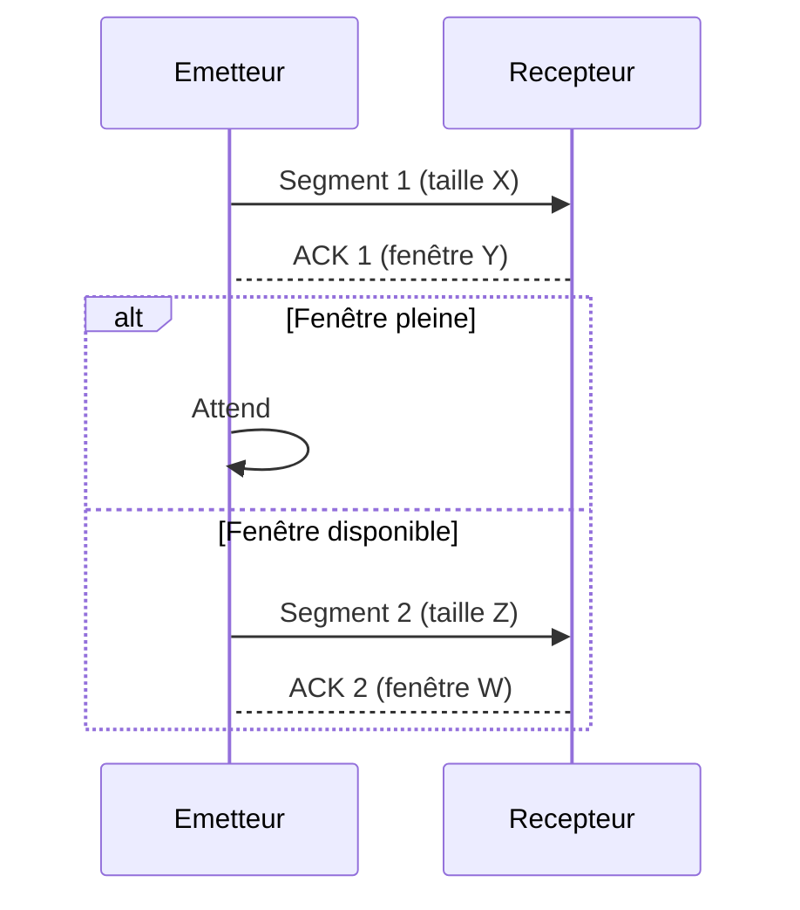

---
aliases:
  - Contrôle de Flux
  - Flow Control
  - Stop-and-Wait
  - Sliding Window
archetype: concept-reseau
couche_osi:
  - "Couche 2 - Liaison"
  - "Couche 4 - Transport"
technologie:
  - Stop-and-Wait
  - Sliding Window
cssclasses:
  - max
tags:
  - communication/controle-flux
  - protocole/tcp/controle-flux
  - modele-tcp-ip/couche-transport
  - protocole/fenetre-glissante
  - protocole/stop-and-wait
  - latence
  - debit
  - fiabilite
  - reseau/congestion
  - transmission-donnees
  - mecanisme
---

# Flow Control

> [!abstract] Définition
> Le **contrôle de flux** est un mécanisme de gestion des données qui régule la quantité de données qu'un émetteur peut envoyer avant de recevoir une confirmation d'un récepteur. Son rôle est de prévenir la saturation du récepteur, assurant ainsi une transmission de données fiable et efficace en adaptant le débit de l'émetteur à la capacité de traitement du récepteur.

## ⚙️ Mécanisme & Fonctionnement
Le contrôle de flux repose sur l'échange de messages entre l'émetteur et le récepteur pour synchroniser leur débit de transmission et de réception.

### Encapsulation / Traitement
*   **Entrée** : L'émetteur dispose de segments ou de trames de données à transmettre au récepteur.
*   **Action** :
    *   L'émetteur envoie des données et attend un accusé de réception (ACK) ou une indication de la capacité de réception du récepteur (fenêtre).
    *   Le récepteur traite les données reçues et renvoie des ACKs ou des mises à jour de fenêtre pour informer l'émetteur de sa disponibilité.
    *   L'émetteur ajuste son débit en fonction des informations de flux reçues.
*   **Sortie** : Les données sont transmises de manière ordonnée et sans perte due à la surcharge du récepteur, avec un débit optimisé.

### Mécanismes et Implémentations

#### **Stop-and-Wait**
Ce mécanisme est le plus simple. L'émetteur envoie une trame ou un segment et attend un accusé de réception (ACK) avant d'envoyer la trame ou le segment suivant.
*   **Avantages** : Très simple à implémenter, garantit l'ordre et l'intégrité des données.
*   **Inconvénients** : Peu efficace en termes d'utilisation de la bande passante, car l'émetteur passe beaucoup de temps à attendre les ACKs, surtout sur des liaisons à latence élevée.

#### **Sliding Window (Fenêtre Glissante)**
La fenêtre glissante permet à l'émetteur d'envoyer plusieurs trames ou segments consécutivement sans attendre un ACK pour chacun, tant que le nombre de données non acquittées ne dépasse pas une taille de fenêtre prédéfinie ou annoncée par le récepteur.
*   **Fenêtre d'émission** : Définit le nombre maximal de trames/segments que l'émetteur peut envoyer avant de recevoir un ACK.
*   **Fenêtre de réception** : Définit le nombre de trames/segments que le récepteur est prêt à accepter.
*   **Avantages** : Augmente significativement l'efficacité de l'utilisation de la bande passante et le débit par rapport à Stop-and-Wait.
*   **Inconvénients** : Plus complexe à implémenter, nécessite une gestion des tampons de part et d'autre. Utilisé notamment par TCP au niveau de la couche transport.

## 💡 Cas d'Usage Typique
Pourquoi l'utilise-t-on ?
1.  **Prévention de la Surcharge du Récepteur** : Le contrôle de flux empêche un émetteur rapide de submerger un récepteur plus lent ou dont les ressources (tampons) sont limitées, évitant ainsi la perte de paquets due à un débordement.
2.  **Fiabilité de la Transmission** : En garantissant que le récepteur peut effectivement traiter les données, le contrôle de flux contribue à la livraison fiable des informations, complétant les mécanismes de retransmission en cas de perte.
3.  **Optimisation des Ressources** : Il permet une utilisation plus efficace des ressources réseau en adaptant dynamiquement le débit de l'émetteur à la capacité du récepteur, réduisant les retransmissions inutiles et la congestion.

## ⚠️ Limitations & Problèmes
> [!warning] Points d'attention
> *   **Performance** : Les mécanismes de contrôle de flux, notamment Stop-and-Wait, peuvent introduire de la latence et réduire le débit effectif en raison des temps d'attente pour les ACKs. Des fenêtres trop petites peuvent brider les performances sur des liaisons à haut débit et forte latence.
> *   **Complexité d'Implémentation** : Les mécanismes avancés comme la fenêtre glissante nécessitent une gestion sophistiquée des numéros de séquence, des tampons et des accusés de réception, ce qui augmente la complexité du protocole.
> *   **Deadlock (Interblocage)** : Dans des scénarios rares et mal gérés (par exemple, si un ACK est perdu et que l'émetteur attend indéfiniment), un interblocage peut survenir, bien que des mécanismes de timeout soient généralement mis en place pour l'éviter.
> *   **Inefficacité sur certaines liaisons** : Sur des liaisons caractérisées par des pertes élevées et une latence importante, un contrôle de flux mal adapté peut entraîner une sous-utilisation de la bande passante disponible.