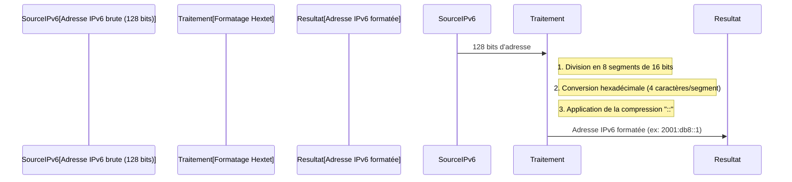

---
aliases:
  - Hextets
  - Hexadecimal Segment (IPv6)
  - Segment Hexadécimal (IPv6)
archetype: concept-reseau
couche_osi:
  - "Couche 3 - Réseau"
technologie:
  - IPv6
cssclasses:
  - max
tags:
  - protocole/ip/ipv6
  - protocole/ipv6/adressage
  - hextet
  - protocole/ip/ipv6/compression-zeros
  - encoding/hexadecimal
---

# Hextet

> [!abstract] Définition
> Un *hextet* est un terme informel désignant un **segment de 16 bits** (deux octets) d'une adresse *IPv6*, représenté en notation *hexadécimale*. Il s'agit d'une des huit sections qui composent une adresse IPv6 complète, séparées par des deux-points.

## ⚙️ Mécanisme & Fonctionnement
Les adresses *IPv6* sont composées de 128 bits. Pour faciliter leur lecture et leur écriture, elles sont divisées en huit blocs de 16 bits chacun. Chaque bloc de 16 bits est converti en quatre chiffres hexadécimaux, formant ainsi un hextet. Ces hextets sont ensuite séparés par des deux-points.

### Encapsulation / Traitement
*   **Entrée** : Une adresse *IPv6* complète, typiquement en format binaire ou décimal conceptuel.
*   **Action** :
    1.  **Division** : L'adresse de 128 bits est segmentée en huit groupes de 16 bits.
    2.  **Conversion Hexadécimale** : Chaque groupe de 16 bits est converti en sa représentation hexadécimale, résultant en un hextet de quatre caractères hexadécimaux.
    3.  **Compression des Zéros** : Pour améliorer la lisibilité, les hextets composés uniquement de zéros (par exemple, `0000`) peuvent être omis. Une séquence consécutive de plusieurs hextets de zéros peut être compressée en utilisant la notation `::` (double deux-points). Cette compression ne peut être utilisée qu'une seule fois par adresse pour éviter toute ambiguïté.
*   **Sortie** : Une adresse *IPv6* formatée avec des hextets, potentiellement compressée, comme `2001:0db8:85a3:0000:0000:8a2e:0370:7334` ou sa forme compressée `2001:0db8:85a3::8a2e:0370:7334`.

## 💡 Cas d'Usage Typique
1.  **Représentation Standard d'IPv6** : Les hextets sont la méthode standardisée de représentation des adresses *IPv6* sous une forme lisible par l'homme, facilitant la configuration et le dépannage réseau.
2.  **Configuration de Périphériques Réseau** : Lors de la configuration de routeurs, de commutateurs ou d'hôtes avec des adresses *IPv6*, la notation par hextets est universellement utilisée.
3.  **Documentation et Communication** : La compréhension des hextets est fondamentale pour la documentation des topologies *IPv6* et la communication technique entre ingénieurs réseau.

## ⚠️ Limitations & Problèmes
> [!warning] Points d'attention
> *   **Ambiguïté de la Compression** : La règle de n'utiliser la compression `::` qu'une seule fois est cruciale. Une utilisation multiple entraînerait une impossibilité de déterminer la longueur des séquences de zéros compressées, rendant l'adresse ambigüe.
> *   **Courbe d'Apprentissage** : Pour les professionnels habitués à la notation décimale pointée d'*IPv4*, l'adaptation à la notation hexadécimale des hextets peut nécessiter une période d'apprentissage.