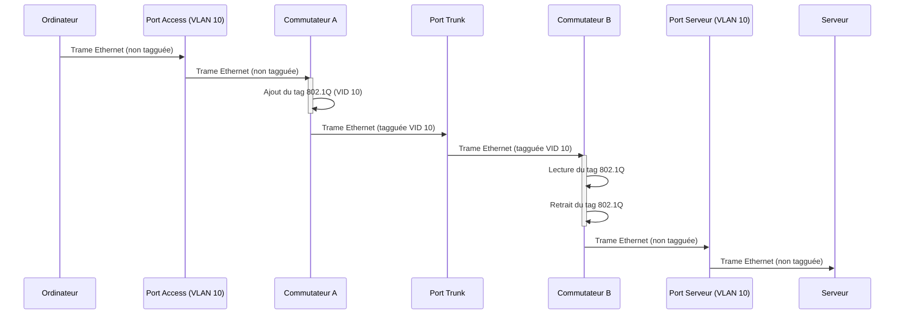

---
aliases:
  - "IEEE 802.1Q"
  - "802.1Q"
  - "VLAN Tagging"
  - "Virtual LAN Standard"
  - "Segmentation Réseau VLAN"
archetype: concept-reseau
couche_osi:
  - "Couche 2 - Liaison"
cssclasses:
  - max
technologie:
  - VLAN
  - Ethernet
tags:
  - norme/ieee-802-1q
  - protocole/ethernet
  - reseau/vlan
  - reseau/vlan/tagging
  - reseau/segmentation
  - securite/reseau
  - materiel/reseau/switch
  - mecanisme/encapsulation
  - qos
  - protocole/ieee-802-1q/tpid
  - protocole/ieee-802-1q/tci
  - protocole/ieee-802-1q/pcp
  - protocole/ieee-802-1q/dei
  - protocole/ieee-802-1q/vid
  - reseau/trunk-port
  - reseau/access-port
  - reseau/vlan/natif
  - reseau/trame
---

# IEEE 802.1Q

> [!abstract] Définition
> La norme IEEE 802.1Q est un protocole de réseau qui prend en charge les réseaux locaux virtuels (*Virtual Local Area Networks - VLANs*) sur un réseau Ethernet IEEE 802.3. Elle définit un système de **tagging VLAN** pour les trames Ethernet et les procédures associées utilisées par les ponts et commutateurs pour gérer ces trames. Le 802.1Q permet de segmenter logiquement un réseau physique en plusieurs réseaux logiques, améliorant ainsi la sécurité, les performances et la gestion.

## ⚙️ Mécanisme & Fonctionnement
Le standard 802.1Q introduit un mécanisme de "tagging" (étiquetage) interne qui insère un champ de 4 octets, appelé *VLAN Tag*, dans la trame Ethernet originale. Ce tag est inséré entre l'adresse MAC source et le champ EtherType/Length. Cette modification étend la taille maximale de la trame Ethernet de 1518 octets à 1522 octets.

Le *VLAN Tag* de 4 octets est composé de deux champs principaux :
*   **Tag Protocol Identifier (TPID)** : Un champ de 2 octets (16 bits) dont la valeur est fixée à `0x8100`. Cette valeur identifie la trame comme étant une trame taggée IEEE 802.1Q.
*   **Tag Control Information (TCI)** : Un champ de 2 octets (16 bits) qui contient trois sous-champs :
    *   **Priority Code Point (PCP)** : Un champ de 3 bits qui se réfère à la classe de service (CoS) IEEE 802.1p, permettant de prioriser le trafic (QoS).
    *   **Drop Eligible Indicator (DEI)** : Un champ de 1 bit qui indique si la trame peut être abandonnée en cas de congestion.
    *   **VLAN Identifier (VID)** : Un champ de 12 bits qui contient l'identifiant unique du VLAN auquel la trame appartient. Ce champ permet de supporter jusqu'à 4094 VLANs uniques (les IDs 0 et 4095 étant réservés).

Lorsqu'une trame traverse un lien *trunk* (lien inter-commutateurs) configuré en 802.1Q, le tag VLAN est ajouté à la trame pour identifier son appartenance au VLAN. À la réception sur un autre commutateur ou périphérique compatible 802.1Q, le tag est lu pour acheminer la trame vers les ports membres du VLAN correspondant. Pour les ports *access* (liés aux périphériques finaux), le tag est généralement retiré avant que la trame n'atteigne le périphérique, ou ajouté lors de l'envoi depuis le périphérique vers le réseau, de sorte que le périphérique final n'a pas besoin d'être "VLAN-aware". Les trames appartenant au **VLAN natif** sont transmises sans tag sur le lien trunk.

### Encapsulation / Traitement
*   **Entrée (Périphérique final vers Commutateur)** : Une trame Ethernet *non taggée* arrive sur un port *access* configuré pour un VLAN spécifique (par exemple, VLAN 10).
*   **Action (Commutateur)** : Le commutateur insère le tag 802.1Q (TPID `0x8100` et VID 10) dans la trame Ethernet. Le FCS (Frame Check Sequence) est recalculé car la trame est modifiée.
*   **Sortie (Commutateur vers Lien Trunk)** : La trame **taggée** est envoyée sur le lien *trunk* vers un autre commutateur.
*   **Entrée (Lien Trunk vers Commutateur destinataire)** : Une trame **taggée** est reçue par un commutateur sur un port *trunk*. Le commutateur lit le VID pour identifier le VLAN.
*   **Action (Commutateur destinataire)** : Si la trame est destinée à un périphérique sur un port *access* configuré pour le même VLAN, le commutateur retire le tag 802.1Q.
*   **Sortie (Commutateur destinataire vers Périphérique final)** : La trame *non taggée* est livrée au périphérique final.

## 💡 Cas d'Usage Typique
Le 802.1Q est fondamental pour l'implémentation des VLANs, offrant plusieurs avantages pratiques dans les architectures réseau modernes :
1.  **Segmentation Réseau** : Il permet de diviser un réseau physique unique en plusieurs réseaux logiques isolés. Cela est crucial pour les entreprises qui souhaitent séparer différents départements (Finance, RH, IT) ou types de trafic (Voix, Données, Invité) sur la même infrastructure physique, améliorant ainsi la sécurité et la performance.
2.  **Sécurité Améliorée** : L'isolation du trafic entre les VLANs empêche la communication non autorisée entre les segments, réduisant les risques de menaces internes et externes. Les systèmes critiques peuvent être placés sur des VLANs séparés pour limiter l'accès.
3.  **Optimisation des Performances Réseau** : En limitant la portée des domaines de diffusion (*broadcast domains*), les VLANs réduisent le trafic de diffusion inutile, ce qui diminue la congestion du réseau et améliore l'efficacité globale.
4.  **Gestion Simplifiée et Scalabilité** : Les VLANs permettent de regrouper logiquement des périphériques indépendamment de leur emplacement physique, facilitant ainsi la gestion des politiques réseau (QoS, contrôle d'accès) et la flexibilité pour ajouter, déplacer ou modifier des segments sans recâblage physique. Cela réduit les coûts d'infrastructure en maximisant l'utilisation du matériel existant.
5.  **Priorisation du Trafic (QoS)** : Le champ PCP du tag 802.1Q permet de marquer et de prioriser certains types de trafic, comme la voix sur IP (VoIP) ou la vidéo, afin de garantir une qualité de service adéquate en réduisant la latence et la perte de paquets.

## ⚠️ Limitations & Problèmes
> [!warning] Points d'attention
> *   **Complexité de Configuration** : La gestion des VLANs et des configurations de *trunk* nécessite une expertise et une planification minutieuse. Des erreurs de configuration peuvent entraîner des problèmes de communication ou des vulnérabilités de sécurité.
> *   **Risques de Sécurité (VLAN Hopping)** : Bien que les VLANs améliorent la sécurité, des misconfigurations peuvent conduire à des attaques de *VLAN hopping*, où un attaquant obtient un accès non autorisé à d'autres VLANs. Les attaques de *double tagging* (double étiquetage) sont un exemple où un attaquant injecte des trames avec deux tags 802.1Q pour contourner les restrictions VLAN.
> *   **Dépendance à la Couche 3 pour la Communication Inter-VLAN** : Les périphériques de différents VLANs ne peuvent pas communiquer directement ; ils nécessitent un périphérique de Couche 3 (un routeur ou un commutateur de Couche 3) pour effectuer le routage inter-VLAN. Cela peut ajouter de la complexité et potentiellement augmenter les coûts matériels.
> *   **Impact sur la Performance (minimal)** : L'ajout du tag de 4 octets augmente légèrement la taille de la trame et peut avoir un impact marginal sur la bande passante et le CPU des anciens équipements. Cependant, dans les réseaux modernes, cet impact est généralement négligeable.
> *   **Problèmes de Dépannage** : Les misconfigurations de VLAN peuvent être difficiles à diagnostiquer en raison de la séparation logique du trafic, nécessitant une connaissance approfondie des paramètres VLAN, du tagging et du routage.