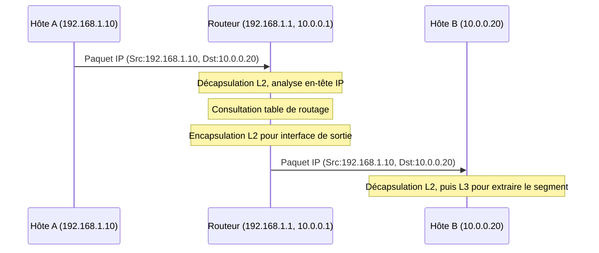

---
aliases:
  - "Internet Protocol version 4"
  - "IP version 4"
  - "Protocole Internet version 4"
archetype: concept-reseau
couche_osi:
  - "Couche 3 - Réseau"
cssclasses:
  - max
technologie:
  - "IPv4"
tags:
  - protocole/ip
  - protocole/ip/ipv4
  - reseau/adressage/ip
  - reseau/adressage/ip/classes
  - reseau/masque-de-sous-reseau
  - reseau/cidr
  - encapsulation
  - reseau/routage
  - fragmentation-paquets
  - nat
  - protocole/ip/epuisement-adresses
  - modele-osi/couche-3
  - protocole/internet
  - protocole/sans-connexion
---

# IPv4

> [!abstract] Définition
> **IPv4** (Internet Protocol version 4) est la quatrième révision du protocole Internet, un protocole sans connexion qui définit la manière dont les données sont transmises sur les réseaux. Son rôle principal est d'adresser et de router des paquets de données entre différents hôtes sur un réseau IP. Il est fondamental pour la communication sur Internet et la plupart des réseaux locaux modernes.

## ⚙️ Mécanisme & Fonctionnement
IPv4 fonctionne en acheminant des *paquets* de données à travers un réseau en utilisant des adresses IP uniques pour chaque périphérique.

### Format d'Adresse IPv4
Une adresse IPv4 est une valeur numérique de 32 bits, généralement représentée sous forme décimale pointée (dotted-decimal notation). Cette notation divise les 32 bits en quatre octets (groupes de 8 bits), séparés par des points. Chaque octet peut prendre une valeur de 0 à 255.
*   **Exemple** : `192.168.1.1`

### Classes d'Adresses (Historique)
Historiquement, les adresses IPv4 étaient divisées en classes (A, B, C, D, E) pour structurer les réseaux.
*   **Classe A** : Pour de très grands réseaux, premier octet de 1 à 126.
*   **Classe B** : Pour des réseaux de taille moyenne à grande, premier octet de 128 à 191.
*   **Classe C** : Pour de petits réseaux, premier octet de 192 à 223.
*   **Classe D** : Réservée au *multicast*.
*   **Classe E** : Réservée à la recherche.

### Masque de Sous-réseau
Le *masque de sous-réseau* est une valeur de 32 bits qui permet de séparer la partie *réseau* de l'adresse IP de la partie *hôte*. Il est utilisé par les routeurs pour déterminer si un paquet est destiné à un hôte sur le même réseau local ou s'il doit être routé vers un autre réseau.
*   **Exemple** : Adresse IP `192.168.1.10`, Masque de sous-réseau `255.255.255.0`. La partie réseau est `192.168.1`, la partie hôte est `10`.

### CIDR (Classless Inter-Domain Routing)
Le *CIDR* a été introduit pour remplacer le système de classes d'adresses, qui s'est avéré inefficace et gaspillait des adresses. Le CIDR permet une allocation plus flexible des blocs d'adresses IP en utilisant une notation de préfixe (`/`) suivie du nombre de bits de la partie réseau.
*   **Exemple** : `192.168.1.0/24` indique que les 24 premiers bits de l'adresse définissent le réseau.

### Encapsulation / Traitement
*   **Entrée** : Un segment de données provenant de la couche de transport (Couche 4), avec les adresses IP source et destination.
*   **Action** : La couche Réseau (Couche 3) encapsule le segment dans un paquet IPv4 en ajoutant un en-tête IP contenant les adresses IP source et destination, la version du protocole, la durée de vie (TTL), etc. Le routeur examine l'adresse IP de destination et utilise sa table de routage pour déterminer l'interface de sortie et l'adresse IP du prochain saut.
*   **Sortie** : Le paquet IPv4 est ensuite passé à la couche de liaison de données (Couche 2) pour encapsulation dans une trame.

## 💡 Cas d'Usage Typique
Pourquoi l'utilise-t-on ?
1.  **Routage Inter-réseaux** : IPv4 permet aux routeurs de diriger des paquets de données d'un réseau à un autre, rendant possible la communication à travers Internet. C'est la base de la connectivité globale.
2.  **Adressage Unique des Périphériques** : Chaque périphérique connecté à un réseau IP reçoit une adresse IPv4 unique, ce qui permet d'identifier précisément la source et la destination des communications.
3.  **Segmentation Réseau (Sous-réseautage)** : Le masque de sous-réseau et le CIDR permettent de diviser de grands réseaux en sous-réseaux plus petits et gérables, améliorant la sécurité, la performance et l'organisation du réseau.

## ⚠️ Limitations & Problèmes
> [!warning] Points d'attention
> *   **Épuisement des Adresses** : La limitation la plus critique d'IPv4 est l'épuisement de ses 4,3 milliards d'adresses uniques. Avec la prolifération des appareils connectés, la plupart des blocs d'adresses IPv4 publiques ont été alloués, rendant difficile l'expansion future de l'Internet.
> *   **Complexité du NAT** : Pour pallier l'épuisement des adresses, le *NAT* (Network Address Translation) est largement utilisé. Bien que fonctionnel, il ajoute de la complexité au réseau et peut poser des problèmes pour certaines applications nécessitant une connectivité de bout en bout.
> *   **Fragmentation des Paquets** : IPv4 prend en charge la fragmentation des paquets, ce qui peut entraîner une surcharge de traitement pour les routeurs et une diminution des performances.
> *   **Sécurité** : IPv4 n'intègre pas nativement de mécanismes de sécurité robustes comme l'authentification ou le chiffrement, nécessitant des protocoles supplémentaires (comme IPsec) pour assurer la sécurité des communications.

Ces limitations ont conduit au développement et à l'adoption progressive d'IPv6.