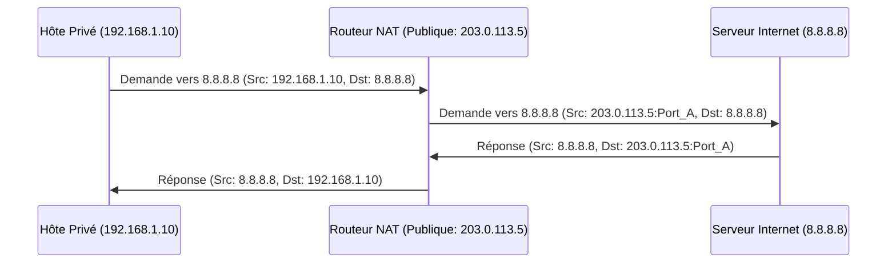

---
aliases:
  - "Épuisement IPv4"
  - "IPv4 Exhaustion"
  - "IPv4 Address Depletion"
  - "Pénurie IPv4"
archetype: concept-reseau
couche_osi:
  - "Couche 3 - Réseau"
technologie:
  - "IPv4"
  - "CIDR"
  - "NAT"
  - "IPv6"
cssclasses:
  - max
tags:
  - protocole/ip/epuisement-adresses
  - protocole/ip/ipv4
  - protocole/ip/ipv6
  - reseau/cidr
  - nat
  - nat/pat
  - protocole/ipv6/migration
  - protocole/ipv6/dual-stack
  - modele-osi/couche-3
  - modele-osi/couche-4
  - performance/reseau
  - latence
  - securite/reseau
  - connectivite
  - reseau/adressage/ip
---

# IPv4 Address Exhaustion

> [!abstract] Définition
> L'**épuisement des adresses IPv4** est la consommation totale des blocs d'adresses IP uniques disponibles dans l'espace d'adressage IPv4. Ce phénomène limite la capacité à attribuer de nouvelles adresses IP publiques, entravant la croissance directe d'Internet et la connectivité pour de nouveaux appareils ou réseaux.

## ⚙️ Mécanisme & Fonctionnement
L'épuisement des adresses IPv4 est le résultat de la conception initiale de l'Internet et de sa croissance exponentielle. Le protocole IPv4 utilise des adresses sur 32 bits, offrant un total théorique de 2^32 (environ 4,3 milliards) adresses uniques. La gestion historique des attributions, notamment les classes d'adresses (A, B, C) qui allouaient des blocs parfois surdimensionnés à de grandes entités, a conduit à un gaspillage significatif. L'explosion du nombre d'utilisateurs, d'appareils connectés (ordinateurs, smartphones, IoT) et de services en ligne a accéléré cette consommation.

Pour contrer cet épuisement, plusieurs mécanismes ont été mis en œuvre :

*   **CIDR (Classless Inter-Domain Routing)** : Permet une allocation plus granulaire des blocs d'adresses, optimisant l'utilisation de l'espace disponible et réduisant le gaspillage.
*   **NAT (Network Address Translation)** : Ce mécanisme permet à plusieurs hôtes sur un réseau privé d'utiliser une seule adresse IP publique pour communiquer avec l'Internet. Il s'agit d'une solution à court et moyen terme, car elle ne résout pas la pénurie mais la masque en partageant les adresses publiques.
*   **IPv6** : La solution à long terme, utilisant des adresses sur 128 bits, offrant un espace d'adressage pratiquement illimité (2^128 adresses). La transition vers IPv6 est en cours mais complexe en raison de l'incompatibilité directe avec IPv4.

### Encapsulation / Traitement
Le NAT est un exemple pertinent de traitement d'adresse qui intervient au niveau de la couche réseau (Couche 3) et potentiellement la couche transport (Couche 4) avec le NAPT (Network Address Port Translation).

*   **Entrée** : Une requête d'un hôte sur un réseau privé (par exemple, 192.168.1.10) vers une ressource Internet (par exemple, un serveur web public). Le paquet IP contient l'adresse IP source privée et le port source.
*   **Action** : Le routeur NAT intercepte le paquet. Il remplace l'adresse IP source privée par son adresse IP publique et, dans le cas du NAPT, modifie le port source pour maintenir une unicité des connexions. Le routeur tient une table de translation pour faire le suivi de ces mappings.
*   **Sortie** : Le paquet est envoyé sur Internet avec l'adresse IP publique du routeur comme source. À la réception de la réponse, le routeur NAT utilise sa table de translation pour rediriger le paquet vers l'hôte privé d'origine, décapsulant ainsi l'adresse publique pour remettre l'adresse privée.

## 💡 Cas d'Usage Typique
L'épuisement des adresses IPv4 a forcé l'adoption de solutions dans des cas d'usage courants en entreprise :
1.  **Extension de Réseaux Locaux** : Les entreprises utilisent le **NAT** pour permettre à un grand nombre de périphériques internes (postes de travail, imprimantes, serveurs internes) d'accéder à Internet en partageant un pool limité d'adresses IP publiques. Cela réduit la demande d'adresses publiques uniques pour chaque appareil.
2.  **Allocation Efficace aux FAI** : Les fournisseurs d'accès Internet (FAI) utilisent **CIDR** pour allouer des blocs d'adresses IP à leurs clients de manière plus flexible et plus efficace qu'avec l'ancien système de classes, maximisant ainsi la durée de vie de leurs réserves d'adresses IPv4.
3.  **Préparation à l'Avenir** : Les entreprises et FAI déploient progressivement **IPv6** en parallèle avec IPv4 (dual-stack) ou via des mécanismes de transition (comme des tunnels IPv6 sur IPv4) pour assurer une connectivité future sans les contraintes de l'espace d'adresses IPv4.

## ⚠️ Limitations & Problèmes
> [!warning] Points d'attention
> *   **Performance** : Le NAT introduit une surcharge de traitement sur les routeurs, car chaque paquet doit être inspecté et modifié. Cela peut entraîner une légère dégradation des performances et augmenter la latence.
> *   **Sécurité** : Le NAT brise la connectivité de bout en bout, ce qui complique certaines applications peer-to-peer ou l'établissement de connexions entrantes directes vers des hôtes privés. Il peut également rendre plus difficile le traçage des attaques. Cependant, le NAT offre aussi un certain niveau de sécurité implicite en masquant la topologie interne du réseau.
> *   **Complexité de la Transition** : La coexistence et la transition entre IPv4 et IPv6 sont complexes. Les mécanismes comme le dual-stack ou le tunneling nécessitent une gestion attentive et peuvent introduire leurs propres défis de performance et de sécurité.
> *   **Dépendance au NAT** : La forte dépendance au NAT, bien que temporairement utile, retarde l'adoption généralisée d'IPv6 et perpétue une architecture réseau qui n'est pas optimale pour la connectivité moderne.