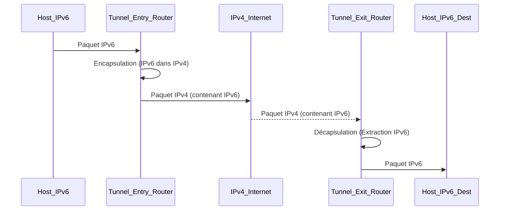

---
aliases:
  - Tunneling IPv6
  - IPv6 Tunneling
  - 6to4
  - ISATAP
  - Teredo
  - IPv6 Transition Mechanisms
archetype: concept-reseau
couche_osi:
  - "Couche 3 - Réseau"
technologie:
  - IPv6
  - IPv4
cssclasses:
  - max
tags:
  - protocole/ip/ipv6
  - protocole/ip/ipv4
  - protocole/ipv6/tunneling
  - protocole/ipv6/tunneling/6to4
  - protocole/ipv6/tunneling/isatap
  - protocole/ipv6/tunneling/teredo
  - encapsulation
  - decapsulation
  - nat
  - nat/traversal
  - performance
  - performance/reseau
  - securite
  - securite/reseau
  - fragmentation-paquets
  - latence
  - pare-feu
  - spoofing
---

# IPv6 Tunneling Techniques

> [!abstract] Définition
> Les **techniques de tunneling IPv6** permettent de transporter des paquets *IPv6* sur des infrastructures de réseau *IPv4* existantes. L'objectif principal est de faciliter la transition vers *IPv6* en permettant à des hôtes ou réseaux *IPv6* isolés de communiquer sur un réseau *IPv4* sans nécessiter une mise à niveau complète de l'infrastructure sous-jacente. Ces mécanismes sont cruciaux pendant la phase de coexistence entre les deux protocoles.

## ⚙️ Mécanisme & Fonctionnement
Le principe général du tunneling *IPv6* consiste à encapsuler un paquet *IPv6* entier dans la charge utile d'un paquet *IPv4*. Le paquet *IPv4* résultant est ensuite acheminé sur le réseau *IPv4* jusqu'à un point de décapsulation, où le paquet *IPv6* original est extrait et routé vers sa destination finale.

Plusieurs techniques de tunneling existent, chacune avec ses propres mécanismes et scénarios d'application :

*   **6to4** : Cette méthode utilise l'**adresse IPv4 publique** comme partie intégrante de l'adresse *IPv6*. Les préfixes *IPv6* 6to4 commencent par `2002::/16`, suivis de l'adresse *IPv4* du routeur de tunneling. Il permet à des réseaux ou hôtes *IPv6* isolés d'atteindre l'Internet *IPv6* via des routeurs 6to4 agissant comme des passerelles.
*   **ISATAP (Intra-Site Automatic Tunnel Addressing Protocol)** : Conçu pour les déploiements *IPv6* au sein d'un **réseau d'entreprise existant en *IPv4***. Les adresses *IPv6* ISATAP sont construites avec un préfixe *IPv6* de 64 bits et les 32 bits de l'adresse *IPv4* du routeur ou de l'hôte, généralement sous la forme `fe80::0:5efe:A.B.C.D` (pour les adresses locales de lien) ou `2001:DB8::0:5efe:A.B.C.D`. Il ne nécessite pas de configuration de tunnel point-à-point, mais repose sur un routeur ISATAP pour l'acheminement vers l'extérieur du site.
*   **Teredo** : Cette technique est destinée aux **hôtes *IPv6* derrière des équipements *NAT*** (*Network Address Translation*). Teredo encapsule les paquets *IPv6* dans des paquets *UDP* qui sont ensuite encapsulés dans des paquets *IPv4*, permettant ainsi de traverser les *NATs* en exploitant des ports *UDP*. Les adresses Teredo sont identifiables par le préfixe `2001:0000::/32`. Il implique des **clients Teredo**, des **serveurs Teredo** (pour la configuration initiale et la découverte) et des **relais Teredo** (pour acheminer le trafic entre Teredo et l'Internet *IPv6* natif).

### Encapsulation / Traitement
*   **Entrée** : Un *paquet IPv6* provenant d'un hôte ou d'un réseau *IPv6*.
*   **Action** : Le *paquet IPv6* est encapsulé comme charge utile dans un *paquet IPv4*. Un nouveau *header IPv4* est ajouté, spécifiant l'adresse *IPv4* du point d'entrée du tunnel et celle du point de sortie. Pour Teredo, une encapsulation *UDP* intermédiaire est également ajoutée.
*   **Sortie** : Un *paquet IPv4* transportant le *paquet IPv6* original, prêt à être acheminé sur le réseau *IPv4*.

## 💡 Cas d'Usage Typique
1.  **Connectivité entre réseaux IPv6 isolés** : Le tunneling 6to4 est souvent utilisé pour relier des **îlots *IPv6*** sur l'Internet *IPv4*, permettant à des réseaux *IPv6* distants de communiquer sans infrastructure *IPv6* native sur le chemin.
2.  **Déploiement graduel d'IPv6 en entreprise** : ISATAP facilite l'introduction d'*IPv6* au sein d'un **intranet *IPv4*** existant. Il permet aux hôtes *IPv6* ou aux applications *IPv6* d'opérer sans perturber le réseau *IPv4* sous-jacent, en fournissant une connectivité entre eux et vers l'Internet *IPv6* via un routeur ISATAP.
3.  **Accès IPv6 pour hôtes derrière NAT** : Teredo est particulièrement utile pour les **utilisateurs domestiques ou mobiles** qui se trouvent derrière un routeur *NAT* et souhaitent accéder à des ressources *IPv6* sur l'Internet. Il contourne les limitations de *NAT* en encapsulant le trafic dans l'*UDP*, souvent permis par les *NATs*.

## ⚠️ Limitations & Problèmes
> [!warning] Points d'attention
> *   **Performance** : L'encapsulation et la décapsulation ajoutent une **charge de traitement** aux routeurs de tunneling et augmentent la **taille des paquets**, réduisant l'efficacité de la bande passante et pouvant introduire de la latence due à la fragmentation des paquets *IPv4*.
> *   **Sécurité** : Les tunnels *IPv6* sur *IPv4* peuvent **contourner les mécanismes de sécurité existants** sur le réseau *IPv4* (comme les firewalls qui ne sont pas configurés pour inspecter le trafic encapsulé), créant des points d'entrée ou de sortie non surveillés pour le trafic *IPv6*. Le spoofing d'adresses *IPv4* ou *IPv6* peut être exploité.
> *   **Complexité de gestion et de débogage** : Le déploiement et la maintenance de tunnels peuvent être **complexes**, surtout dans les grands environnements. Le diagnostic des problèmes peut être difficile en raison des multiples couches d'encapsulation.
> *   **Dépendance à l'IPv4** : Les techniques de tunneling sont des **solutions temporaires** qui dépendent entièrement de l'infrastructure *IPv4*. Elles ne résolvent pas le problème fondamental de l'épuisement des adresses *IPv4* et ne sont pas une solution à long terme pour la transition complète vers *IPv6*.
> *   **Problèmes de NAT pour 6to4** : 6to4 ne fonctionne généralement **pas correctement derrière des équipements *NAT***, car il s'attend à une adresse *IPv4* publique routable pour former l'adresse *IPv6*. Teredo a été spécifiquement conçu pour pallier cette limitation.
> *   **Scalabilité** : Les dépendances à des serveurs ou relais centralisés (comme pour Teredo) ou la nécessité de configuration manuelle (pour les tunnels configurés) peuvent poser des **problèmes de scalabilité** et de fiabilité si ces points uniques de défaillance ne sont pas gérés correctement.