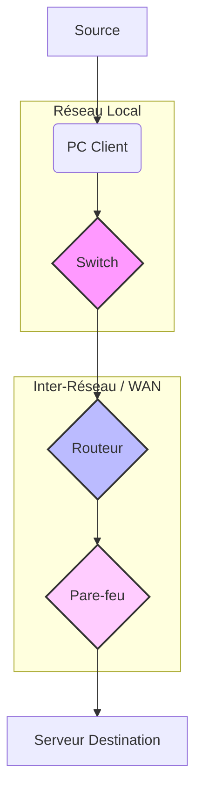

---
aliases:
  - Dispositifs Intermédiaires
  - Network Intermediary Devices
  - Intermediate Devices
archetype: concept-reseau
couche_osi:
  - "Couche 1 - Physique"
  - "Couche 2 - Liaison"
  - "Couche 3 - Réseau"
  - "Couche 4 - Transport"
  - "Couche 7 - Application"
technologie:
  - Ethernet
  - Wi-Fi
  - Routing
  - Switching
  - Firewalling
cssclasses:
  - max
tags:
  - materiel
  - materiel/reseau
  - reseau
  - device
  - materiel/reseau/switch
  - materiel/reseau/routeur
  - pare-feu
  - materiel/reseau/point-acces-sans-fil
  - reseau/commutation
  - reseau/routage
  - filtrage
  - nat
  - reseau/sans-fil
  - modele-osi
  - securite/reseau
  - performance
  - latence
  - vulnerabilite
  - gestion/complexite
  - economie/cout
  - attaque/vlan-hopping
  - attaque/arp-spoofing
---

# Intermediate Devices

> [!abstract] Définition
> Les **dispositifs intermédiaires** sont des composants matériels qui connectent les périphériques d'extrémité (ordinateurs, serveurs, téléphones IP, etc.) au sein d'un réseau et permettent le transport et le traitement des données entre eux. Leur rôle principal est d'assurer la connectivité, la gestion du trafic, la sécurité et l'expansion du réseau, facilitant la communication et le partage des ressources.

## ⚙️ Mécanisme & Fonctionnement
Les dispositifs intermédiaires reçoivent, régénèrent et retransmettent les signaux de données, tout en exécutant des fonctions spécifiques telles que le filtrage, le routage, la commutation ou la sécurité. Ils opèrent à différentes couches du modèle OSI, déterminant comment le trafic est géré.

### Types de Traitement & Fonctions
*   **Régénération/Amplification** : Les hubs et répéteurs nettoient et renforcent les signaux électriques ou optiques pour étendre la portée physique du réseau.
*   **Commutation (Switching)** : Les commutateurs reçoivent des trames de données, consultent leur table d'adresses MAC et transfèrent la trame uniquement vers le port de destination approprié, réduisant ainsi les collisions et l'encombrement du réseau local.
*   **Routage (Routing)** : Les routeurs examinent les adresses IP de destination des paquets, utilisent leurs tables de routage pour déterminer le meilleur chemin, et les transfèrent entre différents réseaux (LAN, WAN, Internet).
*   **Filtrage/Sécurité** : Les pare-feu inspectent le trafic réseau entrant et sortant selon des règles de sécurité prédéfinies pour bloquer les accès non autorisés ou les menaces. Les systèmes de prévention d'intrusion (IPS) peuvent également détecter et bloquer les activités malveillantes.
*   **Traduction d'adresses (NAT)** : Certains routeurs peuvent traduire les adresses IP privées en adresses IP publiques, permettant à plusieurs appareils d'un réseau local de partager une seule adresse IP publique pour accéder à Internet.
*   **Gestion sans fil** : Les points d'accès sans fil (WAP) permettent aux périphériques de se connecter au réseau via Wi-Fi, convertissant les signaux radio en signaux Ethernet et vice-versa.

## 💡 Cas d'Usage Typique
Les dispositifs intermédiaires sont fondamentaux pour toutes les infrastructures réseau modernes :
1.  **Extension de la connectivité LAN** : Les **commutateurs** (switches) connectent les postes de travail, les serveurs et les imprimantes au sein d'un même réseau local, permettant une communication rapide et efficace entre eux.
2.  **Interconnexion de réseaux disparates** : Les **routeurs** permettent la communication entre différents réseaux (par exemple, votre réseau domestique et Internet, ou différents départements d'une entreprise), acheminant les données vers leur destination finale à travers des chemins optimaux.
3.  **Sécurisation du périmètre réseau** : Les **pare-feu** protègent les réseaux internes contre les menaces externes en filtrant le trafic et en appliquant des politiques de sécurité strictes, essentiels pour toute entreprise ou organisation.
4.  **Accès sans fil** : Les **points d'accès Wi-Fi** fournissent une connectivité sans fil aux appareils mobiles, aux ordinateurs portables et à d'autres périphériques, offrant flexibilité et mobilité au sein du réseau.

## ⚠️ Limitations & Problèmes
> [!warning] Points d'attention
> *   **Performance** : Un dimensionnement incorrect ou une configuration défectueuse des dispositifs intermédiaires peut entraîner des goulots d'étranglement, une latence élevée ou des pertes de paquets, impactant la performance globale du réseau. Par exemple, un commutateur surchargé peut dégrader la vitesse de transmission des données.
> *   **Sécurité** : Si les dispositifs intermédiaires ne sont pas correctement configurés et mis à jour, ils peuvent devenir des points de vulnérabilité. Un routeur ou un commutateur mal sécurisé peut être exploité pour des attaques, comme le *VLAN hopping* ou le *ARP spoofing*, compromettant l'intégrité du réseau. Les pare-feu mal configurés peuvent laisser des portes ouvertes aux menaces.
> *   **Complexité de gestion** : Dans les grands réseaux, la gestion et la maintenance de nombreux dispositifs intermédiaires peuvent devenir complexes et nécessiter des compétences techniques avancées, ainsi que des outils de gestion de réseau dédiés.
> *   **Coût** : L'acquisition et la maintenance de dispositifs intermédiaires de haute performance (notamment les routeurs d'entreprise et les pare-feu de nouvelle génération) représentent un investissement significatif.