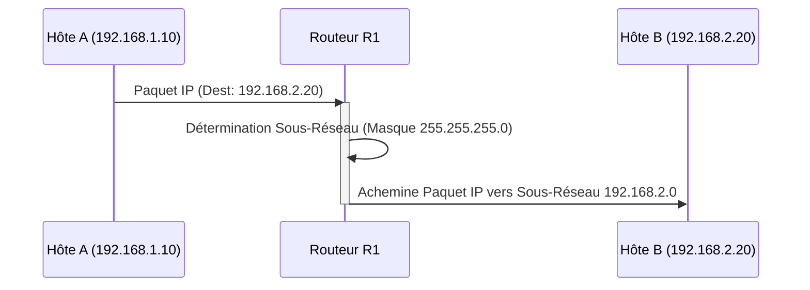

---
aliases:
  - Sous-Réseautage IP
  - Subnetting
  - IP Subnetting
  - VLSM
  - CIDR
archetype: concept-reseau
couche_osi:
  - "Couche 3 - Réseau"
technologie:
  - IP
  - IPv4
cssclasses:
  - max
tags:
  - reseau/sous-reseautage
  - reseau/masque-de-sous-reseau
  - reseau/adressage/ip/adresse-reseau
  - reseau/adressage/ip/adresse-broadcast
  - reseau/adressage/ip/classes
  - vlsm
  - cidr
  - reseau/segmentation
  - securite/reseau
  - gestion/reseau
  - reseau/trafic
  - reseau/performance
  - routage
  - routage/table
  - paquet
  - protocole/ip
  - reseau/domaine-de-diffusion
  - modele/tcp-ip
---

# IpSubnetting

> [!abstract] Définition
> Le **sous-réseautage IP** est le processus de division d'un grand réseau IP en plusieurs sous-réseaux plus petits et interconnectés, appelés *sous-réseaux*. Cette technique permet une gestion plus efficace de l'espace d'adresses IP, améliore la sécurité et optimise le trafic réseau en réduisant la taille des domaines de diffusion.

## ⚙️ Mécanisme & Fonctionnement
Le sous-réseautage fonctionne en utilisant une partie des bits de la portion *hôte* d'une adresse IP pour créer une nouvelle portion *réseau* (sous-réseau). Ceci est réalisé grâce à un **masque de sous-réseau** étendu, qui indique au routeur quelle partie de l'adresse IP correspond au sous-réseau et quelle partie correspond à l'hôte.

### Encapsulation / Traitement
*   **Entrée** : Un paquet IP arrive sur une interface de routeur, destiné à une adresse IP spécifique.
*   **Action** : Le routeur applique son masque de sous-réseau configuré à l'adresse IP de destination du paquet. Il effectue une opération logique ET (AND) bit à bit avec le masque de sous-réseau pour déterminer l'adresse du sous-réseau de destination. Il compare ensuite cette adresse de sous-réseau avec les entrées de sa table de routage pour identifier l'interface de sortie appropriée pour atteindre le sous-réseau cible.
*   **Sortie** : Le paquet IP est transmis via l'interface correcte vers le sous-réseau de destination ou vers le prochain routeur sur le chemin.

### Principes de calcul
Pour chaque sous-réseau, plusieurs éléments sont critiques :
*   **Masque de sous-réseau** : Une valeur binaire qui sépare l'adresse réseau de l'adresse hôte. Il est représenté en notation décimale pointée (ex: 255.255.255.0) ou en notation CIDR (ex: /24).
*   **Adresse réseau** : La première adresse du sous-réseau, où tous les bits de la partie hôte sont à zéro. Elle identifie de manière unique le sous-réseau.
*   **Adresse de broadcast** : La dernière adresse du sous-réseau, où tous les bits de la partie hôte sont à un. Un paquet envoyé à cette adresse est reçu par tous les hôtes du sous-réseau.
*   **Nombre d'hôtes** : Le nombre d'adresses IP utilisables pour les hôtes dans un sous-réseau. Il est calculé par `2^n - 2`, où `n` est le nombre de bits disponibles pour la partie hôte (les 2 adresses soustraites étant l'adresse réseau et l'adresse de broadcast).

### Classes d'adresses IP (Rappel rapide)
Historiquement, les adresses IP étaient divisées en classes (A, B, C) avec des masques de sous-réseau fixes.
*   **Classe A** : Pour les très grands réseaux (premier octet de 1 à 126, masque par défaut /8).
*   **Classe B** : Pour les réseaux de taille moyenne (premier octet de 128 à 191, masque par défaut /16).
*   **Classe C** : Pour les petits réseaux (premier octet de 192 à 223, masque par défaut /24).
Cependant, ce système entraînait un gaspillage d'adresses.

### VLSM (Variable Length Subnet Masking) et CIDR (Classless Inter-Domain Routing)
Pour surmonter les limitations des classes d'adresses, **VLSM** et **CIDR** ont été introduits :
*   **VLSM** permet d'utiliser des masques de sous-réseau de différentes longueurs au sein du même réseau principal, ce qui optimise considérablement l'utilisation des adresses IP en allouant des sous-réseaux de tailles diverses selon les besoins réels.
*   **CIDR** a aboli le concept de classes d'adresses, permettant d'agréger des plages d'adresses IP et d'utiliser des masques de sous-réseau de longueur arbitraire, désignés par une notation `/n` (où `n` est le nombre de bits du masque).

## 💡 Cas d'Usage Typique
Le sous-réseautage IP est fondamental dans la conception de réseaux d'entreprise pour plusieurs raisons :
1.  **Optimisation de l'espace d'adresses** : En divisant un grand réseau en petits sous-réseaux, on minimise le gaspillage d'adresses IP, notamment avec VLSM, où chaque sous-réseau reçoit juste le nombre d'adresses dont il a besoin.
2.  **Amélioration de la sécurité** : L'isolement logique des sous-réseaux permet de contenir les problèmes de sécurité (attaques, infections) à des segments spécifiques du réseau. Des règles de pare-feu peuvent être appliquées entre les sous-réseaux pour contrôler finement le trafic.
3.  **Gestion du trafic et des performances** : Chaque sous-réseau agit comme un domaine de diffusion indépendant. Réduire la taille des domaines de diffusion diminue le trafic de broadcast, améliorant ainsi les performances globales du réseau et la bande passante disponible pour le trafic utile.
4.  **Organisation et gestion du réseau** : Il facilite la structuration logique du réseau en regroupant les hôtes par département, fonction ou emplacement géographique. Cela simplifie l'administration et le dépannage.

## ⚠️ Limitations & Problèmes
> [!warning] Points d'attention
> *   **Complexité de la conception** : Une mauvaise planification du sous-réseautage peut entraîner des problèmes d'évolutivité, de routage ou de gaspillage d'adresses. Une compréhension approfondie des calculs est essentielle.
> *   **Administration** : La gestion de nombreux sous-réseaux peut devenir complexe, nécessitant une documentation rigoureuse et des outils de gestion IP (IPAM) pour suivre les allocations.
> *   **Fragmentation de l'espace d'adresses** : Une utilisation excessive ou mal planifiée du VLSM peut conduire à une fragmentation de l'espace d'adresses, rendant difficile l'allocation de blocs contigus plus grands à l'avenir.
> *   **Maintenance** : Toute modification majeure de la topologie réseau ou de l'expansion nécessite souvent une réévaluation et potentiellement une refonte du plan de sous-réseautage.