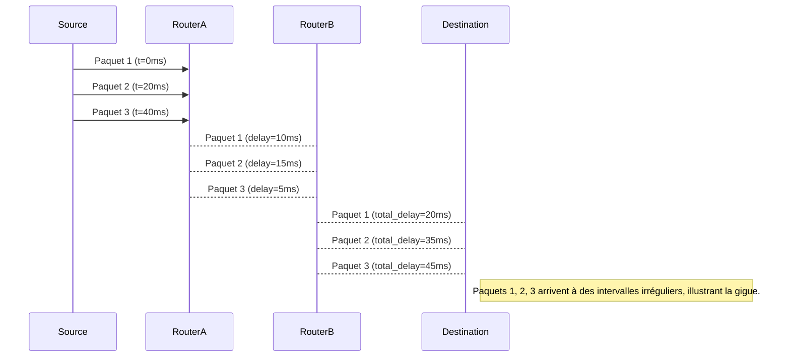

---
aliases:
  - Gigue
  - Network Jitter
  - Packet Delay Variation
  - Variation du délai de paquets
archetype: concept-reseau
couche_osi:
  - "Couche 3 - Réseau"
  - "Couche 4 - Transport"
  - "Couche 7 - Application"
technologie:
  - QoS
  - Buffering
  - Adaptive Clocks
cssclasses:
  - max
tags:
  - jitter
  - reseau/performance
  - latence
  - qos
  - application/voip
  - application/streaming-multimedia
  - application/jeux-en-ligne
  - reseau/congestion
  - jitter-buffer
  - reseau/paquet
---

# Jitter

> [!abstract] Définition
> Le **Jitter**, ou *gigue* en français, est la variation du délai d'arrivée des paquets de données au sein d'un flux, entraînant une irrégularité dans leur réception. Contrairement à un délai constant, le jitter représente la fluctuation de ce délai, ce qui peut perturber la fluidité des applications en temps réel.

## ⚙️ Mécanisme & Fonctionnement
Le jitter se manifeste lorsque des paquets de données, envoyés à intervalles réguliers, arrivent à destination avec des retards variables. Ces variations de délai sont dues à des facteurs tels que la congestion du réseau, les changements de chemin de routage, les mises en file d'attente (queues) de différentes longueurs et la charge de traitement des équipements intermédiaires.

### Encapsulation / Traitement
*   **Entrée** : Un flux de paquets émis avec un intervalle de temps constant entre chaque paquet.
*   **Action** : Durant leur transit à travers le réseau, les paquets sont traités et mis en file d'attente par divers équipements (routeurs, commutateurs). La variabilité de la charge sur ces équipements et des chemins empruntés peut entraîner des retards inégaux pour les paquets, modifiant ainsi leur espacement temporel relatif.
*   **Sortie** : Les paquets arrivent à destination avec des intervalles irréguliers, certains arrivant plus tôt que prévu, d'autres plus tard. Le destinataire doit alors compenser ces variations pour reconstituer le flux original.

## 💡 Cas d'Usage Typique
Le jitter est particulièrement critique pour les applications sensibles à la latence et nécessitant une diffusion continue et en temps réel des données :
1.  **Voix sur IP (VoIP) et visioconférence** : Un jitter élevé peut provoquer des coupures de son, des retards inégaux, des phrases hachées et une dégradation significative de la qualité de la conversation ou de l'image. Les paquets arrivant trop tard sont souvent considérés comme perdus.
2.  **Streaming multimédia** : Pour la vidéo et l'audio en continu, le jitter entraîne des saccades, des gels d'image ou des interruptions du son, affectant l'expérience utilisateur.
3.  **Jeux en ligne** : La variabilité du ping causée par le jitter peut rendre les jeux réactifs injouables, entraînant un désavantage compétitif ou une frustration.
4.  **Applications industrielles et de contrôle en temps réel** : Dans certains environnements où des capteurs et actionneurs doivent communiquer de manière synchronisée, le jitter peut compromettre la fiabilité et la sécurité des opérations.

## ⚠️ Limitations & Problèmes
> [!warning] Points d'attention
> -   **Performance** : Un jitter excessif dégrade sévèrement la qualité des services en temps réel, entraînant une mauvaise expérience utilisateur. Il peut rendre les applications VoIP et vidéo inutilisables. La ressource principale impactée est le temps et la capacité des équipements terminaux à gérer les variations de délai.
> -   **Gestion du Jitter (Atténuation et solutions)** :
> 	- **Mise en place de buffers de jitter (Jitter Buffers)** : Les équipements récepteurs (téléphones IP, lecteurs multimédia) utilisent des mémoires tampons pour stocker temporairement les paquets entrants. Cela permet de lisser les variations de délai en retenant les paquets qui arrivent tôt afin de les rejouer au bon moment. Un buffer trop petit ne compensera pas le jitter, tandis qu'un buffer trop grand augmentera la latence globale.
> 	- **Qualité de Service (QoS)** : L'implémentation de politiques QoS sur le réseau permet de prioriser le trafic sensible au jitter (comme la VoIP) par rapport à d'autres types de trafic moins critiques. Des mécanismes comme la mise en file d'attente à faible latence (LLQ - Low Latency Queuing) ou la mise en forme du trafic (traffic shaping) peuvent réduire la gigue en garantissant que les paquets prioritaires soient traités rapidement.
> 	- **Augmentation de la bande passante** : Une bande passante insuffisante est une cause fréquente de congestion, qui elle-même génère du jitter. Augmenter la capacité du réseau peut réduire la probabilité de congestion et, par conséquent, le jitter.
> 	- **Mise à niveau des équipements réseau** : Des routeurs et commutateurs plus performants, avec des capacités de traitement et de mise en file d'attente plus efficaces, peuvent aider à minimiser les retards variables.
> 	- **Synchronisation des horloges** : Pour certaines applications, la synchronisation précise des horloges entre les périphériques réseau peut contribuer à réduire le jitter, notamment via des protocoles comme NTP (Network Time Protocol) ou PTP (Precision Time Protocol).

