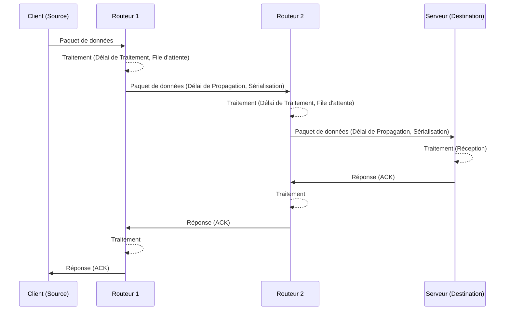

---
aliases:
  - Latence
  - Lag
  - Network Latency
  - Délai de transmission
  - Transmission Delay
  - Round Trip Time
  - RTT
archetype: concept-reseau
couche_osi:
  - "Couche 1 - Physique"
  - "Couche 2 - Liaison"
  - "Couche 3 - Réseau"
  - "Couche 4 - Transport"
technologie:
  - Réseaux IP
  - TCP/IP
cssclasses:
  - max
tags:
  - latence
  - reseau
  - reseau/performance
  - concept/definition
  - modele-osi
  - modele/tcp-ip
  - protocole/tcp
  - protocole/udp
  - mecanisme/encapsulation
  - communication/reseau
  - reseau/congestion
  - materiel/routeur
  - materiel/switch
  - internet
  - latence/propagation
  - latence/traitement
  - latence/file-attente
  - latence/serialisation
  - reseau/rtt
  - reseau/temps-de-reponse
  - application/voip
  - application/jeux-en-ligne
---

# Latency

> [!abstract] Définition
> La **latence réseau** (ou simplement *latence*) représente le délai de temps pendant la transmission de données sur un réseau. Elle est le temps nécessaire à un paquet de données pour voyager de la source à la destination, mesuré généralement en millisecondes (ms). Une latence élevée signifie un temps de réponse lent, tandis qu'une faible latence indique des temps de réponse rapides.

## ⚙️ Mécanisme & Fonctionnement
La latence est la somme des retards cumulés à différentes étapes du parcours d'un paquet de données à travers le réseau. Plusieurs facteurs contribuent à cette somme :

*   **Latence de Propagation** : C'est le temps nécessaire au signal pour traverser physiquement le support de transmission (câble à fibres optiques, cuivre, ondes radio). Elle est directement influencée par la distance géographique entre la source et la destination et la vitesse de la lumière dans le médium. Par exemple, la lumière voyage à environ 4,9 microsecondes par kilomètre dans un câble à fibre optique.
*   **Latence de Traitement (Processing Latency)** : Le temps que les équipements réseau (routeurs, commutateurs, pare-feu, serveurs) mettent à traiter, inspecter et acheminer les paquets de données. Chaque "saut" (hop) via un périphérique réseau ajoute un léger délai de traitement.
*   **Latence de File d'attente (Queuing Latency)** : Le temps que les paquets de données passent à attendre dans les tampons (buffers) ou les files d'attente des périphériques réseau en raison de la congestion du réseau ou de la surcharge des équipements.
*   **Latence de Sérialisation (Serialization Latency)** : Le temps nécessaire pour convertir les données en un format binaire (bits) et les placer sur le support de transmission ("on the wire"). Ce délai dépend de la vitesse de la liaison et de la taille du paquet.

D'autres facteurs incluent la congestion du réseau, les limitations matérielles (équipements obsolètes ou surchargés), la surcharge des protocoles (le protocole TCP, par exemple, introduit plus de surcharge pour la correction d'erreurs et les retransmissions que l'UDP), et la performance des serveurs.

### Encapsulation / Traitement
L'**encapsulation** et la **décapsulation** sont des processus fondamentaux dans le modèle OSI et TCP/IP, et chacun d'eux contribue à la latence de traitement :

*   **Entrée** : Un bloc de données (Service Data Unit - SDU) arrive d'une couche supérieure. Par exemple, au niveau de la couche transport, des segments TCP ou des datagrammes UDP arrivent de la couche session.
*   **Action** :
    1.  **Encapsulation** (Sens descendant) : Chaque couche ajoute ses propres informations de contrôle (en-têtes et parfois pieds de page) au SDU pour créer une Unité de Données de Protocole (PDU). Par exemple, la couche Réseau ajoute l'en-tête IP (adresses IP source/destination, TTL) à un segment TCP pour former un paquet IP. Ce processus de "conditionnement" prend du temps.
    2.  **Décapsulation** (Sens ascendant) : À la réception, chaque couche supprime l'en-tête et le pied de page correspondant, puis transmet les données restantes à la couche supérieure. Ce retrait et l'inspection des informations de contrôle introduisent également un délai.
*   **Sortie** : Le PDU est transmis à la couche inférieure pour un traitement supplémentaire (encapsulation) ou le SDU est transmis à la couche supérieure (décapsulation).

Ces ajouts et retraits d'en-têtes, ainsi que les décisions de routage et de commutation basées sur ces informations, contribuent à la latence de traitement à chaque niveau du réseau. Des équipements optimisés sont nécessaires pour minimiser ces retards.

Le temps total de cet échange aller-retour est appelé **Round Trip Time (RTT)**, qui est une mesure courante de la latence.

## 💡 Cas d'Usage Typique
Une faible latence est cruciale pour garantir la performance et la réactivité de nombreuses applications et services :
1.  **Communication en temps réel** : Les applications de voix sur IP (VoIP), de visioconférence et de collaboration dépendent d'une faible latence pour des conversations fluides et sans décalage.
2.  **Jeux en ligne** : La latence (souvent appelée "lag" par les joueurs) impacte directement l'expérience utilisateur. Une latence élevée peut rendre un jeu injouable en raison de retards entre les actions du joueur et les réponses du serveur.
3.  **Transactions financières à haute fréquence** : Dans le trading algorithmique, chaque milliseconde compte. Une latence minimale est essentielle pour l'exécution rapide des ordres et l'avantage concurrentiel.
4.  **Services Cloud et Applications Distribuées** : Pour les applications basées sur le cloud et les environnements de travail à distance, une faible latence garantit un accès rapide aux données et aux applications, améliorant la productivité.
5.  **Analyse en temps réel et IoT** : Les systèmes collectant et traitant des données de capteurs en temps réel nécessitent une latence minimale pour une prise de décision rapide et efficace.

## ⚠️ Limitations & Problèmes
> [!warning] Points d'attention
> *   **Performance des applications** : Une latence élevée ralentit considérablement les temps de réponse des applications, entraînant une expérience utilisateur frustrante et une baisse de la productivité.
> *   **Débit réduit** : Bien que distincte de la bande passante, une latence élevée peut réduire le débit effectif des données transférées, car le temps d'attente entre les envois et les accusés de réception augmente.
> *   **Gigue (Jitter)** : La variation de la latence entre les paquets (gigue) est particulièrement problématique pour les applications en temps réel, entraînant des coupures audio ou vidéo et des performances incohérentes.
> *   **Fiabilité** : Des niveaux de latence très élevés peuvent entraîner des abandons de connexion et des échecs de système, en particulier pour les protocoles sensibles au temps.

## 🔗 Notes Connexes
*   **Protocole lié** : TCP (Transmission Control Protocol), UDP (User Datagram Protocol)
*   **Matériel** : Router, Switch, Firewall
*   **Concept Connexe** : Bandwidth, Throughput, Jitter