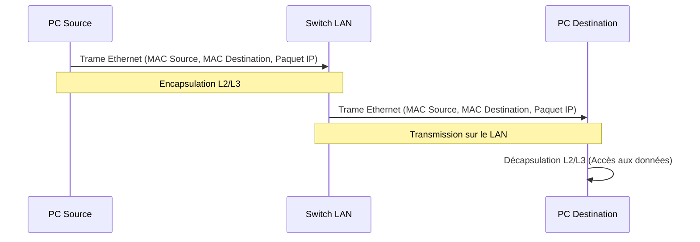

---
tags:
  - reseau/local
  - infrastructure/reseau
  - protocoles/ethernet
  - materiel/switch
  - materiel/routeur
  - securite/reseau
  - connectivite
  - modele/osi
aliases:
  - Réseau Local
  - Local Area Network
  - LAN
archetype: concept-reseau
couche_osi:
  - "Couche 1 - Physique"
  - "Couche 2 - Liaison"
  - "Couche 3 - Réseau"
technologie:
  - Ethernet
  - Wi-Fi
cssclasses:
  - max
---

# Local Area Network

> [!abstract] Définition
> Un **Local Area Network (LAN)** est un réseau informatique qui connecte des ordinateurs et d'autres appareils dans une zone géographique limitée, comme une maison, un bureau, une école ou un groupe de bâtiments proches. Il permet aux appareils de partager des ressources (fichiers, imprimantes, applications) et d'échanger des données à des vitesses élevées. Les LAN sont généralement caractérisés par leur portée relativement petite et leur propriété privée ou locale.

## ⚙️ Mécanisme & Fonctionnement
Le fonctionnement d'un LAN repose sur la capacité des appareils connectés à communiquer entre eux via des médiums de transmission physiques ou sans fil. Au sein d'un LAN, les données sont encapsulées et décapsulées à travers les couches basses du modèle OSI pour assurer une transmission efficace et ordonnée.

### Encapsulation / Traitement
*   **Entrée** : Une Application génère des données à envoyer vers un autre appareil sur le LAN. Ces données sont passées à la couche Transport, puis à la couche Réseau où elles sont segmentées en *paquets* IP.
*   **Action** :
    1.  **Couche Réseau (Couche 3)** : Le paquet IP est créé avec les adresses IP source et destination. Si la destination est dans le même sous-réseau LAN, le paquet sera directement envoyé à l'adresse MAC de destination via ARP (Address Resolution Protocol). Si la destination est externe au LAN, le paquet est dirigé vers la passerelle par défaut (routeur).
    2.  **Couche Liaison (Couche 2)** : Le paquet IP est ensuite encapsulé dans une *trame* Ethernet (ou Wi-Fi). L'adresse MAC source et l'adresse MAC de destination (celle de l'appareil cible ou du routeur) sont ajoutées à l'en-tête de la trame. Un CRC (Cyclic Redundancy Check) est ajouté pour la détection d'erreurs.
    3.  **Couche Physique (Couche 1)** : La trame est convertie en signaux électriques (pour l'Ethernet câblé) ou en ondes radio (pour le Wi-Fi) et transmise sur le médium physique du LAN.
*   **Sortie** : Les signaux sont reçus par la carte réseau de l'appareil de destination, décapsulés couche par couche (retrait de l'en-tête Ethernet, puis de l'en-tête IP) jusqu'à ce que les données originales soient reconstruites et passées à l'application.

## 💡 Cas d'Usage Typique
Les LAN sont omniprésents et essentiels pour la connectivité locale.
1.  **Réseaux d'entreprise et de bureau** : Les LAN permettent aux employés de partager des imprimantes réseau, d'accéder à des serveurs de fichiers centralisés, d'utiliser des applications internes et de communiquer via des systèmes de messagerie et de téléphonie IP.
2.  **Réseaux domestiques** : Un LAN domestique connecte les ordinateurs, smartphones, tablettes, télévisions intelligentes et autres appareils IoT (Internet of Things) à Internet via un routeur et permet le partage de fichiers ou le streaming multimédia entre eux.
3.  **Salles de classe et laboratoires universitaires** : Ils fournissent un accès internet et aux ressources éducatives partagées (logiciels, bases de données) pour les étudiants et le personnel.
4.  **Centres de données (Data Centers)** : Les LAN à haute performance interconnectent des milliers de serveurs et de dispositifs de stockage, gérant des volumes massifs de trafic de données à l'intérieur du centre.

## ⚠️ Limitations & Problèmes
> [!warning] Points d'attention
> *   **Portée géographique limitée** : La principale limitation d'un LAN est sa couverture géographique restreinte. Il n'est pas conçu pour connecter des sites distants, nécessitant alors l'utilisation de **Wide Area Networks (WAN)**.
> *   **Risques de sécurité** : Bien que souvent considérés comme "sûrs" car locaux, les LAN peuvent être vulnérables aux menaces internes (utilisateurs malveillants, périphériques compromis) et nécessitent des mesures de sécurité comme les pare-feux, les segments VLAN et l'authentification.
> *   **Congestion** : Dans les grands LAN avec un trafic intense, une mauvaise conception ou un matériel sous-dimensionné peut entraîner une congestion du réseau, réduisant les performances.
> *   **Gestion de l'adressage** : Une mauvaise planification de l'adressage IP (manuelle ou DHCP) peut entraîner des conflits d'adresses et des problèmes de connectivité.

