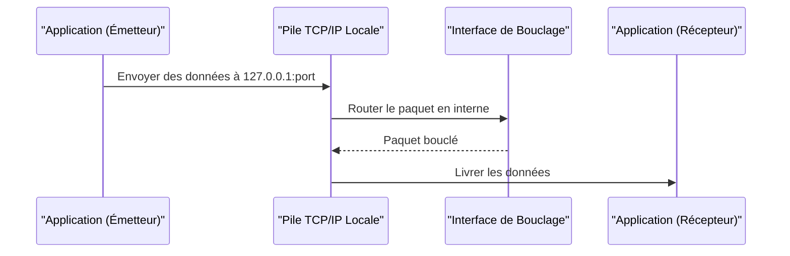

---
aliases:
  - "Adresse de bouclage"
  - "Loopback Address"
  - "Loopback"
archetype: concept-reseau
couche_osi:
  - "Couche 3 - Réseau"
technologie:
  - "IPv4"
  - "IPv6"
cssclasses:
  - max
tags:
  - protocole/ip/loopback
  - adresse-ip
  - protocole/ip
  - protocole/ip/ipv4
  - protocole/ip/ipv6
  - modele-tcp-ip
  - encapsulation
  - test
  - reseau/depannage
  - securite/reseau
  - commande/ping
---

# Loopback Address

> [!abstract] Définition
> Une **adresse de bouclage** (ou *loopback address*) est une adresse IP spéciale utilisée pour désigner le *système local* lui-même, permettant à un appareil de s'envoyer des paquets. Elle est associée à une *interface de bouclage* virtuelle qui n'est pas connectée à un support physique et dont le trafic ne quitte jamais le périphérique.

## ⚙️ Mécanisme & Fonctionnement
Le mécanisme de bouclage permet à un hôte de communiquer avec lui-même en utilisant les protocoles réseau standards (TCP/IP) sans que le trafic ne passe par une interface réseau physique (carte réseau). Les paquets destinés à l'adresse de bouclage sont traités par la pile réseau interne du système et immédiatement redirigés vers l'hôte émetteur.

### Encapsulation / Traitement
*   **Entrée** : Un processus applicatif envoie des données à une adresse de bouclage (par exemple, **127.0.0.1** ou **::1**). Ces données sont encapsulées dans des segments TCP ou UDP.
*   **Action** : La pile de protocoles réseau du système détecte que la destination est l'adresse de bouclage locale. Au lieu de transmettre le paquet à une carte réseau physique pour un envoi externe, le paquet est *bouclé* en interne. Il passe par les couches réseau et transport du même hôte comme s'il avait été envoyé et reçu.
*   **Sortie** : Les données décapsulées sont livrées au processus applicatif de destination, qui peut être le même processus ou un processus différent écoutant sur le port spécifié sur l'adresse de bouclage.

## 💡 Cas d'Usage Typique
L'adresse de bouclage est fondamentale pour le développement, le test et le diagnostic réseau.
1.  **Tests de services réseau locaux** : Un développeur peut exécuter un serveur web sur son ordinateur et y accéder via `http://127.0.0.1` (ou `http://localhost`) pour tester son fonctionnement sans dépendre d'une connexion réseau externe.
2.  **Diagnostics de la pile TCP/IP** : Le fait de pouvoir "pinger" l'adresse `127.0.0.1` avec succès (commande `ping 127.0.0.1`) confirme que la pile de protocoles TCP/IP de l'ordinateur fonctionne correctement. Si ce ping échoue, cela indique un problème fondamental avec l'installation réseau du système, indépendant de toute interface physique ou connexion externe.
3.  **Hébergement de services internes** : Des applications ou des services système peuvent écouter sur l'adresse de bouclage pour offrir des fonctionnalités uniquement accessibles aux processus s'exécutant sur la même machine, augmentant ainsi la sécurité en empêchant l'accès externe.

## ⚠️ Limitations & Problèmes
> [!warning] Points d'attention
> *   **Confinement Local** : La principale "limitation" de l'adresse de bouclage est intentionnelle : le trafic qui lui est destiné ne quitte jamais l'appareil. Cela signifie qu'elle ne peut pas être utilisée pour tester la connectivité ou la performance vers des ressources réseau externes.
> *   **Non-Représentativité du Réseau Externe** : Bien qu'elle valide le fonctionnement de la pile TCP/IP, elle ne garantit en aucun cas que les interfaces réseau physiques (Ethernet, Wi-Fi) fonctionnent correctement ou que l'appareil peut communiquer avec d'autres hôtes sur le réseau local ou Internet.
> *   **Impact sur la performance** : L'utilisation de l'interface de bouclage a un impact négligeable sur le CPU ou la bande passante par rapport à une communication inter-appareils, car elle évite la surcharge liée à la transmission physique et à la latence du réseau.
> *   **Sécurité** : Si un service écoute sur l'interface de bouclage et qu'une faille de sécurité permet à un attaquant d'exécuter du code localement, cet attaquant pourrait potentiellement interagir avec ce service. Cependant, l'interface de bouclage elle-même ne présente pas de risque de sécurité direct car elle n'est pas exposée au réseau externe.