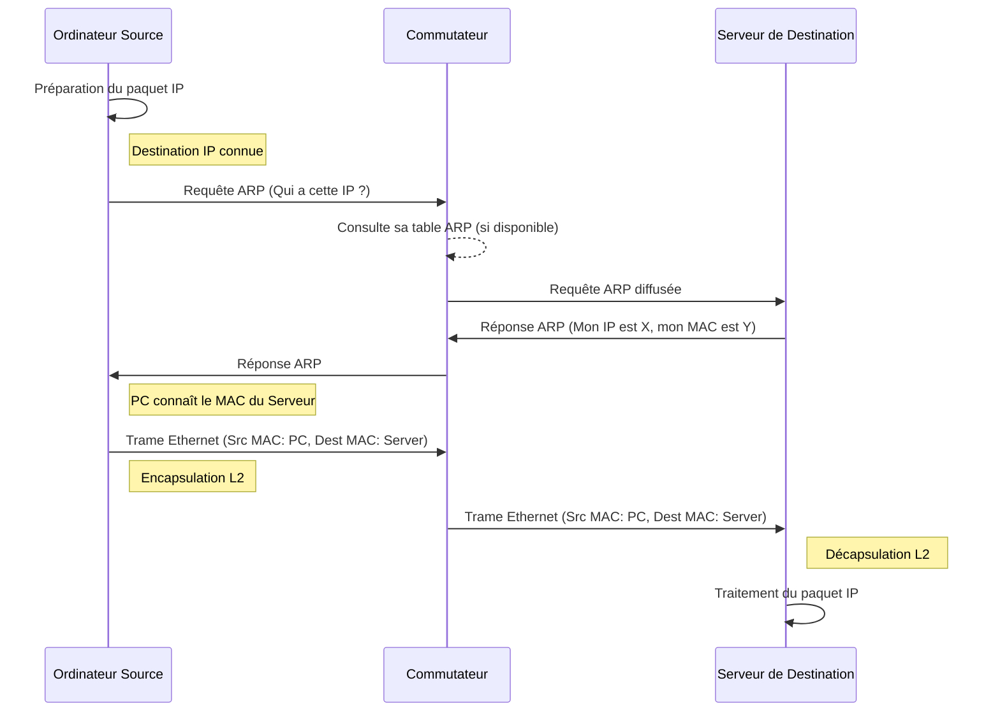

---
aliases:
  - Adresse MAC
  - Media Access Control
  - MAC Address
archetype: concept-reseau
couche_osi:
  - "Couche 2 - Liaison"
technologie:
  - Ethernet
  - IEEE 802
cssclasses:
  - max
tags:
  - reseau/adressage/mac
  - modele-osi/couche-2
  - protocole/ethernet
  - protocole/arp
  - reseau/commutateur
  - protocole/dhcp
  - attaque/mac-spoofing
  - securite/gestion-acces
  - hyperviseur
  - definition
---

# Mac Address

> [!abstract] Définition
> L'**Adresse MAC** (Media Access Control) est un identifiant unique attribué à chaque interface réseau (carte réseau, adaptateur Wi-Fi, etc.) d'un périphérique connecté à un réseau local. Elle opère à la couche 2 (liaison de données) du modèle OSI et est utilisée pour l'adressage physique au sein d'un segment de réseau, permettant l'acheminement des trames Ethernet entre des dispositifs directement connectés.

## ⚙️ Mécanisme & Fonctionnement

Une adresse MAC est un numéro de série de 48 bits (6 octets) représenté le plus souvent sous forme hexadécimale, séparée par des deux-points ou des tirets (par exemple, `00:1A:2B:3C:4D:5E`). Cette adresse est mondialement unique et est généralement "gravée" dans la carte réseau par le fabricant.

### Structure (OUI/NIC)
La structure d'une adresse MAC est divisée en deux parties principales :
*   **OUI (Organizationally Unique Identifier)** : Les trois premiers octets (les 24 premiers bits) de l'adresse MAC. Ce préfixe est attribué par l'IEEE (Institute of Electrical and Electronics Engineers) à un fabricant spécifique. Cela permet d'identifier le fabricant de l'interface réseau.
*   **NIC (Network Interface Controller specific)** : Les trois derniers octets (les 24 derniers bits). Cette partie est attribuée par le fabricant lui-même et doit être unique pour chaque carte réseau produite par ce fabricant.

### Adresses MAC Physiques vs. Logiques
*   **Adresse MAC Physique (burned-in address - BIA)** : C'est l'adresse MAC originale, codée en dur dans le micrologiciel (firmware) de la carte réseau lors de sa fabrication. Elle est censée être permanente et unique.
*   **Adresse MAC Logique (ou Virtuelle)** : Dans les environnements de virtualisation (machines virtuelles, conteneurs), les hyperviseurs attribuent souvent des adresses MAC virtuelles aux interfaces réseau de ces entités logiques. Ces adresses sont générées logiciellement et peuvent être différentes de l'adresse MAC physique sous-jacente du serveur hôte. Elles permettent à chaque machine virtuelle d'avoir sa propre identité de couche 2 sur le réseau. Le *MAC spoofing* est une technique qui consiste à modifier l'adresse MAC d'une interface pour en usurper une autre, souvent pour des raisons de sécurité ou de contournement de restrictions.

### Encapsulation / Traitement
*   **Entrée** : Une trame de données IP (paquet IP) est reçue par la couche liaison.
*   **Action** : Le système doit déterminer l'adresse MAC de destination du prochain saut (soit la destination finale si sur le même segment, soit la passerelle par défaut). Il utilise le protocole ARP (Address Resolution Protocol) pour résoudre une adresse IP de destination en son adresse MAC correspondante. Une fois l'adresse MAC de destination connue, la couche liaison ajoute un en-tête Ethernet à la trame IP, incluant l'adresse MAC source (de l'expéditeur) et l'adresse MAC de destination.
*   **Sortie** : Une trame Ethernet complète est transmise sur le support physique (câble, onde radio) vers l'adresse MAC de destination spécifiée.

## 💡 Cas d'Usage Typique
Pourquoi l'utilise-t-on ?
1.  **Communication sur Réseau Local** : Les adresses MAC sont fondamentales pour la livraison de trames au sein d'un même segment de réseau Ethernet. Les commutateurs (switches) utilisent les adresses MAC pour construire leurs tables MAC et aiguiller les trames vers le port de destination correct.
2.  **Résolution d'Adresses (ARP)** : Le protocole ARP s'appuie sur les adresses MAC pour faire le lien entre une adresse IP (couche 3) et l'adresse MAC correspondante (couche 2) sur le réseau local.
3.  **Filtrage et Sécurité** : Les adresses MAC peuvent être utilisées pour implémenter des listes de contrôle d'accès (ACLs) au niveau de la couche 2, permettant de n'autoriser que certains appareils spécifiques à se connecter à un port de switch ou à un réseau Wi-Fi.
4.  **Attribution DHCP** : Les serveurs DHCP peuvent être configurés pour attribuer toujours la même adresse IP à une machine spécifique en se basant sur son adresse MAC.
5.  **Authentification 802.1X** : Dans certains scénarios, les adresses MAC sont utilisées comme partie du processus d'authentification pour l'accès au réseau.

## ⚠️ Limitations & Problèmes
> [!warning] Points d'attention
> *   **Non Routable** : Les adresses MAC ne sont pas routables au-delà du segment de réseau local. Elles ne sont pertinentes que pour la communication directe entre dispositifs sur le même réseau Layer 2. Pour communiquer entre différents réseaux, l'adressage IP (couche 3) est nécessaire.
> *   **Sécurité (MAC Spoofing)** : Les adresses MAC peuvent être falsifiées (MAC spoofing), ce qui peut être utilisé pour contourner des contrôles de sécurité basés sur MAC, usurper l'identité d'un autre appareil ou perturber le réseau.
> *   **Surcharge de Diffusion (Broadcast)** : En l'absence d'informations MAC spécifiques (par exemple, lors d'une requête ARP initiale), les trames peuvent être diffusées (broadcast) à tous les hôtes du segment, ce qui peut générer du trafic inutile dans de très grands domaines de diffusion.