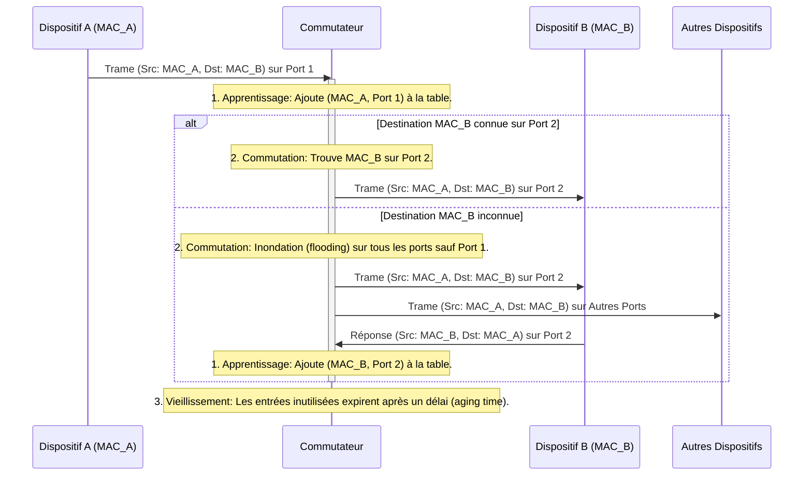

---
aliases:
  - Table d'Adresses MAC
  - MAC Address Table
  - CAM Table
  - Content Addressable Memory Table
  - FDB Table
  - Forwarding Database Table
archetype: concept-reseau
couche_osi:
  - "Couche 2 - Liaison"
technologie:
  - Switching
tags:
  - mac-address-table
  - cam-table
  - fdb-table
  - reseau
  - materiel/reseau/switch
  - reseau/fonctionnement
  - reseau/adressage/mac
  - protocole/ethernet
  - reseau/trame
  - reseau/commutation
  - reseau/apprentissage-mac
  - reseau/vieillissement-mac
  - reseau/unicast
  - reseau/broadcast
  - reseau/multicast
  - port
---

# MAC Address Table

> [!abstract] Définition
> La **Table d'Adresses MAC**, également connue sous le nom de **CAM Table** (Content Addressable Memory Table) ou **FDB Table** (Forwarding Database Table), est une structure de données cruciale utilisée par les commutateurs réseau (switches) pour acheminer efficacement les trames Ethernet vers leurs destinations. Elle établit une correspondance entre les adresses MAC des périphériques connectés et les ports physiques du commutateur par lesquels ces périphériques sont accessibles. Cela permet au commutateur de diriger le trafic de manière ciblée, évitant ainsi le besoin de diffuser toutes les données sur l'ensemble du réseau, ce qui améliore l'efficacité et réduit la congestion.

## ⚙️ Mécanisme & Fonctionnement
Le fonctionnement d'une table d'adresses MAC repose sur trois processus clés : l'apprentissage, la commutation (ou le transfert) et le vieillissement (aging).

### Apprentissage (Learning)
Lorsqu'un commutateur reçoit une trame Ethernet, il examine l'adresse MAC source de la trame.
*   **Entrée** : Une trame Ethernet arrive sur un port du commutateur.
*   **Action** : Le commutateur inspecte l'adresse MAC source de la trame. Si cette adresse MAC n'est pas déjà présente dans sa table d'adresses MAC ou si elle est associée à un port différent, le commutateur met à jour sa table. Il associe l'adresse MAC source au port d'entrée par lequel la trame a été reçue. Pour les entrées dynamiques, un temporisateur de vieillissement (aging timer) est démarré ou réinitialisé pour cette entrée.
*   **Sortie** : La table d'adresses MAC est mise à jour avec l'adresse MAC source et son port d'association, prête pour les décisions de commutation futures.

### Commutation / Traitement (Forwarding)
Après l'apprentissage de l'adresse MAC source, le commutateur prend une décision concernant le transfert de la trame en fonction de l'adresse MAC de destination.
*   **Entrée** : Une trame Ethernet arrive sur un port avec une adresse MAC de destination.
*   **Action** :
    1.  **Recherche dans la table** : Le commutateur examine l'adresse MAC de destination de la trame et recherche une correspondance dans sa table d'adresses MAC.
    2.  **Destination connue (Unicast)** : Si l'adresse MAC de destination est trouvée dans la table et est associée à un port spécifique, le commutateur transfère la trame uniquement vers ce port de sortie. C'est ce qu'on appelle la commutation unicast efficace.
    3.  **Destination inconnue (Unicast Inconnu, Broadcast, Multicast)** : Si l'adresse MAC de destination n'est pas trouvée dans la table (pour un unicast inconnu) ou s'il s'agit d'une adresse de diffusion (broadcast) ou de multidiffusion (multicast), le commutateur inonde la trame. Cela signifie que la trame est envoyée sur tous les ports actifs, à l'exception du port d'où elle a été reçue. Si un appareil répond à une trame inondée, le commutateur mettra à jour sa table MAC avec l'adresse MAC source de la réponse et le port correspondant.
*   **Sortie** : La trame est transférée vers le port de destination approprié ou inondée sur tous les ports (sauf le port d'entrée) si la destination est inconnue ou est un broadcast/multicast.

### Vieillissement (Aging)
Les entrées dynamiques dans la table d'adresses MAC ne sont pas permanentes et sont soumises à un processus de vieillissement.
*   **Action** : Chaque entrée dynamique dans la table a un temporisateur de vieillissement (age-time ou time-to-live). Si aucune trame n'est reçue avec l'adresse MAC source associée à cette entrée pendant une période prédéfinie (généralement quelques minutes), l'entrée est supprimée de la table. Si du trafic est reçu avec l'adresse MAC source d'une entrée existante, le temporisateur est réinitialisé.
*   **But** : Ce processus garantit que la table reste à jour et ne contient pas d'informations obsolètes sur les périphériques qui ne sont plus connectés au réseau ou qui ont changé de port.

## 💡 Cas d'Usage Typique
1.  **Commutation Efficace des Trames (Unicast)** : La fonction principale de la table d'adresses MAC est de permettre aux commutateurs de transférer les trames de manière intelligente, en les dirigeant uniquement vers le port où se trouve le périphérique de destination. Cela réduit le trafic inutile sur le réseau et optimise l'utilisation de la bande passante.
2.  **Segmentation du Réseau Local (LAN)** : En garantissant que les trames unicast ne sont envoyées qu'au port approprié, la table d'adresses MAC aide à segmenter le réseau, créant des domaines de collision plus petits par port de commutateur, ce qui améliore les performances globales du LAN.
3.  **Support de la Sécurité Portuaire (Port Security)** : Les administrateurs réseau peuvent utiliser la table d'adresses MAC en conjonction avec la sécurité des ports pour limiter le nombre d'adresses MAC autorisées à apprendre sur un port spécifique, ou même pour lier statiquement une adresse MAC à un port. Cela permet d'empêcher les attaques de falsification d'adresses MAC (MAC spoofing) et les attaques par inondation de table MAC (MAC flooding).

## ⚠️ Limitations & Problèmes
> [!warning] Points d'attention
> *   **Performance** : La taille de la table d'adresses MAC est limitée par la mémoire CAM (Content Addressable Memory) du commutateur. Si un nombre excessif d'adresses MAC est appris sur un port, ou si la table se remplit, cela peut entraîner des problèmes de performance, le commutateur pouvant se mettre à inonder les trames comme un hub, augmentant la congestion et la latence.
> *   **Sécurité** :
    *   **Attaques par inondation de table MAC (MAC Flooding / CAM Table Overflow)** : Un attaquant peut inonder le commutateur avec un grand nombre de fausses adresses MAC, ce qui peut remplir la table d'adresses MAC. Lorsque la table est pleine, le commutateur entre dans un mode "fail-open" et commence à diffuser (flooder) toutes les trames inconnues vers tous les ports. L'attaquant peut alors intercepter le trafic destiné à d'autres périphériques.
    *   **Falsification d'adresses MAC (MAC Spoofing)** : Un attaquant peut modifier l'adresse MAC de son propre périphérique pour qu'elle corresponde à celle d'un autre périphérique légitime sur le réseau. Cela peut contourner les contrôles d'accès basés sur les adresses MAC et permettre à l'attaquant d'intercepter ou de rediriger le trafic. Des mesures comme le "port security" peuvent aider à atténuer ces risques.