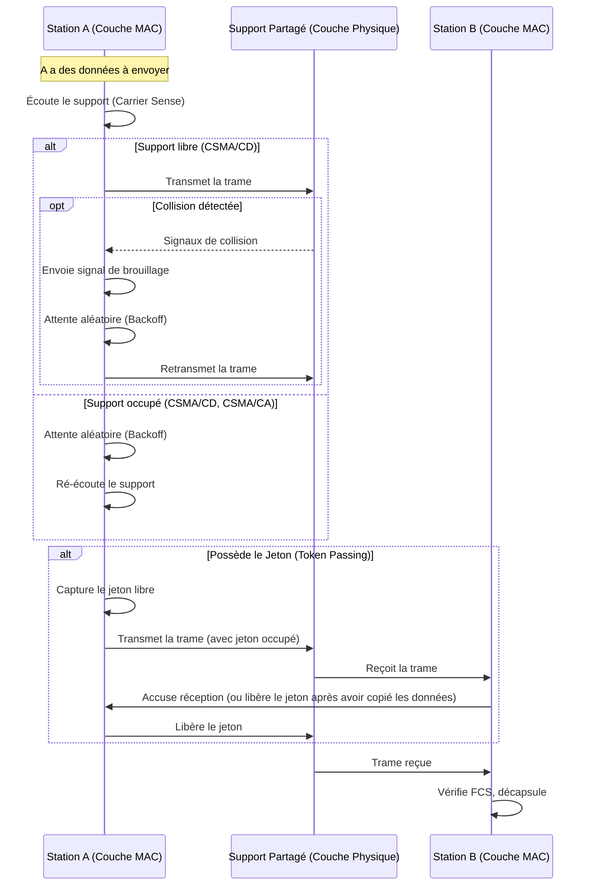

---
aliases:
  - Mécanisme de Contrôle d'Accès au Média
  - Media Access Control
  - Contrôle d'accès au média
archetype: concept-reseau
couche_osi:
  - Couche 2 - Liaison
  - Couche 1 - Physique
technologie:
  - Ethernet
  - Wi-Fi
  - Token Ring
cssclasses:
  - max
tags:
  - gestion-acces
  - modele-osi/couche-2
  - protocole/ethernet
  - reseau/sans-fil/wi-fi
  - gestion-acces/csma-ca
  - protocole/csma/cd
  - protocole/aloha
  - protocole/token-ring
  - protocole/fddi
  - collision
  - communication/controle-flux
---

# Media Access Control Mechanism

> [!abstract] Définition
> Le **Mécanisme de Contrôle d'Accès au Média (MAC)** est un ensemble de méthodes et de protocoles qui régissent la manière dont les périphériques d'un réseau partagent un support de communication commun, tel qu'un câble ou un canal sans fil. Son rôle principal est de minimiser les collisions de données, d'assurer une transmission efficace et de coordonner le flux de paquets de données entre différents appareils. Le MAC est une sous-couche de la couche de liaison de données (Couche 2) du modèle OSI.

## ⚙️ Mécanisme & Fonctionnement
Les mécanismes de contrôle d'accès au média définissent les règles par lesquelles les stations réseau peuvent accéder au support partagé et transmettre des données. L'objectif est de gérer l'utilisation du support de manière ordonnée, en évitant ou en détectant les collisions lorsque plusieurs appareils tentent de transmettre simultanément.

Il existe trois types principaux de méthodes d'accès au média : la **contention**, le **passage de jeton (token passing)** et la **priorité à la demande (demand priority)**.

### Types de Mécanismes d'Accès au Média

#### 1. Mécanismes basés sur la Contention (Random Access)
Dans les méthodes basées sur la contention, les appareils "rivalisent" pour l'accès au canal de communication. Le premier appareil qui "parle" transmet ses données, et les autres doivent attendre.

*   **ALOHA (Pure ALOHA et Slotted ALOHA)**:
    *   **Pure ALOHA**: C'est le protocole d'accès aléatoire le plus simple, développé à l'origine pour les réseaux radio. Les stations transmettent des trames chaque fois qu'elles en ont, sans vérifier si le canal est libre. Si une collision se produit (deux stations transmettent simultanément), les trames sont détruites, et les expéditeurs attendent un temps aléatoire avant de retransmettre. Son efficacité est faible (environ 18,4%).
    *   **Slotted ALOHA**: Une amélioration de Pure ALOHA où le temps est divisé en intervalles discrets (slots). Les stations ne peuvent commencer la transmission qu'au début d'un slot. Cela réduit la probabilité de collision et double l'efficacité par rapport à Pure ALOHA (environ 36,8%).

*   **CSMA (Carrier Sense Multiple Access)**:
    *   Les stations "écoutent" le support (détection de porteuse) avant de transmettre pour vérifier si une autre transmission est en cours. Si le support est libre, la station transmet. Si le support est occupé, elle attend.
    *   **CSMA/CD (Collision Detection - Détection de Collisions)**: Utilisé principalement dans les réseaux **Ethernet** filaires. Si deux appareils détectent que le support est libre et transmettent simultanément, une collision peut se produire. Le CSMA/CD permet aux appareils de détecter cette collision (par une augmentation de la tension sur le câble) et d'arrêter la transmission. Ils envoient un signal de brouillage (jam signal) pour informer les autres stations, puis attendent une période aléatoire (backoff period) avant de tenter de retransmettre.
    *   **CSMA/CA (Collision Avoidance - Évitement de Collisions)**: Utilisé principalement dans les réseaux **Wi-Fi** sans fil. En raison de la nature des transmissions sans fil (les émetteurs ne peuvent pas écouter efficacement pendant qu'ils transmettent, problème du "nœud caché"), la détection de collision est difficile. Le CSMA/CA tente d'éviter les collisions avant qu'elles ne se produisent en utilisant des mécanismes comme "Listen Before Talk" (écouter avant de parler) et un délai d'attente aléatoire (random backoff) avant de transmettre. Des mécanismes optionnels comme RTS/CTS (Request To Send/Clear To Send) peuvent être utilisés pour réserver le canal.

#### 2. Mécanismes basés sur le Passage de Jeton (Controlled Access)
Dans ces méthodes, les appareils suivent un programme ou une séquence prédéterminée pour accéder au canal de communication.

*   **Token Passing (Passage de Jeton)**: Un jeton spécial (une petite trame de données) circule sur le réseau. Seul l'appareil en possession du jeton est autorisé à transmettre des données. Une fois la transmission terminée, le jeton est libéré pour qu'une autre station puisse l'utiliser. Cela garantit un accès ordonné et sans collision. L'exemple le plus courant est le **Token Ring** (IEEE 802.5) et **FDDI (Fiber Distributed Data Interface)**.

#### 3. Priorité à la Demande (Demand Priority)
Développé par Hewlett Packard pour VG-AnyLAN, ce mécanisme hiérarchise les différents types de données et donne la préférence aux données de priorité plus élevée en cas de contention au niveau des concentrateurs.

### Positionnement dans le Modèle OSI/TCP-IP
Le mécanisme de contrôle d'accès au média est une sous-couche du la **Couche 2 - Liaison de données** du modèle OSI. Plus précisément, la couche de liaison de données est divisée en deux sous-couches : la **Logical Link Control (LLC)** et la **Medium Access Control (MAC)**. La sous-couche MAC est responsable de l'interaction avec le support de transmission physique (câblé ou sans fil) et fournit une abstraction à la sous-couche LLC et aux couches supérieures.

### Encapsulation / Traitement
*   **Entrée** : Trame de données provenant de la sous-couche LLC (ou directement de la couche réseau pour Ethernet "raw"). La trame inclut les adresses MAC source et destination.
*   **Action** :
    1.  **Arbitrage d'accès au support** : La station applique le mécanisme MAC approprié (par exemple, détection de porteuse, attente du jeton) pour obtenir le droit de transmettre.
    2.  **Préparation de la trame pour la transmission physique** : Ajout d'un préambule (syncword) pour la synchronisation, et potentiellement du remplissage (padding) si nécessaire, pour adapter la trame au support.
    3.  **Calcul et ajout de la séquence de contrôle de trame (FCS)** : Un mécanisme de vérification d'erreur est ajouté à la fin de la trame.
*   **Sortie** : La trame MAC est transmise à la Couche 1 - Physique pour être convertie en signaux électriques ou optiques et placée sur le support.

## 💡 Cas d'Usage Typique
Pourquoi l'utilise-t-on ?
1.  **Accès au Médium Partagé** : Les mécanismes MAC sont fondamentaux pour permettre à plusieurs appareils de partager efficacement un même support de transmission, qu'il soit filaire (comme un câble Ethernet partagé, bien que moins courant aujourd'hui avec les commutateurs) ou sans fil (comme le Wi-Fi).
2.  **Prévention et Gestion des Collisions** : Ils sont conçus pour éviter les collisions de données (où plusieurs transmissions simultanées interfèrent) ou pour les détecter et les résoudre rapidement, garantissant ainsi l'intégrité des données.
3.  **Optimisation de l'Utilisation de la Bande Passante** : En régulant l'accès, les protocoles MAC s'assurent que la bande passante est utilisée de manière plus efficace, réduisant la congestion et améliorant la performance globale du réseau.
4.  **Accès Équitable ou Priorisé** : Certains mécanismes, comme le passage de jeton, peuvent assurer un accès déterministe et équitable pour toutes les stations. D'autres, comme la priorité à la demande, peuvent hiérarchiser certains types de trafic.

## ⚠️ Limitations & Problèmes
> [!warning] Points d'attention
> *   **Performance (Contention)** : Les mécanismes basés sur la contention (CSMA/CD, ALOHA) peuvent souffrir d'une baisse de performance significative dans les environnements à fort trafic en raison des collisions et des retransmissions. Le CSMA/CD, par exemple, a une efficacité théorique maximale d'environ 37% de la bande passante.
> *   **Coût et Complexité (Token Passing)** : Les réseaux à passage de jeton (Token Ring) sont généralement plus coûteux et plus complexes à installer et à maintenir que les réseaux Ethernet, ce qui a contribué à leur déclin.
> *   **Problème du Nœud Caché (CSMA/CA)** : Dans les réseaux sans fil, le CSMA/CA doit faire face au problème du "nœud caché", où deux stations peuvent ne pas se "voir" mutuellement mais causer des interférences à un récepteur commun, rendant l'évitement des collisions plus complexe.
> *   **Surcharge (Overhead)** : Certains mécanismes, comme le CSMA/CA avec RTS/CTS, introduisent une surcharge (overhead) de contrôle supplémentaire pour l'évitement des collisions, ce qui peut affecter l'efficacité de la bande passante.