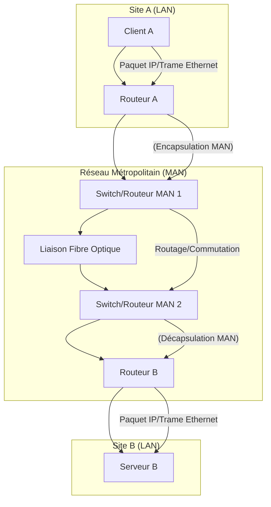

---
aliases:
  - Réseau Métropolitain
  - Metropolitan Area Network
  - MAN
archetype: concept-reseau
couche_osi:
  - "Couche 2 - Liaison"
  - "Couche 3 - Réseau"
technologie:
  - Ethernet
  - Fibre Optique
  - MPLS
  - WiMAX
cssclasses:
  - max
tags:
  - reseau/man
  - reseau/topologie
  - reseau/infrastructure/fibre-optique
  - reseau/interconnexion-urbaine
---

# Metropolitan Area Network (MAN)

> [!abstract] Définition
> Un *Metropolitan Area Network* (MAN), ou **Réseau Métropolitain**, est un type de réseau informatique qui interconnecte des utilisateurs et des ressources informatiques dans une zone géographique plus étendue qu'un réseau local (LAN) mais plus petite qu'un réseau étendu (WAN). Il couvre généralement une ville, une agglomération ou un campus de grande taille, offrant une connectivité à haut débit sur des distances de quelques dizaines de kilomètres. Les MAN sont conçus pour relier plusieurs LAN au sein d'une même zone métropolitaine, facilitant le partage de ressources et la communication inter-sites.

## ⚙️ Mécanisme & Fonctionnement
Les MAN fonctionnent en étendant les capacités de connectivité des réseaux locaux (LAN) sur une zone urbaine. Ils s'appuient généralement sur une infrastructure à haut débit, souvent à base de **fibre optique**, pour relier différents sites. Bien qu'ils puissent opérer à différentes couches du modèle OSI, ils sont principalement pertinents aux couches 2 (Liaison de données) et 3 (Réseau) pour l'acheminement des données entre les sites.

### Encapsulation / Traitement
Étant donné que le MAN est une architecture réseau et non un protocole spécifique, le processus d'encapsulation/décapsulation se produit au niveau des équipements qui composent le MAN (routeurs, commutateurs, modems optiques).

*   **Entrée** : Une *trame Ethernet* ou un *paquet IP* provenant d'un réseau local (LAN) distant.
*   **Action** :
    *   Au niveau de la *Couche 2*, les commutateurs du MAN peuvent ajouter des informations de *VLAN* ou des balises de *MPLS* (Multi-Protocol Label Switching) pour acheminer la trame à travers le cœur du réseau MAN.
    *   Au niveau de la *Couche 3*, les routeurs gèrent l'adressage IP et le routage des paquets entre les différents sous-réseaux connectés au MAN.
*   **Sortie** : Une *trame Ethernet* ou un *paquet IP* est délivré au LAN de destination, souvent après suppression des balises spécifiques au transport au sein du MAN.

## 💡 Cas d'Usage Typique
Les MAN sont couramment utilisés dans plusieurs scénarios d'entreprise et de services :
1.  **Interconnexion de succursales** : Les entreprises ayant plusieurs bureaux ou sites dans la même ville utilisent un MAN pour relier ces sites à haut débit, permettant le partage centralisé de serveurs, de bases de données et d'autres ressources.
2.  **Services Internet pour les FAI** : Les fournisseurs d'accès Internet (FAI) déploient des MAN pour connecter leurs points de présence (PoP) et distribuer des services à large bande aux clients résidentiels et professionnels au sein d'une ville.
3.  **Services de voix, vidéo et données** : Les MAN facilitent la transmission simultanée de trafic voix (VoIP), vidéo (vidéoconférence, surveillance) et données, nécessitant une bande passante élevée et une faible latence.
4.  **Réseaux universitaires ou hospitaliers** : Les grands campus universitaires ou les réseaux hospitaliers peuvent utiliser une infrastructure MAN pour relier leurs multiples bâtiments et départements, assurant une connectivité homogène.

## ⚠️ Limitations & Problèmes
> [!warning] Points d'attention
> *   **Coût d'implémentation** : La mise en place d'un MAN, notamment avec une infrastructure en fibre optique, peut être coûteuse en raison de l'achat d'équipements spécialisés et du déploiement de l'infrastructure physique sur de longues distances.
> *   **Complexité de gestion** : Un MAN est plus complexe à gérer qu'un LAN en raison de son étendue, du nombre d'équipements et de la diversité des technologies impliquées.
> *   **Dépendance à un FAI/Opérateur** : Souvent, les entreprises louent des services MAN à des opérateurs télécoms, ce qui peut entraîner une dépendance et des coûts opérationnels récurrents.
> *   **Performance** : Bien que plus performant qu'un WAN pour des distances comparables, un MAN peut rencontrer des problèmes de latence ou de gigue si l'infrastructure n'est pas correctement conçue ou si le trafic est mal géré.
> *   **Sécurité** : Comme tout réseau étendu, un MAN est vulnérable aux menaces de sécurité. La protection des données transitant entre les différents sites nécessite des mesures robustes telles que le chiffrement et la segmentation réseau.

