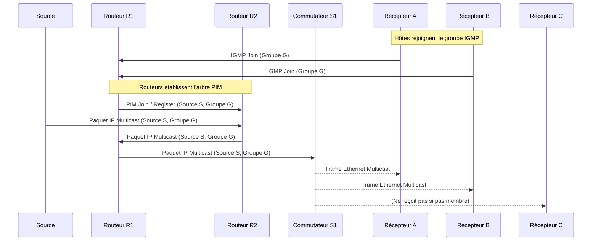

---
aliases:
  - "Communication Multicast"
  - "Multicast Communication"
  - "IP Multicast"
archetype: concept-reseau
couche_osi:
  - "Couche 3 - Réseau"
  - "Couche 2 - Liaison"
technologie:
  - "IGMP"
  - "PIM"
  - "Multicast Routing"
cssclasses:
  - max
tags:
  - reseau/multicast
  - protocole/igmp
  - protocole/pim
  - protocole/pim/dense-mode
  - protocole/pim/sparse-mode
  - protocole/pim/source-specific-multicast
  - routage/multicast
  - gestion-groupes
  - protocole/ip/multicast
  - reseau/adressage/mac/multicast
  - mecanisme/encapsulation
  - decapsulation
  - routeur/multicast
  - switch/igmp-snooping
  - protocole/pim/rendezvous-point
  - protocole/pim/shared-tree
  - protocole/pim/source-tree
  - reseau/unicast
  - reseau/broadcast
  - bande-passante
  - protocole/ip
  - protocole/ethernet
  - communication/reseau
---

# Multicast Communication

> [!abstract] Définition
> La *communication multicast* est un type de communication réseau "un-à-plusieurs" où un émetteur envoie des paquets de données à un groupe de récepteurs spécifiques qui ont explicitement rejoint ce groupe. Contrairement à l'unicast (un-à-un) ou au broadcast (un-à-tous), le multicast optimise l'utilisation de la bande passante en livrant une seule copie du trafic sur chaque segment de réseau où des destinataires sont présents, évitant ainsi la duplication inutile.

## ⚙️ Mécanisme & Fonctionnement
Le fonctionnement de la communication multicast repose sur plusieurs mécanismes et protocoles pour la gestion des groupes et le routage du trafic.

### Gestion des groupes (IGMP)
Le *Internet Group Management Protocol* (IGMP) est un protocole de la couche réseau utilisé par les hôtes et les routeurs IP pour établir et maintenir des appartenances aux groupes multicast.
*   **Adhésion** : Un hôte souhaitant recevoir le trafic d'un groupe multicast envoie un message **IGMP Join** au routeur de son sous-réseau.
*   **Maintien** : Les routeurs multicast envoient périodiquement des requêtes IGMP pour s'assurer qu'il y a toujours des membres actifs pour un groupe donné sur un segment LAN.
*   **Départ** : Un hôte peut envoyer un message **IGMP Leave** pour indiquer qu'il ne souhaite plus recevoir le trafic d'un groupe.
Différentes versions d'IGMP (v1, v2, v3) existent, la v3 offrant des fonctionnalités plus avancées comme le filtrage *Source-Specific Multicast* (SSM).

### Routage Multicast (PIM)
Le *Protocol Independent Multicast* (PIM) est un protocole de routage multicast qui ne dépend pas d'un protocole de routage unicast spécifique pour sa topologie, mais utilise les informations de routage unicast existantes. PIM gère la distribution du trafic multicast à travers le réseau inter-réseaux.

Il existe plusieurs modes PIM :
*   **PIM Dense Mode (PIM-DM)** : Fonctionne en inondant le trafic multicast vers tous les routeurs, puis en élaguant les branches où aucun membre de groupe n'est présent. C'est un mode "pull" où les routeurs tirent le trafic si nécessaire.
*   **PIM Sparse Mode (PIM-SM)** : Construit des arbres de distribution de trafic à partir d'un *Rendezvous Point* (RP) centralisé, uniquement vers les branches où des récepteurs se sont manifestés. C'est un mode "push" où le trafic est poussé vers les points d'intérêt. Les routeurs construisent d'abord un *shared tree* (arbre partagé) vers le RP, puis peuvent basculer vers un *source tree* (arbre de source) pour une livraison plus optimisée.
*   **PIM Source-Specific Multicast (PIM-SSM)** : Une extension de PIM-SM qui permet aux récepteurs de spécifier non seulement le groupe multicast, mais aussi la source spécifique du trafic qu'ils souhaitent recevoir.

### Encapsulation / Traitement
*   **Entrée** : Un paquet IP unicast de l'application est destiné à un groupe multicast.
*   **Action** :
    1.  L'application envoie un paquet IP avec une **adresse IP de destination multicast** (plage 224.0.0.0 à 239.255.255.255).
    2.  Au niveau de la couche liaison de données, le paquet IP multicast est encapsulé dans une trame Ethernet, et l'adresse IP multicast est mappée à une **adresse MAC multicast** spécifique (plage 01:00:5E:00:00:00 à 01:00:5E:7F:FF:FF).
    3.  Les commutateurs (switches) qui supportent l'IGMP snooping examinent les messages IGMP pour savoir quels ports sont connectés à des membres de groupes multicast et ne transmettent le trafic multicast que vers ces ports, au lieu de l'inonder sur tout le VLAN.
    4.  Les routeurs multicast (activés avec PIM) reçoivent la trame, décapsulent le paquet IP, déterminent l'interface de sortie appropriée en fonction des tables de routage multicast (créées par PIM et IGMP), puis ré-encapsulent le paquet IP dans une nouvelle trame Ethernet pour chaque interface de sortie pertinente.
*   **Sortie** : Une ou plusieurs trames Ethernet contenant le paquet IP multicast sont livrées uniquement aux hôtes et segments de réseau ayant des membres du groupe.

## 💡 Cas d'Usage Typique
La communication multicast est essentielle pour optimiser la bande passante dans les scénarios de distribution de contenu à grande échelle.
1.  **Diffusion de flux vidéo et audio (IPTV, visioconférence)** : Permet à des milliers d'utilisateurs de recevoir simultanément le même flux sans surcharger la source ou le réseau avec des copies redondantes.
2.  **Mises à jour de données en temps réel** : Utilisé pour distribuer des informations boursières, des scores sportifs ou des alertes à un grand nombre de clients simultanément et avec une faible latence.
3.  **Déploiement de logiciels et mises à jour de systèmes d'exploitation** : Permet de distribuer efficacement des images système ou des correctifs logiciels à de nombreux ordinateurs au sein d'un réseau d'entreprise.
4.  **Jeux en ligne multijoueurs** : Facilite la synchronisation des états de jeu entre plusieurs participants.

## ⚠️ Limitations & Problèmes
> [!warning] Points d'attention
> *   **Complexité de configuration** : La mise en œuvre et le dépannage du multicast peuvent être complexes en raison de la nécessité de configurer IGMP sur les hôtes et les commutateurs, et PIM sur les routeurs, ainsi que la gestion des RPs dans PIM-SM.
> *   **Problèmes de portée (TTL)** : Le *Time-To-Live* (TTL) des paquets multicast peut limiter leur portée à un certain nombre de sauts de routeurs, ce qui peut empêcher la distribution au-delà de certains domaines.
> *   **Absence de fiabilité intrinsèque** : IP multicast est un service sans connexion et non fiable (UDP est souvent utilisé). La perte de paquets n'est pas gérée au niveau IP, nécessitant des mécanismes d'application ou des protocoles fiables de couche supérieure si la fiabilité est requise.
> *   **Sécurité** : Il peut être difficile de contrôler qui peut rejoindre un groupe multicast ou d'authentifier les sources de trafic multicast, ce qui peut entraîner des problèmes d'accès non autorisé ou d'attaques par déni de service (DoS) si le trafic n'est pas correctement filtré.
> *   **Performance** : Si le multicast n'est pas correctement configuré (par exemple, pas d'IGMP snooping sur les commutateurs), le trafic peut être inondé sur des segments LAN entiers, consommant inutilement de la bande passante et des ressources des hôtes non intéressés.