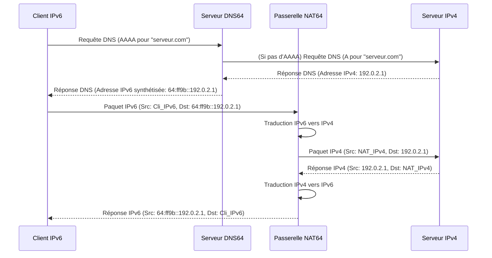

---
aliases:
  - NAT64
  - Mécanisme NAT64
  - NAT64 Mechanism
  - Network Address Translation 64
archetype: concept-reseau
couche_osi:
  - "Couche 3 - Réseau"
  - "Couche 4 - Transport"
technologie:
  - IPv6 Transition
  - Network Address Translation
  - IPv6-only networks
  - IPv4-only servers
cssclasses:
  - max
tags:
  - nat/nat64
  - protocole/ip/ipv6
  - protocole/ip/ipv4
  - dns/dns64
  - protocole/ipv6/migration
  - nat/stateful
  - protocole/tcp
  - protocole/udp
  - protocole/icmp
  - reseau/traduction-adresse
  - reseau/coexistence-ipv4-ipv6
  - internet/fai
  - reseau/passerelle
---

# NAT64 Mechanism

> [!abstract] Définition
> Le **NAT64** (Network Address Translation 64) est un mécanisme de transition IPv6 qui permet la communication entre les hôtes IPv6-only et les serveurs IPv4-only. Il réalise une traduction d'adresses et de protocoles, transformant les paquets IPv6 en paquets IPv4 et vice-versa, facilitant ainsi l'accès aux ressources IPv4 pour les réseaux basés exclusivement sur IPv6.

## ⚙️ Mécanisme & Fonctionnement
Le NAT64 opère en traduisant les en-têtes de paquets entre les formats IPv6 et IPv4. Un composant clé est la passerelle NAT64, qui possède au moins deux interfaces : une connectée au réseau IPv6 et une autre au réseau IPv4.

Le processus de traduction s'appuie sur :
*   **Préfixe NAT64** : Un préfixe IPv6 spécifique, généralement `64:ff9b::/96`, est utilisé pour identifier les adresses IPv6 synthétisées qui contiennent une adresse IPv4 embarquée. Ce préfixe est combiné avec l'adresse IPv4 de destination pour former une adresse IPv6 unique.
*   **DNS64** : C'est un service complémentaire (souvent déployé sur un serveur DNSv6) qui synthétise des enregistrements AAAA pour les domaines qui n'ont que des enregistrements A (IPv4). Lorsqu'un client IPv6-only interroge le DNS64 pour une ressource IPv4-only, le DNS64 génère une adresse IPv6 synthétique en combinant le préfixe NAT64 avec l'adresse IPv4 réelle de la ressource.

Le NAT64 peut être *stateful* ou *stateless*. Le **NAT64 stateful** est le plus courant pour les clients, permettant à plusieurs hôtes IPv6 de partager une ou plusieurs adresses IPv4 publiques, à l'instar du NAPT (Network Address Port Translation). Il maintient des mappages de session entre les adresses IPv6 et IPv4, ainsi que les ports.

Les protocoles supportés par NAT64 incluent TCP, UDP et ICMP. Il est important de noter que NAT64 ne repose pas sur l'encapsulation, mais sur la *traduction* directe des en-têtes de paquets.

### Encapsulation / Traitement
*   **Entrée** : Un paquet IPv6 provenant d'un client IPv6-only, dont l'adresse de destination est une adresse IPv6 synthétisée (contenant un préfixe NAT64 et une adresse IPv4 embarquée).
*   **Action** : La passerelle NAT64 intercepte le paquet. Elle extrait l'adresse IPv4 de destination de l'adresse IPv6 synthétisée. Elle traduit ensuite l'en-tête IPv6 en un en-tête IPv4, y compris l'adresse source IPv6 (qui est mappée à une adresse IPv4 du pool NAT64) et l'adresse de destination. Dans un NAT64 stateful, les numéros de port peuvent également être traduits pour multiplexer plusieurs sessions IPv6 sur une seule adresse IPv4.
*   **Sortie** : Un paquet IPv4 est envoyé vers le serveur IPv4-only, avec les adresses IP et potentiellement les ports traduits. Lorsque le serveur IPv4 répond, la passerelle NAT64 effectue la traduction inverse pour renvoyer le paquet au client IPv6.

## 💡 Cas d'Usage Typique
Le NAT64 est une solution essentielle pour la coexistence des réseaux IPv4 et IPv6 durant la période de transition.
1.  **Clients IPv6-only accédant à des serveurs IPv4-only** : C'est le cas d'usage principal. Les clients sur un réseau purement IPv6 peuvent joindre des services et des applications qui ne sont disponibles qu'en IPv4, sans nécessiter de double pile sur les clients.
2.  **Fournisseurs d'Accès Internet (FAI) et Opérateurs** : Permet aux FAI de déployer des réseaux d'accès IPv6-only pour leurs abonnés, tout en leur assurant un accès transparent à l'Internet IPv4 existant, gérant ainsi l'épuisement des adresses IPv4.
3.  **Centres de Données et Réseaux d'Entreprise** : Facilite la migration progressive vers des infrastructures IPv6 en permettant aux serveurs et applications IPv6-only de communiquer avec des ressources IPv4 internes ou externes.

## ⚠️ Limitations & Problèmes
> [!warning] Points d'attention
> *   **Initiation Unidirectionnelle** : Le NAT64 est principalement conçu pour les connexions initiées par des clients IPv6 vers des serveurs IPv4. Les connexions entrantes depuis un réseau IPv4 vers un hôte IPv6-only ne sont pas directement prises en charge sans des mappages statiques spécifiques.
> *   **Support des Protocoles** : Il ne prend en charge que la traduction pour TCP, UDP et ICMP. Les protocoles qui intègrent des adresses IPv4 littérales dans leur charge utile (comme certains protocoles FTP, SIP sans Application-Level Gateway (ALG) ou PCP, ou WebRTC) peuvent rencontrer des problèmes de fonctionnement.
> *   **Perte d'Informations Source** : En mode stateful (comme le NAPT), plusieurs clients IPv6 partagent une même adresse IPv4 publique. Cela peut entraîner une perte de visibilité sur l'adresse source IPv6 réelle pour le serveur IPv4, similaire aux problèmes posés par le NAT traditionnel pour le dépannage et la sécurité.
> *   **Dépendance DNS64** : Pour un fonctionnement automatique et transparent, le service DNS64 est crucial. Sans DNS64, les clients IPv6 devraient effectuer une traduction manuelle pour les adresses de destination IPv4.
> *   **Complexité et Overhead** : Bien que les performances puissent être comparables au NAT44, l'ajout d'une couche de traduction introduit une certaine complexité architecturale et un léger surcoût de traitement.