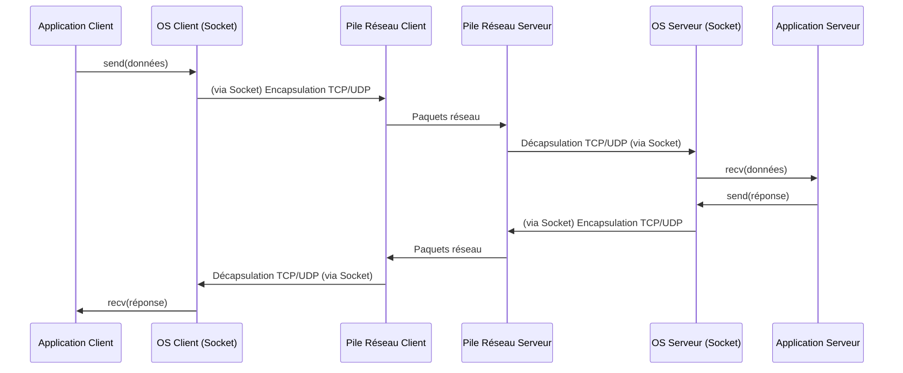

---
aliases:
  - Socket Réseau
  - Network Socket
  - Socket
archetype: concept-reseau
couche_osi:
  - "Couche 4 - Transport"
  - "Couche 7 - Application"
technologie:
  - TCP
  - UDP
cssclasses:
  - max
tags:
  - reseau/socket
  - protocole/tcp
  - protocole/udp
  - ip
  - port
  - modele-tcp-ip/couche-transport
  - modele-tcp-ip/couche-internet
  - mecanisme/encapsulation
  - decapsulation
  - modele/client-serveur
  - application/streaming-multimedia
  - reseau/communication
  - fiabilite
  - latence
  - reseau/socket/stream
  - reseau/socket/datagram
  - reseau/socket/etat-tcp
  - application/distribuee
---

# Network Socket

> [!abstract] Définition
> Un **socket réseau** est un point d'extrémité logique bidirectionnel pour l'envoi et la réception de données à travers un réseau informatique. Il représente une interface programmatique fournie par le système d'exploitation, permettant aux applications de communiquer entre elles, qu'elles soient sur la même machine (communication inter-processus) ou sur des machines différentes (communication inter-machines). Un socket est identifié de manière unique par une combinaison d'*adresse IP* et d'un *numéro de port*.

## ⚙️ Mécanisme & Fonctionnement
Un socket agit comme un handle ou un descripteur de fichier pour une connexion réseau ou un point de communication. Les applications créent un socket pour initier des communications, le lient à une adresse locale et un port, puis peuvent écouter des connexions entrantes (pour un serveur) ou se connecter à un socket distant (pour un client).

Les principaux types de sockets sont :
*   **Socket Stream (Orienté Connexion)** : Utilisé généralement avec le protocole *TCP (Transmission Control Protocol)*. Il garantit une livraison ordonnée, fiable et sans erreur des données. Les données sont traitées comme un flux continu d'octets.
*   **Socket Datagram (Sans Connexion)** : Utilisé généralement avec le protocole *UDP (User Datagram Protocol)*. Il offre une communication plus rapide mais sans garantie de livraison, d'ordre ou de détection d'erreurs. Les données sont envoyées sous forme de paquets discrets (datagrammes).

### États d'un Socket TCP
Pour les sockets TCP, l'état évolue au cours de la vie de la connexion :
*   **LISTEN** : Le socket est en attente de connexions entrantes (serveur).
*   **SYN_SENT** : Le client a initié une connexion (envoyé un SYN).
*   **ESTABLISHED** : La connexion est établie et les données peuvent être échangées.
*   **FIN_WAIT_1**, **FIN_WAIT_2**, **CLOSE_WAIT**, **LAST_ACK**, **TIME_WAIT** : Divers états pendant la fermeture de la connexion.
*   **CLOSED** : Le socket est fermé.

### Encapsulation / Traitement
*   **Entrée** : Données de l'application (flux d'octets pour TCP, datagrammes pour UDP).
*   **Action** : Le système d'exploitation, via l'interface du socket, gère :
    *   **Pour l'émission** : La segmentation des données (en segments TCP ou datagrammes UDP), l'ajout des en-têtes de la **couche Transport** (numéros de port source/destination, numéros de séquence/acquittement pour TCP, etc.), la gestion des buffers d'envoi. Les données sont ensuite passées à la couche réseau pour l'ajout des en-têtes IP et l'acheminement.
    *   **Pour la réception** : La réassemblage des segments/datagrammes reçus, la vérification des en-têtes de la **couche Transport**, la gestion des buffers de réception et la livraison ordonnée (pour TCP) des données à l'application via le socket.
*   **Sortie** :
    *   **Côté émission** : Segments TCP ou Datagrammes UDP prêts à être encapsulés par la couche Réseau.
    *   **Côté réception** : Données brutes dé-encapsulées, prêtes à être lues par l'application.

## 💡 Cas d'Usage Typique
1.  **Communication Client-Serveur** :
    *   Les serveurs (web, mail, fichiers) ouvrent un socket et écoutent sur un port spécifique. Les clients créent un socket, se connectent à l'adresse IP et au port du serveur, puis établissent une communication pour échanger des requêtes et des réponses (ex: HTTP, FTP, SMTP).
2.  **Applications Distribuées** :
    *   Les microservices ou les applications distribuées utilisent des sockets pour communiquer entre leurs différents composants sur des machines distinctes, échangeant des données via des APIs ou des protocoles personnalisés.
3.  **Streaming Audio/Vidéo** :
    *   Les applications de streaming utilisent souvent des sockets UDP pour envoyer des flux de données en temps réel. La tolérance aux pertes de paquets est préférée à la latence introduite par les retransmissions TCP.

## ⚠️ Limitations & Problèmes
> [!warning] Points d'attention
> *   **Gestion des ressources** : Un grand nombre de sockets ouverts peut consommer des ressources système importantes (mémoire, descripteurs de fichiers), menant à des problèmes de performance ou à des dénis de service (DoS) si non géré correctement.
> *   **Complexité de programmation** : La gestion directe des sockets (surtout TCP avec ses états) nécessite une programmation attentive pour gérer les erreurs, les fermetures de connexion et les conditions de concurrence.
> *   **Sécurité** :
    *   Un socket écoutant sur un port non sécurisé peut être une cible pour les attaques si les données ne sont pas chiffrées (ex: utilisation de TLS/SSL par-dessus les sockets).
    *   Des sockets mal configurés ou des applications vulnérables peuvent permettre des injections de données ou des accès non autorisés au système.
*   **Performance** : Les appels système pour l'utilisation des sockets impliquent un coût de commutation de contexte entre l'espace utilisateur et l'espace noyau, ce qui peut impacter la performance pour des communications à très haute fréquence.