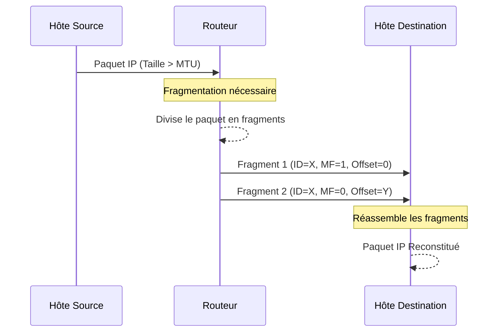

---
aliases:
  - Fragmentation de Paquets
  - Packet Fragmentation
  - IP Fragmentation
archetype: concept-reseau
couche_osi:
  - Couche 3 - Réseau
technologie:
  - IP
  - IPv4
tags:
  - fragmentation-paquets
  - reassemblage-paquets
  - mtu
  - protocole/ip
  - protocole/icmp
  - protocole/tcp
  - protocole/udp
  - modele-osi/couche-3
  - routeur
  - encapsulation
  - latence
  - perte-paquets
  - path-mtu-discovery
  - protocole/ip/df-flag
  - protocole/ip/mf-flag
  - protocole/ip/fragment-offset
cssclasses:
  - max
---

# Packet Fragmentation

> [!abstract] Définition
> La **fragmentation de paquets** est un mécanisme de la couche réseau qui divise un paquet de données IP trop volumineux pour être transmis sur un segment de réseau donné en plusieurs paquets plus petits, appelés *fragments*. Chaque fragment est ensuite transmis indépendamment et doit être réassemblé à destination pour reformer le paquet original.

## ⚙️ Mécanisme & Fonctionnement
Lorsqu'un routeur reçoit un **datagramme IP** dont la taille dépasse la **Maximum Transmission Unit (MTU)** du segment de réseau suivant, il procède à sa fragmentation. Ce processus est géré par la **couche IP**.

### Éléments clés du mécanisme :
*   **MTU (Maximum Transmission Unit)** : La taille maximale d'un paquet, y compris les en-têtes, que peut transporter un lien de couche 2 sans fragmentation.
*   **Champ Identification (ID)** : Un identifiant unique attribué à chaque paquet IP original. Tous les fragments d'un même paquet partagent le même ID, permettant au récepteur de les regrouper.
*   **Champ Flags (DF/MF)** :
    *   **DF (Don't Fragment)** : Si ce bit est à 1, le paquet ne doit pas être fragmenté. Si un routeur rencontre un paquet avec DF=1 et qu'il dépasse la MTU, il doit le supprimer et envoyer un message ICMP "Fragmentation Needed" (Type 3, Code 4) à la source.
    *   **MF (More Fragments)** : Ce bit est à 1 pour tous les fragments sauf le dernier, indiquant au destinataire qu'il doit s'attendre à d'autres fragments pour le même paquet.
*   **Champ Fragment Offset** : Indique la position du fragment dans le paquet original, mesurée en unités de 8 octets. Le premier fragment a un offset de 0.

Le routeur recalcule également le champ *Header Checksum* pour chaque nouveau fragment.

### Encapsulation / Traitement
*   **Entrée** : Un **datagramme IP** (par exemple, 1520 octets) dont la taille excède la MTU du lien de sortie (par exemple, 1500 octets).
*   **Action** :
    1.  Le routeur détermine la taille maximale des données pouvant être contenues dans un fragment (MTU - taille de l'en-tête IP).
    2.  Le datagramme original est divisé en plusieurs fragments.
    3.  Pour chaque fragment, un nouvel en-tête IP est créé. Les champs *Identification* sont copiés de l'original. Les champs *Flags* (MF) et *Fragment Offset* sont ajustés en fonction de la position du fragment.
    4.  Le *Header Checksum* est recalculé pour chaque fragment.
*   **Sortie** : Plusieurs **fragments IP** (par exemple, deux fragments de 1500 octets et 40 octets respectivement, avec des en-têtes IP mis à jour).

## 💡 Cas d'Usage Typique
La fragmentation de paquets est utilisée lorsque des **réseaux interconnectés** ont des MTU différentes, et qu'un paquet doit traverser un lien avec une MTU inférieure à sa taille actuelle.
1.  **Traversée de liens hétérogènes** : Par exemple, un paquet généré sur un réseau Ethernet (MTU 1500 octets) transitant par un lien PPPoE (MTU 1492 octets) ou un tunnel VPN (qui réduit la MTU effective).
2.  **Compatibilité avec des équipements anciens** : Permettre à des systèmes plus anciens ou des configurations spécifiques de gérer des paquets de grande taille qui autrement seraient rejetés.
3.  **Path MTU Discovery (PMTUD) en échec** : Si la découverte de la MTU du chemin ne fonctionne pas (par exemple, à cause de firewalls bloquant les messages ICMP), la fragmentation peut être le mécanisme de dernier recours pour que le trafic passe, bien que cela soit sous-optimal.

## ⚠️ Limitations & Problèmes
> [!warning] Points d'attention
> *   **Performance** :
    *   **Charge CPU** : La fragmentation et le réassemblage consomment des ressources CPU sur les routeurs intermédiaires (fragmentation) et sur l'hôte destinataire (réassemblage).
    *   **Délais** : Le réassemblage des fragments introduit des délais supplémentaires à destination, car tous les fragments doivent être reçus avant que le paquet original puisse être traité.
    *   **Perte de fragments** : Si un seul fragment est perdu, l'intégralité du paquet original doit être retransmise par la source, ce qui peut entraîner une retransmission inutile de tous les autres fragments déjà arrivés. Cela affecte particulièrement les protocoles de transport comme **TCP**, qui gèrent leur propre contrôle de flux et de retransmission. Pour **UDP**, la perte d'un fragment signifie la perte de l'ensemble du datagramme UDP.
    *   **Surcharge d'en-têtes** : Chaque fragment transporte son propre en-tête IP, augmentant le *overhead* et réduisant l'efficacité de la bande passante.
*   **Sécurité** :
    *   **Attaques par déni de service (DoS)** : Un attaquant peut envoyer de nombreux fragments incomplets ou malformés pour surcharger les ressources de réassemblage de l'hôte destinataire ou des équipements réseau (par exemple, routeurs, firewalls, équilibreurs de charge).
    *   **Contournement de firewalls et IDS/IPS** : La fragmentation peut être utilisée pour cacher des informations malveillantes en divisant le contenu en petits fragments que les règles de filtrage ou les moteurs d'inspection de sécurité ne sont pas toujours capables d'analyser correctement ensemble. Des attaques comme *Tiny Fragment Attacks* peuvent tenter de faire passer des informations critiques (comme des drapeaux TCP) dans des fragments dont la taille rend difficile l'inspection par les systèmes de sécurité.
    *   **Attaques par chevauchement de fragments** : Des fragments peuvent être intentionnellement envoyés de manière à ce qu'ils se chevauchent, potentiellement pour modifier le contenu du paquet final réassemblé et échapper à la détection.
*   **Impact sur IPv6** : IPv6 gère la fragmentation différemment. Seule l'hôte source peut fragmenter un paquet, et les routeurs intermédiaires ne fragmentent *jamais* les paquets IPv6. Si un routeur IPv6 rencontre un paquet trop grand pour la MTU du lien suivant, il doit le supprimer et envoyer un message ICMPv6 "Packet Too Big" à la source.
