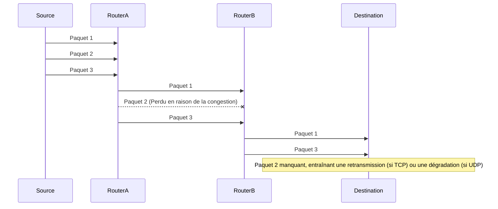

---
aliases:
  - Perte de Paquets
  - Packet Drop
  - Packet Dropping
archetype: concept-reseau
couche_osi:
  - "Couche 1 - Physique"
  - "Couche 2 - Liaison"
  - "Couche 3 - Réseau"
  - "Couche 4 - Transport"
technologie:
  - TCP
  - UDP
  - QoS
cssclasses:
  - max
tags:
  - reseau/perte-paquets
  - reseau/congestion
  - latence
  - reseau/performance
  - qos
  - protocole/tcp
  - protocole/udp
  - attaque/deni-de-service
  - vulnerabilite/mauvaise-configuration
  - interferences
  - surveillance
  - reseau/wan
---

# Packet Loss

> [!abstract] Définition
> La *perte de paquets* (packet loss) se produit lorsqu'un ou plusieurs paquets de données ne parviennent pas à destination via un réseau informatique. Cela peut entraîner une dégradation significative des performances des applications, notamment des retards, des retransmissions et des interruptions de service.

## ⚙️ Mécanisme & Fonctionnement
La perte de paquets n'est pas un mécanisme en soi, mais plutôt un symptôme d'un problème sous-jacent dans le flux de données. Elle se manifeste par l'absence d'accusé de réception pour les paquets envoyés ou par la détection de paquets manquants à la réception.

### Causes Courantes et Impacts sur les Applications
La perte de paquets peut être attribuée à diverses causes, chacune ayant des impacts distincts sur les applications et l'expérience utilisateur.

#### Causes
*   **Congestion du Réseau** : C'est la cause la plus fréquente. Lorsque le trafic réseau dépasse la capacité d'un routeur, d'un switch ou d'une liaison, les périphériques peuvent mettre en file d'attente (buffer) les paquets entrants. Si les files d'attente débordent, les périphériques commencent à *abandonner* (drop) les nouveaux paquets pour gérer la charge existante.
*   **Erreurs Matérielles** : Des câbles défectueux, des cartes réseau endommagées, des interfaces de routeur ou de switch défaillantes peuvent corrompre ou bloquer les paquets, les rendant irrécupérables et entraînant leur perte.
*   **Problèmes de Sécurité** : Les attaques de *déni de service* (DoS/DDoS) peuvent intentionnellement inonder un réseau ou un service, provoquant une congestion extrême et la perte de paquets légitimes. Les pare-feu mal configurés ou les systèmes de prévention d'intrusion peuvent également abandonner des paquets qu'ils identifient, à tort ou à raison, comme malveillants.
*   **Logiciels et Configurations Erronées** : Des bugs dans les pilotes de périphériques réseau, des systèmes d'exploitation ou des firmwares peuvent entraîner une gestion incorrecte des paquets. Des configurations réseau incorrectes, telles que des routes manquantes, des listes de contrôle d'accès (ACL) mal définies ou des paramètres de *qualité de service* (QoS) inappropriés, peuvent également provoquer l'abandon de paquets.
*   **Problèmes de Puissance du Signal** : Dans les réseaux sans fil, un signal faible ou des interférences peuvent entraîner la corruption ou la perte de paquets pendant la transmission.
*   **Buffers Insuffisants** : Les tampons (buffers) des périphériques réseau sont essentiels pour gérer les pics de trafic. Des tampons trop petits peuvent entraîner des pertes de paquets même sous une charge modérée si le trafic est intermittent.

#### Impacts sur les Applications
*   **Applications en Temps Réel (VoIP, Vidéo Conférence, Jeux)** : La perte de paquets est particulièrement préjudiciable. Elle se traduit par des coupures audio, des images figées, des délais importants et une expérience utilisateur fortement dégradée, car ces applications sont très sensibles à la latence et à la gigue.
*   **Applications Basées sur TCP (Navigation Web, Transfert de Fichiers)** : TCP est un protocole fiable qui utilise des mécanismes de retransmission pour compenser la perte de paquets. Cependant, la détection de la perte et la retransmission entraînent une augmentation de la latence et une réduction du débit, ce qui ralentit le téléchargement de fichiers ou le chargement des pages web. Des pertes importantes peuvent même provoquer des déconnexions.
*   **Applications Basées sur UDP (Streaming Vidéo/Audio sans correction, DNS)** : UDP n'inclut pas de mécanismes de retransmission intégrés. La perte de paquets est simplement ignorée par le protocole, ce qui peut entraîner une dégradation perceptible de la qualité (par exemple, des pixels manquants ou des artefacts sonores dans le streaming).

## 💡 Cas d'Usage Typique
La compréhension et la gestion de la perte de paquets sont critiques dans plusieurs scénarios d'entreprise :
1.  **Surveillance de la Qualité de Service (QoS)** : Les entreprises déploient des systèmes de surveillance réseau pour détecter la perte de paquets en temps réel, notamment pour les applications critiques comme la voix sur IP (VoIP) ou la visioconférence. Cela permet d'assurer un niveau de service acceptable et de réagir rapidement aux problèmes.
2.  **Optimisation des Réseaux Étendus (WAN)** : La perte de paquets sur les liaisons WAN peut être coûteuse en termes de performance. Des techniques comme l'optimisation WAN, l'équilibrage de charge et la redondance des liens sont utilisées pour minimiser l'impact de la perte.
3.  **Dépannage Réseau** : Lorsqu'un utilisateur signale des lenteurs ou des problèmes de connectivité, la vérification de la perte de paquets est une étape fondamentale du dépannage, permettant d'identifier si le problème est lié à la capacité du réseau, à des erreurs matérielles ou à des configurations.

## ⚠️ Limitations & Problèmes

> [!warning] Méthodes de Résolution et Points d'attention
> *   **Détection** :
    *   **ICMP (Ping, Traceroute)** : Des outils comme `ping` mesurent le pourcentage de paquets perdus entre une source et une destination, tandis que `traceroute` peut aider à identifier le tronçon du réseau où la perte se produit.
    *   **Tests de Jitter/Perte Spécifiques** : Des outils spécialisés comme *iperf* ou des sondes réseau effectuent des tests actifs en envoyant du trafic synthétique pour mesurer précisément la perte de paquets, la latence et la gigue.
    *   **SNMP (Simple Network Management Protocol)** : Les systèmes de supervision réseau interrogent les périphériques pour collecter des statistiques sur les compteurs d'erreurs d'interface, les drops de paquets dans les files d'attente (buffers).
    *   **NetFlow/IPFIX** : Ces protocoles fournissent des données détaillées sur le flux de trafic, permettant d'identifier des schémas de perte liés à des applications ou des utilisateurs spécifiques.
*   **Mitigation** :
    *   **Augmentation de la Bande Passante** : La solution la plus directe pour la congestion est d'augmenter la capacité des liaisons réseau ou des périphériques.
    *   **Qualité de Service (QoS)** : Implémenter des politiques QoS permet de prioriser le trafic critique (VoIP, vidéo) par rapport au trafic moins sensible (transfert de fichiers), garantissant que les paquets importants soient moins susceptibles d'être abandonnés en cas de congestion.
    *   **Gestion des Buffers** : Optimiser la taille des files d'attente (buffers) sur les routeurs et les commutateurs peut aider à absorber les pics de trafic temporaires sans abandonner les paquets.
    *   **Redondance et Équilibrage de Charge** : Mettre en place des chemins réseau redondants et des mécanismes d'équilibrage de charge peut distribuer le trafic, réduire la congestion sur un seul lien et fournir une tolérance aux pannes en cas de défaillance d'un chemin.
    *   **Maintenance Matérielle et Logicielle** : Remplacer les équipements défectueux, maintenir les logiciels et firmwares à jour, et revoir régulièrement les configurations réseau sont essentiels pour prévenir les pertes liées aux erreurs.
    *   **Sécurité Réseau** : Déployer et configurer correctement les pare-feu, les systèmes de détection/prévention d'intrusion (IDS/IPS) et les solutions anti-DDoS pour protéger le réseau contre les attaques qui pourraient causer une perte de paquets intentionnelle.