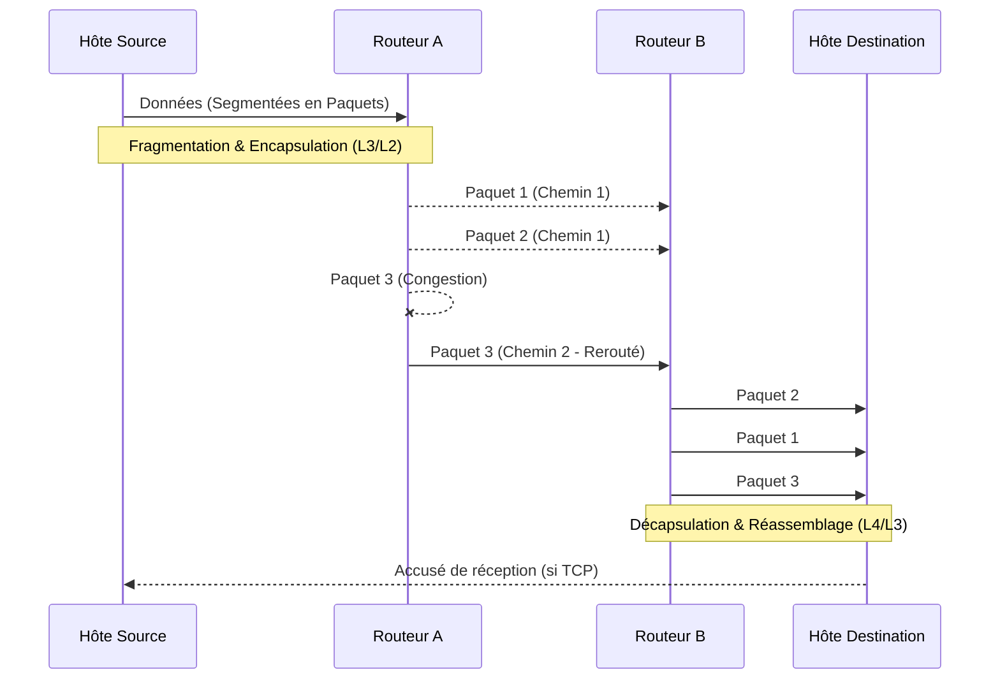

---
aliases:
  - Commutation de paquets
  - Packet Switching
archetype: concept-reseau
couche_osi:
  - "Couche 2 - Liaison"
  - "Couche 3 - Réseau"
  - "Couche 4 - Transport"
technologie:
  - IP
  - Ethernet
  - TCP
  - UDP
cssclasses:
  - max
tags:
  - modele/packet-switching
  - reseau
  - reseau/paquet
  - transmission-donnees
  - routage/dynamique
  - mecanisme/encapsulation
  - decapsulation
  - protocole/tcp
  - protocole/ip
  - protocole/udp
  - architecture/reseau
  - mtu
  - qos
  - fragmentation-paquets
  - reassemblage-paquets
---

# Packet Switching

> [!abstract] Définition
> Le **Packet Switching** (commutation de paquets) est une technique de transmission de données utilisée dans les réseaux informatiques où les informations sont divisées en petites unités appelées *paquets*. Au lieu de réserver un canal de communication dédié pour toute la durée de la transmission, chaque paquet est envoyé indépendamment à travers le réseau et réassemblé à destination pour reconstituer les données originales. Cette méthode permet à plusieurs utilisateurs de partager efficacement les ressources du réseau.

## ⚙️ Mécanisme & Fonctionnement
Le Packet Switching fonctionne en segmentant les données, en les routant de manière dynamique et en les réassemblant à la destination.

### Principes Clés

*   **Fragmentation des Paquets** : Les données volumineuses sont divisées en unités plus petites, appelées paquets. Chaque paquet est composé d'un *en-tête* et d'une *charge utile (payload)*. L'en-tête contient des informations de contrôle cruciales, telles que les adresses source et destination, les numéros de séquence et d'autres informations pour le routage. La taille maximale d'un paquet est déterminée par l'Unité de Transmission Maximale (*Maximum Transmission Unit - MTU*) du réseau. Si un paquet est plus grand que la MTU, il peut être fragmenté en plusieurs sous-paquets par l'hôte source ou un routeur intermédiaire.
*   **Routage Dynamique** : Les paquets sont transmis indépendamment à travers le réseau. Les routeurs examinent l'adresse de destination dans l'en-tête de chaque paquet et utilisent des *tables de routage* pour déterminer le meilleur chemin à suivre. Contrairement à la commutation de circuits, il n'y a pas de chemin fixe dédié, ce qui permet aux paquets d'emprunter des routes différentes en fonction des conditions du réseau (ex: congestion ou pannes). Les routeurs utilisent la méthode "store-and-forward", où chaque paquet est stocké momentanément puis transmis au nœud suivant.
*   **Assemblage des Paquets** : À leur arrivée, les paquets peuvent être désordonnés car ils ont emprunté des chemins différents. La destination est responsable de réordonner les paquets en utilisant les numéros de séquence inclus dans leurs en-têtes et de les réassembler pour reconstituer le message original. Les protocoles comme TCP (Transmission Control Protocol) assurent la fiabilité en détectant les paquets perdus et en demandant leur retransmission, ainsi qu'en gérant l'ordre d'arrivée.

### Encapsulation / Traitement
*   **Entrée** : Données brutes générées par une application (ex: un fichier, un flux vidéo).
*   **Action** :
    1.  **Segmentation** : Les données sont divisées en segments par la couche transport (ex: TCP/UDP), puis en paquets IP par la couche réseau.
    2.  **Encapsulation** : Chaque paquet reçoit un en-tête contenant des informations de routage (adresses IP source/destination) et de contrôle (numéros de séquence, indicateurs de fragmentation). À la couche liaison, le paquet IP est encapsulé dans une trame (ex: Ethernet) avec des adresses MAC.
    3.  **Routage** : Les routeurs et commutateurs intermédiaires lisent les adresses dans les en-têtes (MAC puis IP) pour faire transiter les paquets vers leur destination, en déterminant dynamiquement le chemin le plus efficace.
    4.  **Décapsulation et Réassemblage** : À destination, les en-têtes de couche liaison et réseau sont retirés. Les fragments sont réassemblés, les segments réordonnés, et l'application reçoit les données originales.
*   **Sortie** : Données originales complètes et intègres, disponibles pour l'application destinataire.

## 💡 Cas d'Usage Typique
Le Packet Switching est le fondement des réseaux modernes et d'Internet.
1.  **Internet et Web** : La navigation web, le streaming vidéo et les services cloud reposent entièrement sur la commutation de paquets pour une transmission efficace et résiliente des données.
2.  **Applications en temps réel** : Bien que plus sensible aux délais, le Packet Switching est utilisé pour la VoIP (Voix sur IP) et les vidéoconférences, en optimisant la qualité de service (QoS) pour prioriser ces flux.
3.  **Réseaux d'entreprise (LAN/WAN)** : Tous les réseaux locaux (LAN) basés sur Ethernet et les réseaux étendus (WAN) utilisent la commutation de paquets pour le partage de fichiers, les emails, et l'accès aux bases de données.
4.  **Internet des Objets (IoT)** : Les appareils IoT échangent de petites quantités de données sous forme de paquets, ce qui est idéal pour leur communication intermittente et peu gourmande en bande passante.

## ⚠️ Limitations & Problèmes
> [!warning] Points d'attention
> *   **Performance** :
> 	* **Latence et Jitter** : Étant donné que les paquets peuvent emprunter des chemins différents et que leur transmission dépend de la charge réseau, il peut y avoir des délais variables (*latence*) et des variations dans ces délais (*jitter*), ce qui peut affecter les applications en temps réel.
> 	* **Perte de paquets** : En cas de congestion réseau ou de problèmes matériels, des paquets peuvent être perdus. Les protocoles comme TCP gèrent la retransmission, mais cela introduit des délais supplémentaires.
> 	* **Charge de traitement** : Les routeurs et commutateurs doivent traiter chaque paquet individuellement, ce qui nécessite une puissance de traitement significative et de la mémoire RAM, surtout dans les réseaux à fort trafic.
> *   **Sécurité** :
> 	* **Espionnage de paquets** (*Packet Sniffing*) : Comme les paquets peuvent être interceptés et analysés, la sécurité des données transmises dépend des protocoles de chiffrement utilisés (ex: SSL/TLS) plutôt que de la commutation de paquets elle-même.

### Comparaison avec la Commutation de Circuits (Circuit Switching)
| Caractéristique             | Packet Switching                                          | Circuit Switching                                           |
| :-------------------------- | :-------------------------------------------------------- | :---------------------------------------------------------- |
| **Établissement connexion** | Connexion sans circuit dédié (*connectionless* ou *virtual circuit*) | Circuit dédié établi avant la transmission |
| **Utilisation bande passante** | Partagée, allocation dynamique, très efficace | Réservée, fixe, peut être sous-utilisée      |
| **Routage**                 | Dynamique, paquets peuvent prendre différents chemins | Fixe, chemin unique pour toute la session    |
| **Délai**                   | Variable, peut avoir du jitter              | Constant et prédictible                 |
| **Fiabilité**               | Gérée par les protocoles (ex: TCP retransmet les paquets perdus) | Élevée grâce au canal dédié                 |
| **Complexité**              | Requiert des protocoles complexes et des équipements intelligents | Relativement simple pour les équipements terminaux |
| **Cas d'usage typique**     | Internet, données informatiques, email, web, streaming | Téléphonie traditionnelle, fax           |
