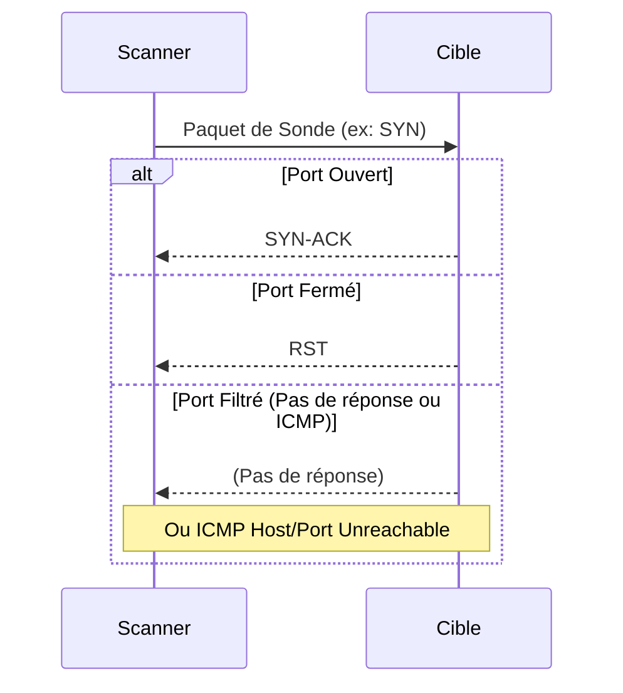

---
aliases:
  - Scan de Ports
  - Port Scan
  - Port Scanning
archetype: concept-reseau
couche_osi:
  - "Couche 3 - Réseau"
  - "Couche 4 - Transport"
technologie:
  - Nmap
cssclasses:
  - max
---

# Port Scanning

> [!abstract] Définition
> Le **scan de ports** est une technique utilisée pour déterminer quels ports sont ouverts et accessibles sur un hôte réseau, révélant ainsi les services ou applications actifs sur ces ports. Il s'agit d'une phase cruciale dans l'exploration d'un réseau ou la recherche de vulnérabilités.

## ⚙️ Mécanisme & Fonctionnement
Le principe général du scan de ports consiste à envoyer des paquets de sonde spécifiques à une série de ports cibles et à analyser les réponses reçues (ou l'absence de réponse) pour en déduire l'état du port.

### Types de Scans & Traitement
*   **SYN Scan (Half-Open Scan)**
    *   **Entrée** : Envoi d'un paquet *SYN* (synchronisation) au port cible.
    *   **Action** : Si le port est ouvert, la cible répond avec un paquet *SYN-ACK*. Le scanner envoie ensuite un *RST* (reset) au lieu d'un *ACK* final pour ne pas établir complètement la connexion. Si le port est fermé, la cible répond avec un *RST*.
    *   **Sortie** : Déduction de l'état du port (ouvert, fermé, filtré) sans journaliser complètement la connexion sur la cible.
*   **Connect Scan (Full Connect)**
    *   **Entrée** : Tentative d'établissement d'une connexion TCP complète via l'appel système `connect()`.
    *   **Action** : Si le port est ouvert, la connexion TCP est établie (SYN, SYN-ACK, ACK). Le scanner la termine ensuite. Si le port est fermé, la connexion est rejetée (SYN, RST).
    *   **Sortie** : Déduction de l'état du port. Plus bruyant que le SYN scan car il crée des entrées de connexion complètes dans les journaux.
*   **UDP Scan**
    *   **Entrée** : Envoi d'un paquet *UDP* vide (ou avec une petite charge utile) au port cible.
    *   **Action** : Si le port est fermé, la cible répond généralement avec un message *ICMP Port Unreachable*. Si le port est ouvert, il n'y a souvent pas de réponse (un service actif pourrait répondre, mais ce n'est pas garanti).
    *   **Sortie** : L'absence de réponse ou une réponse spécifique (ICMP Port Unreachable) permet de déduire l'état du port.
*   **FIN, NULL, Xmas Scan**
    *   **Entrée** : Envoi de paquets TCP avec des drapeaux spécifiques (FIN, aucun drapeau pour NULL, FIN/PSH/URG pour Xmas).
    *   **Action** : Ces scans tentent de contourner les pare-feu rudimentaires. Si le port est fermé, la cible répond avec un *RST*. Si le port est ouvert, elle ne répond généralement pas (pour les systèmes basés sur la pile TCP/IP de RFC 793).
    *   **Sortie** : L'absence de réponse indique un port *ouvert|filtré*, tandis qu'un *RST* indique un port *fermé*.

## 💡 Cas d'Usage Typique
Le scan de ports est un outil fondamental avec plusieurs applications pratiques en entreprise :
1.  **Découverte de Services et d'Hôtes** : Permet aux administrateurs réseau d'identifier les machines actives sur un segment réseau et les services qu'elles exposent. Essentiel pour la gestion des inventaires et la cartographie du réseau.
2.  **Audit de Sécurité et Recherche de Vulnérabilités** : Les équipes de sécurité (internes ou externes) utilisent les scans de ports pour simuler des attaques et identifier les ports ouverts inutilement, les services obsolètes ou mal configurés qui pourraient présenter des failles de sécurité.
3.  **Vérification des Règles de Pare-feu** : Un scan de ports permet de confirmer que les règles de pare-feu sont correctement appliquées et que seuls les ports autorisés sont accessibles de l'extérieur ou entre différents segments du réseau.
4.  **Diagnostic et Dépannage** : En cas de problème de connectivité à un service, un scan de ports peut aider à déterminer si le port est bien ouvert sur la machine cible et si le service écoute comme prévu.

## ⚠️ Limitations & Problèmes
> [!warning] Points d'attention
> *   **Performance** : Un scan intensif de nombreux ports sur de nombreuses cibles peut générer un trafic réseau significatif, potentiellement ralentir le réseau et surcharger les hôtes cibles ou les équipements de sécurité (IDS/IPS).
> *   **Détection par les Systèmes de Sécurité** : Les scans de ports sont souvent considérés comme des activités suspectes et peuvent déclencher des alertes sur les systèmes de détection d'intrusion (IDS) ou de prévention d'intrusion (IPS).
> *   **Sécurité** :
    *   **Faux Positifs/Négatifs** : Les pare-feu et autres dispositifs de sécurité peuvent manipuler les réponses aux scans, conduisant à des résultats trompeurs (ports ouverts rapportés comme fermés, et inversement).
    *   **Reconnaissance pour Attaques** : Les scans de ports sont une étape préliminaire courante pour les attaquants afin de découvrir des points d'entrée potentiels et des vulnérabilités exploitables sur les systèmes cibles.
    *   **Impact sur la Disponibilité** : Dans de rares cas, des scans agressifs ou malformés peuvent provoquer une instabilité de certains services réseau fragiles ou même des dénis de service (DoS) sur des systèmes vulnérables.