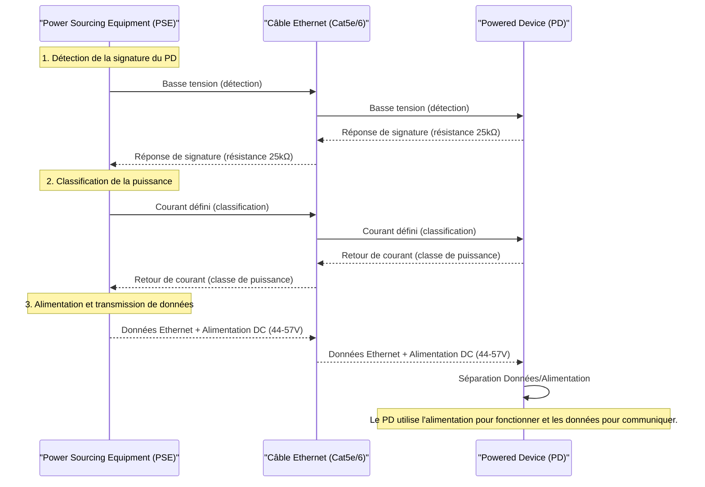

---
aliases:
  - Power Over Ethernet
  - PoE
  - Alimentation par Ethernet
archetype: concept-reseau
couche_osi:
  - "Couche 1 - Physique"
technologie:
  - PoE
cssclasses:
  - max
tags:
  - protocole/poe
  - protocole/ethernet
  - norme/ieee-802-3af
  - norme/ieee-802-3at
  - norme/ieee-802-3bt
  - alimentation-electrique
  - materiel/reseau
  - cable/ethernet
  - modele-osi/couche-1
  - detection
  - classification
  - gestion-energie
  - power-sourcing-equipment
  - powered-device
  - alimentation-fantome
  - iot
  - application/voip
  - point-acces-sans-fil
  - camera-ip
---

# Power Over Ethernet (PoE)

> [!abstract] Définition
> Le Power over Ethernet (PoE) est une technologie qui permet de transmettre l'alimentation électrique (courant continu) et les données réseau sur un même câble Ethernet à paires torsadées. Cela simplifie le déploiement de périphériques réseau en éliminant le besoin de câbles d'alimentation et de prises électriques séparées, réduisant ainsi les coûts et la complexité d'installation.

## ⚙️ Mécanisme & Fonctionnement

Un système PoE se compose de deux éléments principaux : le **Power Sourcing Equipment (PSE)** et le **Powered Device (PD)**.

*   **PSE (Power Sourcing Equipment)** : C'est l'équipement qui injecte la puissance sur le câble Ethernet. Il peut s'agir d'un commutateur PoE (appelé *endspan*) ou d'un injecteur PoE (appelé *midspan*) placé entre un commutateur non PoE et le PD. Le PSE est responsable de la détection, de la classification et de la gestion de l'allocation d'énergie par port.
*   **PD (Powered Device)** : C'est le périphérique qui reçoit l'alimentation du PSE via le câble Ethernet. Les exemples incluent les points d'accès sans fil (WAP), les caméras IP, les téléphones VoIP et les capteurs IoT.

Le processus d'alimentation PoE se déroule en plusieurs étapes :

1.  **Détection** : Le PSE envoie une faible tension sur le port Ethernet pour vérifier si le périphérique connecté est un PD compatible PoE. Le PD présente une résistance de signature (typiquement 25 kΩ) que le PSE détecte. Si la signature est valide, le PSE procède à la classification. Cette étape protège les appareils non PoE contre tout dommage accidentel.
2.  **Classification** : Le PSE détermine les besoins en énergie du PD en mesurant le courant résultant d'une tension définie qu'il applique. Les PD sont classés en différentes catégories de puissance (Classes 0 à 8), ce qui permet au PSE d'allouer la puissance nécessaire.
3.  **Alimentation** : Une fois la classification effectuée, le PSE fournit la pleine tension de fonctionnement (généralement entre 44 et 57 V DC) au PD. Le PD convertit ensuite cette tension PoE en une tension adaptée à ses circuits internes.

Les normes IEEE 802.3 spécifient les méthodes de fourniture de puissance :

*   **Mode A (Paires de données)** : La puissance est délivrée sur les paires de fils utilisées pour la transmission des données (paires 2 et 3 en T568A/B pour 10BASE-T et 100BASE-TX).
*   **Mode B (Paires de rechange)** : La puissance est délivrée sur les paires de fils non utilisées pour les données (paires 1 et 4 en T568A/B pour 10BASE-T et 100BASE-TX).
*   **Mode 4 paires** : Avec les normes plus récentes (802.3bt), les quatre paires de fils du câble Ethernet sont utilisées simultanément pour fournir une puissance accrue, y compris pour les liaisons 1000BASE-T, 2.5GBASE-T, 5GBASE-T et 10GBASE-T où toutes les paires sont utilisées pour les données.

### Normes PoE (IEEE 802.3)

L'évolution du PoE est définie par les normes IEEE 802.3, qui augmentent la puissance disponible pour les périphériques :

*   **IEEE 802.3af (PoE)** : Introduite en 2003, elle fournit jusqu'à 15,4 W au PSE, avec un minimum de 12,95 W disponible au PD après les pertes de câble. Elle utilise deux paires de fils.
*   **IEEE 802.3at (PoE+)** : Lancée en 2009, elle augmente la puissance à 30 W au PSE et un minimum de 25,5 W disponible au PD. Elle utilise également deux paires de fils mais avec un courant plus élevé. Rétrocompatible avec 802.3af.
*   **IEEE 802.3bt (PoE++ / 4PPoE)** : Ratifiée en 2018, cette norme introduit deux types supplémentaires :
    *   **Type 3 (PoE++)** : Fournit jusqu'à 60 W au PSE, avec au moins 51 W au PD.
    *   **Type 4 (High-Power PoE)** : Peut délivrer jusqu'à 90 W (voire 100 W) au PSE, avec au moins 71 W au PD.
    Ces types utilisent les quatre paires de fils du câble Ethernet pour une meilleure efficacité et une puissance accrue. La norme 802.3bt est rétrocompatible avec les normes précédentes.

### Encapsulation / Traitement
Le PoE ne modifie pas l'encapsulation des données Ethernet, mais il les transporte en parallèle avec l'alimentation électrique.

*   **Entrée** : Trame Ethernet (données numériques) et demande d'alimentation électrique du PD.
*   **Action** : Le PSE effectue la détection et la classification du PD via des signaux de basse tension (Couche 1 du modèle OSI). Une fois la puissance négociée, le PSE injecte une tension continue (typiquement 44-57 V DC) sur les paires de câbles Ethernet, en utilisant la technique de l'alimentation fantôme pour ne pas interférer avec la transmission des données.
*   **Sortie** : Trame Ethernet (données numériques) et alimentation électrique continue fournies simultanément au PD. Le PD sépare ensuite l'alimentation des données pour son fonctionnement.

## 💡 Cas d'Usage Typique
Le PoE est largement adopté pour sa flexibilité et sa simplicité d'installation.
1.  **Téléphones VoIP** : Permet de déployer des téléphones IP sans avoir besoin d'une prise électrique à proximité, simplifiant le câblage de bureau.
2.  **Points d'accès sans fil (WAP)** : Facilite le placement optimal des WAP pour une couverture Wi-Fi étendue, même dans des zones difficiles d'accès.
3.  **Caméras de surveillance IP** : Idéal pour les caméras de sécurité qui nécessitent une alimentation fiable et une connexion réseau dans des emplacements variés, y compris en extérieur.
4.  **Éclairage LED intelligent et automatisation des bâtiments** : Les normes PoE++ (802.3bt) à haute puissance permettent d'alimenter des systèmes d'éclairage LED, des capteurs IoT et des contrôleurs industriels, favorisant les bâtiments intelligents.
5.  **Bornes de point de vente (PoS) et signalisation numérique** : Permet une installation flexible de ces dispositifs sans contraintes de prises de courant.

## ⚠️ Limitations & Problèmes

> [!warning] Points d'attention
> *   **Distance limitée** : La distance maximale pour le PoE est de 100 mètres (328 pieds) avec un câble Ethernet standard, tout comme pour les données. Au-delà, la puissance se dégrade en raison de la résistance du câble. Des extendeurs PoE peuvent être utilisés pour prolonger cette distance.
> *   **Budget de puissance** : Un commutateur PoE a un budget de puissance total limité. Il est crucial de planifier la consommation électrique de tous les PD connectés pour éviter la surcharge.
> *   **Compatibilité des normes** : Bien que les normes plus récentes soient rétrocompatibles, un PSE plus ancien (ex: 802.3af) ne pourra pas alimenter un PD nécessitant une puissance plus élevée (ex: 802.3bt Type 4).
> *   **Coût des équipements** : Les commutateurs PoE sont généralement plus coûteux que les commutateurs Ethernet non PoE, bien que les économies sur l'installation de câblage électrique puissent compenser ce surcoût.
> *   **Problèmes de sécurité** : Une mauvaise configuration ou un budget de puissance insuffisant peut entraîner des interruptions de service si le PSE coupe l'alimentation en cas de surcharge ou de détection d'une anomalie.