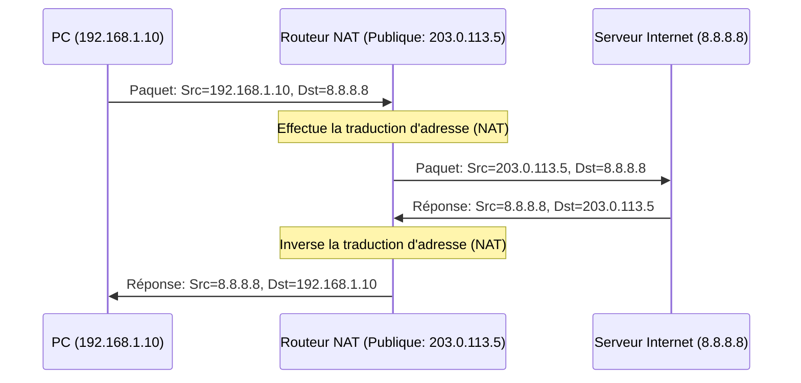

---
aliases:
  - Plages d'Adresses IP Privées
  - Private IP Address Ranges
  - RFC 1918
archetype: concept-reseau
couche_osi:
  - "Couche 3 - Réseau"
technologie:
  - IPv4
  - NAT
cssclasses:
  - max
tags:
  - reseau/adressage/ip/privee
  - norme/rfc/rfc-1918
  - nat
  - protocole/ip/ipv4
  - lan
  - reseau/adressage/ip/classes
  - securite/reseau
  - depannage
---

# Private IP Address Ranges

> [!abstract] Définition
> Les *plages d'adresses IP privées* sont des blocs d'adresses IPv4 réservés pour être utilisés dans les réseaux locaux (LAN). Contrairement aux adresses IP publiques, elles ne sont **pas routables** directement sur l'Internet public, offrant ainsi un mécanisme essentiel pour la gestion des ressources réseau et la conservation des adresses IPv4.

## ⚙️ Mécanisme & Fonctionnement
Le fonctionnement des adresses IP privées repose sur une spécification du RFC 1918, qui définit les blocs d'adresses spécifiques que les organisations peuvent utiliser librement à l'intérieur de leurs réseaux privés. Ces adresses sont conçues pour être uniques au sein d'un réseau local donné, mais elles peuvent être réutilisées dans de nombreux réseaux privés distincts sans créer de conflits globaux sur Internet.

Lorsqu'un paquet provenant d'une adresse IP privée tente d'atteindre une destination sur Internet, il doit passer par un mécanisme de **Traduction d'Adresses Réseau (NAT)**. Le routeur ou le pare-feu effectuant le NAT remplace l'adresse IP source privée par une adresse IP publique routable avant de transmettre le paquet sur Internet.

### Encapsulation / Traitement
*   **Entrée** : Un paquet IP arrive sur un *routeur de bordure* avec une *adresse IP source privée* (par exemple, 192.168.1.10) et une *adresse IP de destination publique* (par exemple, 8.8.8.8).
*   **Action** : Le routeur, configuré pour le NAT, identifie l'adresse source comme privée. Il enregistre la session de communication et remplace l'adresse IP source privée par une de ses propres *adresses IP publiques* disponibles. Il ajuste également le *checksum* du paquet IP et du segment TCP/UDP si nécessaire.
*   **Sortie** : Le paquet modifié, avec une *adresse IP source publique*, est ensuite routé vers sa destination sur Internet. Lors de la réponse, le routeur NAT inverse le processus pour renvoyer le paquet à l'adresse IP privée interne correcte.

## 💡 Cas d'Usage Typique
Les plages d'adresses IP privées sont fondamentales pour la conception et le fonctionnement des réseaux d'entreprise et domestiques :

1.  **Conservation des Adresses IPv4 Publiques** : Elles permettent à un grand nombre d'appareils au sein d'un réseau local de partager un nombre limité, voire une seule, adresse IP publique pour accéder à Internet. Ceci est crucial face à la rareté des adresses IPv4 publiques.
2.  **Sécurité et Isolement du Réseau** : En n'étant pas routables sur Internet, les réseaux utilisant des adresses privées sont naturellement isolés des menaces directes de l'extérieur. Les hôtes internes ne sont pas directement accessibles depuis Internet sans une configuration explicite (ex: redirection de ports via NAT).
3.  **Simplification de la Conception de Réseaux** : Les administrateurs réseau peuvent attribuer des adresses IP aux hôtes sans avoir besoin de coordonner avec les registres Internet ou d'acheter des blocs d'adresses. Cela facilite le déploiement rapide et la renumérotation des réseaux.
4.  **Flexibilité et Réutilisation** : Les mêmes plages d'adresses privées peuvent être utilisées simultanément dans des millions de réseaux locaux différents à travers le monde sans aucun conflit, ce qui permet une grande flexibilité dans l'architecture réseau.

Les plages spécifiques définies par le RFC 1918 sont les suivantes :

*   **Classe A** : `10.0.0.0` à `10.255.255.255` (un seul bloc /8)
*   **Classe B** : `172.16.0.0` à `172.31.255.255` (16 blocs /16 consécutifs)
*   **Classe C** : `192.168.0.0` à `192.168.255.255` (256 blocs /16 consécutifs)

## ⚠️ Limitations & Problèmes
> [!warning] Points d'attention
> *   **Performance du NAT** : La traduction d'adresses par NAT introduit un coût de traitement supplémentaire sur les routeurs, ce qui peut affecter la latence et le débit, surtout pour un grand nombre de connexions simultanées. Le NAT peut également briser certaines applications ou protocoles qui intègrent des adresses IP dans leur *payload*.
> *   **Complexité du Dépannage** : Le NAT masque les adresses IP internes, ce qui peut rendre le dépannage de bout en bout plus difficile, notamment pour identifier la source réelle d'un problème sur un réseau étendu.
> *   **Absence de Connectivité de Bout en Bout** : Les hôtes derrière le NAT ne peuvent pas initier directement des communications entrantes depuis Internet sans configuration spécifique (comme la redirection de port ou le *port forwarding*), ce qui complique les applications peer-to-peer ou les services hébergés en interne.
> *   **Conflits d'Adresses** : Bien que les plages privées soient conçues pour éviter les conflits sur Internet, des conflits peuvent survenir si deux réseaux privés distincts utilisant les mêmes plages d'adresses tentent de se connecter (par exemple, via un VPN), nécessitant alors des solutions complexes comme le *double NAT* ou la renumérotation.