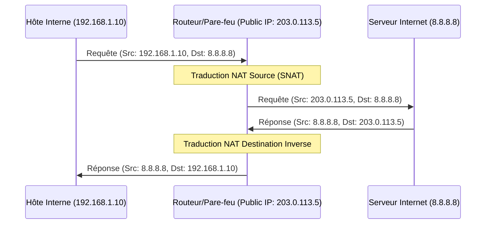

---
aliases:
  - "Adresse IP Publique"
  - "Public IP Address"
  - "IP Publique"
  - "Public IP"
archetype: concept-reseau
couche_osi:
  - "Couche 3 - Réseau"
technologie:
  - "IP Addressing"
  - "NAT"
cssclasses:
  - max
tags:
  - adresse-ip
  - protocole/ip/adresse-publique
  - nat
  - nat/pat
  - encapsulation
  - decapsulation
  - routage
  - internet/acces
  - vpn
  - protocole/ip/epuisement-adresses
  - securite
  - vulnerabilite
  - economie/cout
  - internet/fai
  - pare-feu
  - reseau/local
  - concept/definition
  - protocole/ip
---

# Public IP Address

> [!abstract] Définition
> Une **adresse IP publique** est une adresse IP unique globalement attribuée à un appareil connecté à Internet. Elle est indispensable pour permettre à cet appareil de communiquer directement avec d'autres hôtes sur le réseau Internet. Contrairement aux *adresses IP privées* qui sont utilisées au sein de réseaux locaux et ne sont pas routables sur Internet, l'adresse IP publique est visible et accessible depuis n'importe quel point du réseau mondial. C'est le mécanisme clé qui permet aux paquets de données de trouver leur chemin à travers les routeurs et les fournisseurs d'accès jusqu'à leur destination finale sur Internet.

## ⚙️ Mécanisme & Fonctionnement
L'adresse IP publique est le point d'identification de votre réseau local (ou d'un hôte spécifique configuré) sur l'Internet mondial. La communication entre un hôte interne utilisant une adresse IP privée et un serveur externe sur Internet s'appuie généralement sur la *Traduction d'Adresses Réseau* (**NAT**) effectuée par un routeur ou un pare-feu.

### Encapsulation / Traitement (Outbound - du LAN vers Internet)
*   **Entrée** : Un paquet quitte un hôte interne avec une **adresse IP source privée** (ex: 192.168.1.10) et une **adresse IP destination publique** (ex: 8.8.8.8).
*   **Action** : Le routeur périphérique (ou pare-feu) qui fait l'interface avec Internet intercepte le paquet. Il effectue une *Traduction d'Adresse Réseau (NAT)*, remplaçant l'adresse IP source privée par son propre **adresse IP publique**. Pour les connexions sortantes, cela est souvent réalisé via *Source NAT (SNAT)* ou *Port Address Translation (PAT)*.
*   **Sortie** : Le paquet est envoyé sur Internet avec l'**adresse IP publique** du routeur comme source et l'adresse IP publique de destination inchangée.

### Décapsulation / Traitement (Inbound - d'Internet vers le LAN)
*   **Entrée** : Un paquet de réponse arrive du serveur Internet, destiné à l'**adresse IP publique** du routeur (qui était l'adresse source lors de la requête initiale).
*   **Action** : Le routeur reçoit le paquet. Grâce à sa table de traduction NAT, il identifie que ce paquet est une réponse à une connexion initiée par un hôte interne spécifique. Il remplace l'adresse IP destination (son adresse IP publique) par l'**adresse IP privée** de l'hôte interne correspondant.
*   **Sortie** : Le paquet est ensuite routé vers l'hôte interne du réseau local avec son adresse IP privée comme destination.

## 💡 Cas d'Usage Typique
L'utilisation des adresses IP publiques est fondamentale pour toute activité en ligne :
1.  **Accès à Internet pour les hôtes internes** : Permet à tous les appareils d'un réseau local (utilisant des adresses IP privées) de partager une ou plusieurs adresses IP publiques pour accéder aux ressources du web, envoyer des e-mails, etc., via le mécanisme de NAT.
2.  **Hébergement de services accessibles depuis Internet** : Des serveurs Web, serveurs de messagerie, serveurs VPN ou toute application devant être joignable depuis l'extérieur du réseau d'entreprise nécessitent une adresse IP publique dédiée, ou une redirection de port (Port Forwarding / DNAT) sur l'adresse IP publique du routeur vers une adresse IP privée spécifique du serveur interne.
3.  **Communication inter-succursales via VPN** : Deux sites distants d'une même entreprise peuvent établir un tunnel VPN chiffré sur Internet en utilisant leurs adresses IP publiques respectives comme points d'ancrage pour l'établissement de la connexion sécurisée.

## ⚠️ Limitations & Problèmes
> [!warning] Points d'attention
> *   **Épuisement IPv4** : Le nombre d'adresses IPv4 publiques disponibles est limité, ce qui a conduit à l'adoption de NAT à grande échelle et au développement d'IPv6.
> *   **Complexité du NAT** : Bien que nécessaire, le NAT peut introduire des complications pour certaines applications qui dépendent d'une connectivité de bout en bout directe, ou pour les communications P2P (Peer-to-Peer).
> *   **Sécurité** : Une adresse IP publique expose potentiellement le réseau ou les services qu'elle représente aux menaces d'Internet. Une configuration incorrecte des pare-feu ou des redirections de port peut créer des vulnérabilités exploitables.
> *   **Coût** : Les adresses IP publiques sont des ressources précieuses et sont souvent allouées par les FAI (Fournisseurs d'Accès Internet) ou les RIR (Regional Internet Registries) à un coût associé.