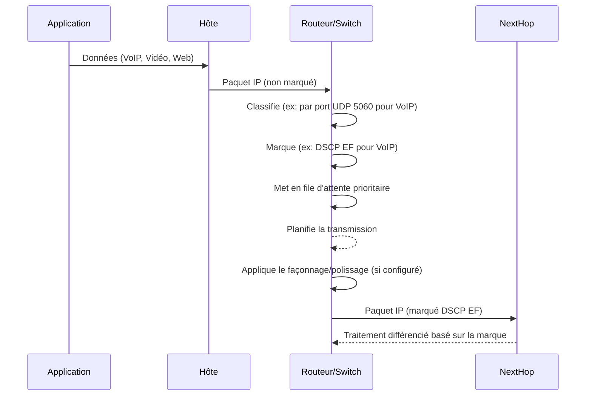

---
aliases:
  - Qualité de Service
  - QoS
  - Quality of Service
archetype: concept-reseau
couche_osi:
  - "Couche 2 - Liaison"
  - "Couche 3 - Réseau"
  - "Couche 4 - Transport"
cssclasses:
  - max
tags:
  - qos
  - reseau/performance
  - gestion/reseau
  - latence
  - jitter
  - bande-passante
  - controle-congestion
  - reseau/trafic/classification
  - reseau/trafic/marquage
  - reseau/trafic/file-attente
  - reseau/trafic/planification
  - application/streaming-multimedia
  - voip
  - complexite
---

# Quality of Service (QoS)

> [!abstract] Définition
> La **Quality of Service (QoS)** est un ensemble de technologies qui permettent de gérer le trafic réseau pour minimiser la perte de données, réduire la latence et la [[Jitter|gigue]], et garantir une bande passante spécifique pour certains types d'applications. Son objectif est d'assurer une expérience utilisateur optimale pour les applications critiques et sensibles aux délais, en priorisant leur traitement par rapport au trafic moins urgent.

## ⚙️ Mécanisme & Fonctionnement
La QoS fonctionne en identifiant, classifiant et marquant les paquets de données, puis en appliquant des politiques de gestion du trafic basées sur ces marques. Ces politiques dictent comment le trafic est mis en file d'attente, planifié et, si nécessaire, éliminé pour maintenir les niveaux de service souhaités.

### Encapsulation / Traitement
*   **Entrée** : Un paquet ou une trame réseau arrive sur un équipement (routeur, switch) avec des champs spécifiques (ex: champ DSCP dans l'en-tête IP, bits CoS dans l'en-tête Ethernet 802.1Q) qui peuvent déjà être marqués ou nécessiter une classification.
*   **Action** :
    1.  **Classification** : Le trafic est identifié et regroupé en classes basées sur divers critères (adresses IP source/destination, ports, protocoles, etc.).
    2.  **Marquage (Marking)** : Les paquets classifiés sont marqués en modifiant un champ dans leur en-tête (ex: *Differentiated Services Code Point* (DSCP) dans l'en-tête IP, ou *Class of Service* (CoS) dans l'en-tête Ethernet 802.1Q). Ces marques indiquent le niveau de priorité ou le traitement spécifique que le paquet doit recevoir.
    3.  **Mise en File d'attente (Queuing)** : Les paquets sont placés dans différentes files d'attente logiques en fonction de leur classification et de leur marquage.
    4.  **Planification (Scheduling)** : Un algorithme de planification détermine l'ordre dans lequel les paquets quittent les files d'attente et sont transmis sur le support physique. Des techniques comme *Weighted Fair Queuing* (WFQ), *Priority Queuing* (PQ) ou *Class-Based Weighted Fair Queuing* (CBWFQ) sont utilisées.
    5.  **Contrôle de Congestion** : Des mécanismes comme le *Traffic Shaping* (façonnement du trafic) ou le *Traffic Policing* (polissage du trafic) peuvent être appliqués pour limiter le débit du trafic ou pour abandonner les paquets excédentaires afin d'éviter la congestion.
*   **Sortie** : Le paquet marqué, potentiellement mis en forme ou poli, est transmis sur le réseau, recevant un traitement prioritaire ou différencié tout au long de son parcours.

## 💡 Cas d'Usage Typique
La QoS est essentielle pour la performance des réseaux d'entreprise modernes :
1.  **Voix sur IP (VoIP) et Visioconférence** : Ces applications sont extrêmement sensibles à la latence, la gigue et la perte de paquets. La QoS garantit que le trafic vocal et vidéo reçoit la bande passante et la priorité nécessaires pour maintenir une qualité de communication claire et fluide.
2.  **Applications Métier Critiques (ERP, CRM)** : Les systèmes comme les *Enterprise Resource Planning* (ERP) ou *Customer Relationship Management* (CRM) sont vitaux pour les opérations. La QoS assure que ces applications disposent toujours des ressources réseau suffisantes, même en période de forte charge, évitant ainsi les ralentissements ou les interruptions.
3.  **Streaming Vidéo et Multimédia** : Pour les formations en ligne, le divertissement ou les présentations en direct, la QoS prévient la mise en mémoire tampon (buffering) et les interruptions en allouant une bande passante dédiée.
4.  **Gestion de la Bande Passante par Utilisateur ou Département** : Dans les environnements partagés, la QoS peut limiter la bande passante allouée au trafic de faible priorité (ex: navigation web non professionnelle, téléchargements) pour empêcher qu'il n'impacte le trafic essentiel.

## ⚠️ Limitations & Problèmes
> [!warning] Points d'attention
> *   **Complexité de la Configuration** : La mise en œuvre de la QoS peut être complexe, nécessitant une compréhension approfondie des flux de trafic, des applications et des mécanismes de QoS. Une configuration incorrecte peut entraîner des performances dégradées ou des dysfonctionnements du réseau.
> *   **Surcharge de Traitement (Overhead)** : La classification, le marquage et la gestion des files d'attente consomment des ressources CPU sur les équipements réseau, ce qui peut potentiellement affecter les performances des périphériques plus anciens ou moins puissants.
> *   **Déploiement de Bout en Bout** : Pour être pleinement efficace, la QoS doit être configurée de manière cohérente sur tous les équipements réseau le long du chemin de données (de l'expéditeur au destinataire). Un maillon faible sans QoS peut annuler tous les efforts.
> *   **Coût** : Les équipements réseau avancés dotés de capacités QoS robustes peuvent être plus coûteux.
> *   **Sécurité** : Des acteurs malveillants pourraient tenter d'abuser des mécanismes QoS pour obtenir un traitement prioritaire de leur trafic illégitime, nécessitant une attention particulière à l'intégration de la QoS avec les politiques de sécurité.