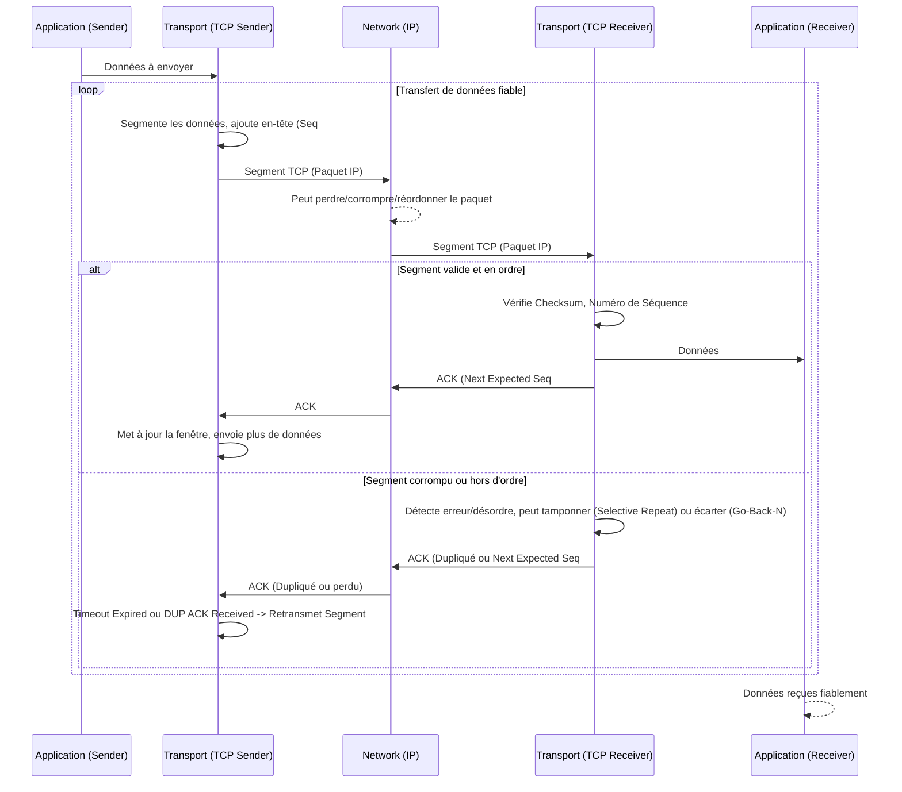

---
aliases:
  - "Transfert de Données Fiable"
  - "Reliable Data Transfer"
  - "RDT"
  - "ARQ"
archetype: concept-reseau
couche_osi:
  - "Couche 4 - Transport"
  - "Couche 2 - Liaison"
technologie:
  - "TCP"
cssclasses:
  - max
tags:
  - transfert-donnees-fiable
  - protocole/tcp
  - modele-osi/couche-4
  - mecanisme
  - controle-erreur
  - communication/controle-flux
  - acquittement
  - retransmission
  - perte-paquets
  - corruption-donnees
  - integrite
  - disponibilite
  - protocole/fenetre-glissante
  - protocole/tcp/numero-sequence
  - checksum
  - encapsulation
---

# Reliable Data Transfer (RDT)

> [!abstract] Définition
> Le **Transfert de Données Fiable (RDT)** est un ensemble de principes et de mécanismes protocolaires conçus pour garantir la livraison **correcte**, **ordonnée** et **complète** de données entre deux entités communicantes, même lorsque le canal de communication sous-jacent est intrinsèquement non fiable (sujet aux pertes, corruptions ou réordonnancements de paquets). Ce concept est fondamental pour des protocoles de couche transport comme TCP.

## ⚙️ Mécanisme & Fonctionnement
Le transfert de données fiable est mis en œuvre par divers mécanismes qui collaborent pour compenser les imperfections d'un canal de communication non fiable.

### Principes Clés
1.  **Détection d'Erreurs** : Les données sont accompagnées de sommes de contrôle (checksums) pour permettre au récepteur de détecter les bits corrompus. Les paquets identifiés comme corrompus sont généralement écartés.
2.  **Acquittements (ACKs)** : Le récepteur envoie des messages d'acquittement positifs (ACK) pour confirmer la bonne réception des données.
3.  **Numérotation de Séquences** : Chaque segment de données est numéroté de manière unique. Cela permet au récepteur de réassembler les données dans le bon ordre et de détecter les paquets perdus ou dupliqués.
4.  **Retransmissions** : Si un émetteur ne reçoit pas d'ACK pour un segment dans un délai imparti (timeout), il retransmet ce segment. Des acquittements cumulatifs dupliqués peuvent également déclencher une retransmission rapide.
5.  **Fenêtrage (Flow Control)** : Pour améliorer l'efficacité et éviter de submerger le récepteur, l'émetteur est autorisé à envoyer plusieurs segments consécutivement sans attendre un ACK pour chacun, tant que le nombre de segments "en vol" ne dépasse pas une "taille de fenêtre" prédéfinie ou négociée. Ceci est souvent appelé le protocole de la *fenêtre glissante (sliding window)*.

### Encapsulation / Traitement
Le processus de transfert fiable de données implique l'ajout et le retrait d'informations de contrôle à travers les couches réseau.

*   **Entrée (Couche Application)** : Données brutes de l'application (par exemple, un flux d'octets).
*   **Action (Couche Transport - Sender)** : Le protocole de transport (ex: TCP) divise le flux de données en segments. Il ajoute un en-tête TCP à chaque segment, incluant le numéro de séquence, le numéro d'acquittement attendu, la taille de la fenêtre et une somme de contrôle. Ce segment est ensuite passé à la couche réseau.
*   **Action (Couche Transport - Receiver)** : À la réception d'un datagramme IP, la couche réseau le transmet à la couche transport. Le protocole de transport (ex: TCP) vérifie la somme de contrôle. Si le segment est intact et dans l'ordre attendu, il envoie un ACK avec le numéro de séquence du prochain octet attendu et délivre les données à la couche application. Si le segment est hors d'ordre ou corrompu, il peut être mis en tampon (pour *Selective Repeat*) ou écarté (pour *Go-Back-N*), et un ACK pour le dernier segment correctement reçu et en ordre est renvoyé.
*   **Sortie (Couche Application)** : Flux de données original, reconstruit dans l'ordre et sans erreur.

## 💡 Cas d'Usage Typique
Le transfert de données fiable est essentiel pour de nombreuses applications et services d'entreprise.
1.  **Navigation Web (HTTP/HTTPS)** : Garantit que toutes les parties d'une page web (texte, images, scripts) sont reçues sans corruption et dans l'ordre, pour que la page s'affiche correctement. Sans RDT, une page web pourrait être incomplète ou mal rendue.
2.  **Transfert de Fichiers (FTP, SCP)** : Assure que les fichiers volumineux sont transférés bit par bit sans aucune perte ou altération, ce qui est crucial pour l'intégrité des données d'entreprise (sauvegardes, documents critiques).
3.  **E-mail (SMTP)** : Garantit que les messages électroniques, y compris les pièces jointes, arrivent à destination de manière intacte et lisible, évitant la perte d'informations importantes.
4.  **Applications de Base de Données** : Assure que les requêtes et les réponses entre les clients et les serveurs de bases de données sont transmises de manière fiable, protégeant ainsi l'intégrité transactionnelle.

## ⚠️ Limitations & Problèmes

> [!warning] Points d'attention
> *   **Performance et Latence** : Les mécanismes de fiabilité (acquittements, retransmissions, gestion des timers) introduisent une surcharge (overhead) significative. Ils peuvent augmenter la latence et réduire le débit effectif, surtout sur des réseaux à forte latence ou pertes élevées.
> *   **Complexité Protocolaire** : La mise en œuvre d'un protocole de transfert de données fiable est complexe, nécessitant la gestion d'états (numéros de séquence, fenêtres, timers) chez l'émetteur et le récepteur, ainsi que des algorithmes sophistiqués pour la gestion des pertes et du contrôle de congestion.
> *   **Réseaux sans Fil (Wireless)** : Les réseaux sans fil sont sujets à des taux d'erreur et des pertes de paquets plus élevés en raison d'interférences, de fading ou de mobilité. Les protocoles RDT conçus pour les réseaux câblés peuvent mal interpréter ces pertes comme de la congestion, ce qui entraîne des retransmissions inutiles et une dégradation des performances.
> *   **Asymétrie de Bande Passante** : Sur les liens asymétriques où le chemin de retour (pour les ACKs) a une bande passante bien inférieure, les ACKs peuvent être retardés ou perdus, affectant la performance du transfert de données fiable.