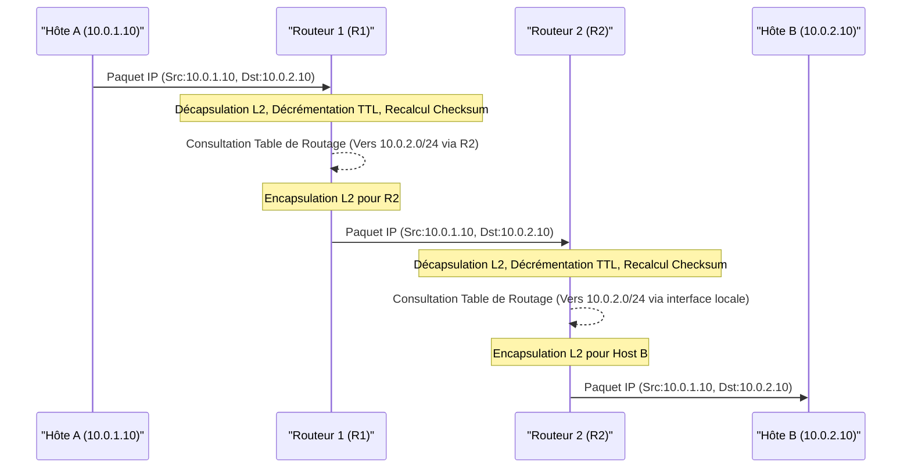

---
aliases:
  - "Notions de routage"
  - "Routage"
  - "Routing"
  - "Network Routing"
archetype: concept-reseau
couche_osi:
  - "Couche 3 - Réseau"
technologie:
  - "IP Routing"
  - "Static Routing"
  - "Dynamic Routing"
  - "OSPF"
  - "EIGRP"
  - "BGP"
  - "RIP"
cssclasses:
  - max
tags:
  - reseau/routage
  - routeur
  - mecanisme/encapsulation
  - reseau/adressage/ip
  - protocole/rip
  - protocole/eigrp
  - protocole/igp
  - routage/statique
  - routage/dynamique
  - routage/table
  - ttl
  - checksum
---

# Routing Concepts

> [!abstract] Définition
> Le **routage** est le processus de sélection d'un chemin à travers un ou plusieurs réseaux pour faire transiter les paquets de données du point d'origine au point de destination. Cette fonction est principalement assurée par des équipements appelés *routeurs*, qui examinent les adresses IP de destination des paquets et consultent leurs *tables de routage* pour déterminer le meilleur chemin vers le réseau de destination.

## ⚙️ Mécanisme & Fonctionnement
Le fonctionnement du routage repose sur la capacité d'un routeur à :
1.  **Recevoir** un paquet de données.
2.  **Examiner** l'adresse IP de destination du paquet.
3.  **Consulter** sa *table de routage* (ou *Forwarding Information Base - FIB*) pour trouver une correspondance entre l'adresse de destination et une entrée de la table.
4.  **Déterminer** le prochain saut (next-hop) et l'interface de sortie appropriée.
5.  **Encapsuler** le paquet dans une nouvelle trame de couche 2, avec l'adresse MAC du prochain saut, puis **transmettre** le paquet.

Les tables de routage peuvent être construites de manière **statique** (configurations manuelles par un administrateur) ou **dynamique** (apprentissage automatique via des protocoles de routage).

### Encapsulation / Traitement
Lorsqu'un routeur reçoit un paquet IP, il effectue les étapes suivantes :
*   **Entrée** : Une trame de couche 2 contenant un paquet IP est reçue sur une interface.
*   **Action** :
    1.  Le routeur décapsule la trame de couche 2 pour accéder au paquet IP.
    2.  Il décrémente le champ *Time To Live (TTL)* du paquet IP. Si le TTL atteint zéro, le paquet est abandonné et un message ICMP est potentiellement envoyé à la source.
    3.  Le routeur recalcule le *checksum* de l'en-tête IP.
    4.  Il consulte sa table de routage en utilisant l'adresse IP de destination pour déterminer l'interface de sortie et l'adresse IP du prochain saut.
    5.  Il résout l'adresse IP du prochain saut en adresse MAC (via ARP par exemple) si le prochain saut est directement connecté.
    6.  Le paquet IP est ré-encapsulé dans une nouvelle trame de couche 2 avec l'adresse MAC de l'interface de sortie du routeur et l'adresse MAC du prochain saut (ou de l'interface de destination si directement connectée).
*   **Sortie** : Une nouvelle trame de couche 2 est envoyée sur l'interface de sortie désignée, transportant le paquet IP modifié vers le prochain saut.

## Types et Protocoles de Routage

Les notions de routage se divisent principalement en routage statique et dynamique, supportées par divers protocoles.

### Routage Statique
Le **routage statique** implique qu'un administrateur configure manuellement chaque route dans la table de routage du routeur.
*   **Avantages** : Simple à configurer pour les petits réseaux, moins de surcharge CPU, plus sécurisé car les routes ne sont pas annoncées dynamiquement.
*   **Inconvénients** : Non-adaptatif aux changements de topologie, fastidieux à gérer pour les grands réseaux, absence de redondance automatique.
*   **Cas d'usage** : Petits réseaux, configuration de routes par défaut (Default Route) pour l'accès à Internet.

### Routage Dynamique
Le **routage dynamique** utilise des protocoles de routage qui permettent aux routeurs de s'échanger des informations de routage et de construire leurs tables de routage automatiquement. Ils s'adaptent aux changements de topologie et offrent de la redondance. On distingue principalement deux catégories de protocoles :

#### Protocoles de Passerelle Interne (IGP - Interior Gateway Protocols)
Utilisés au sein d'un *système autonome (AS)*, c'est-à-dire un groupe de réseaux sous une administration unique.
1.  **Protocoles à Vecteur de Distance (Distance-Vector)** :
    *   Les routeurs partagent leur table de routage complète avec leurs voisins directs.
    *   La métrique est généralement le nombre de sauts (hops).
    *   **RIP (Routing Information Protocol)** : Ancien protocole, métrique basée sur le nombre de sauts (max 15 sauts), envoi de mises à jour périodiques.
    *   **EIGRP (Enhanced Interior Gateway Routing Protocol)** : Protocole propriétaire Cisco (désormais ouvert), utilise l'algorithme DUAL (Diffusing Update Algorithm), fournit des chemins de secours rapides, métrique composite (bande passante, délai, fiabilité, charge).
2.  **Protocoles à État de Lien (Link-State)** :
    *   Les routeurs construisent une "carte" complète de la topologie du réseau en échangeant des informations sur l'état de leurs liens (LSA - Link-State Advertisements).
    *   Utilisent l'algorithme de Dijkstra (SPF - Shortest Path First) pour calculer le chemin le plus court vers chaque destination.
    *   **OSPF (Open Shortest Path First)** : Protocole ouvert, très scalable, utilise des zones (areas) pour hiérarchiser le routage, métrique basée sur le coût (souvent lié à la bande passante).
    *   **IS-IS (Intermediate System to Intermediate System)** : Semblable à OSPF, mais basé sur le protocole CLNP (Connectionless Network Protocol), très utilisé chez les fournisseurs d'accès Internet.

#### Protocoles de Passerelle Externe (EGP - Exterior Gateway Protocols)
Utilisés pour échanger des informations de routage entre différents *systèmes autonomes (AS)*.
1.  **BGP (Border Gateway Protocol)** :
    *   Le protocole de routage de l'Internet. C'est un protocole à *vecteur de chemin (Path-Vector)*.
    *   Il échange des informations de chemin complètes, incluant l'AS d'origine et les AS traversés.
    *   Les décisions de routage sont basées sur des politiques (policies) plutôt que sur des métriques simples, permettant aux administrateurs de contrôler le trafic entrant et sortant de leur AS.

## 💡 Cas d'Usage Typique
1.  **Interconnexion de réseaux locaux (LAN)** : Permet à des postes de travail situés dans des segments de réseau différents de communiquer au sein d'une même entreprise.
2.  **Accès à Internet** : Les routeurs d'entreprise sont configurés pour router le trafic vers les passerelles des fournisseurs d'accès Internet.
3.  **Segmentation de réseau et sécurité** : En séparant les réseaux par le routage, il est possible d'appliquer des politiques de sécurité et des listes de contrôle d'accès (ACLs) spécifiques à chaque segment.
4.  **Routage du trafic entre sites distants** : Connecter des bureaux distants via des liaisons WAN (Wide Area Network) ou des VPN.

## ⚠️ Limitations & Problèmes
> [!warning] Points d'attention
> *   **Performance** : Le routage dynamique, bien qu'efficace, consomme des ressources CPU et mémoire sur les routeurs pour maintenir les tables de routage et exécuter les algorithmes des protocoles. Un grand nombre de routes ou une topologie instable peuvent impacter les performances.
> *   **Complexité** : La configuration et la gestion des protocoles de routage dynamiques complexes (comme OSPF ou BGP) nécessitent une expertise réseau approfondie. Des erreurs de configuration peuvent entraîner des boucles de routage ou des routes inefficaces.
> *   **Sécurité** : Les protocoles de routage dynamiques peuvent être vulnérables aux attaques (spoofing, injection de routes malveillantes) s'ils ne sont pas sécurisés correctement (authentification, filtres). Des routes incorrectes peuvent détourner le trafic ou créer des dénis de service.
> *   **Scalabilité** : Bien que les protocoles dynamiques soient conçus pour la scalabilité, un déploiement non optimisé, sans hiérarchisation (zones OSPF, peering BGP approprié), peut conduire à des tables de routage trop volumineuses ou à une convergence lente.