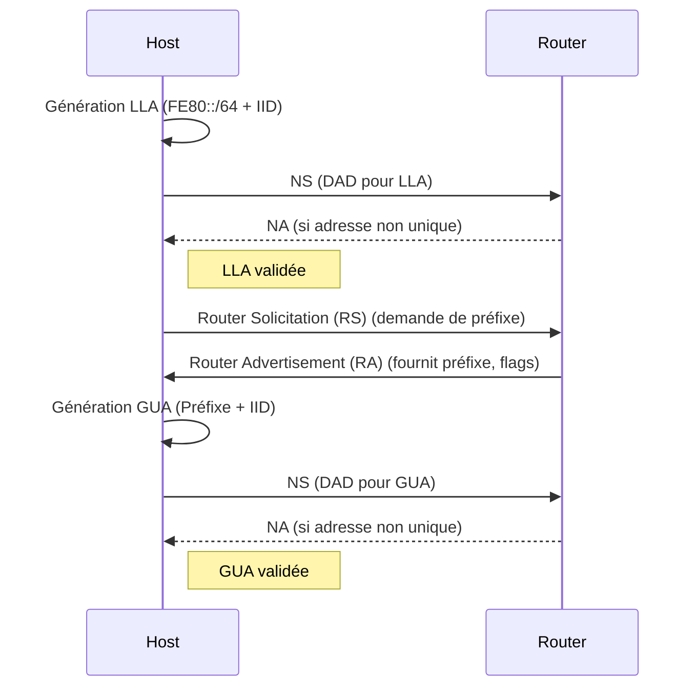

---
aliases:
  - "Auto-configuration d'adresse sans état"
  - "Stateless Address Autoconfiguration"
  - "IPv6 Autoconfiguration"
archetype: concept-reseau
cssclasses:
  - max
couche_osi:
  - "Couche 3 - Réseau"
  - "Couche 2 - Liaison"
technologie:
  - "IPv6"
tags:
  - protocole/ip/ipv6
  - protocole/ipv6/slaac
  - protocole/ndp
  - protocole/icmpv6
  - protocole/ndp/router-advertisement
  - protocole/ndp/router-solicitation
  - protocole/ndp/neighbor-advertisement
  - protocole/ndp/neighbor-solicitation
  - protocole/ipv6/adressage
  - protocole/ipv6/adressage/link-local
  - protocole/ipv6/adressage/global-unicast
  - protocole/ipv6/dad
  - protocole/ipv6/eui-64
  - protocole/ipv6/privacy-extensions
  - materiel/reseau/routeur
  - device
---

# Stateless Address Autoconfiguration (SLAAC)

> [!abstract] Définition
> L'**Auto-configuration d'adresse sans état (SLAAC)** est un mécanisme clé d'IPv6 qui permet aux périphériques hôtes de générer automatiquement leurs propres adresses [[IPv6AddressTypes|IPv6 unicast]] globales et leurs paramètres réseau essentiels (comme le préfixe et la passerelle par défaut) sans nécessiter de serveur DHCPv6 pour maintenir un état (une base de données des adresses attribuées). Le processus est "sans état" car aucune entité centrale ne conserve d'enregistrement des adresses attribuées.

## ⚙️ Mécanisme & Fonctionnement
SLAAC repose sur le **Neighbor Discovery Protocol (NDP)** d'IPv6, qui utilise des messages **ICMPv6** pour permettre aux hôtes et aux routeurs de communiquer et de s'auto-configurer.

### Étapes du processus SLAAC
1.  **Génération de l'adresse Link-Local** : Lorsqu'une interface IPv6 est activée, l'hôte génère d'abord une adresse link-local (FE80::/64) pour la communication sur le segment de réseau local. Cette adresse est souvent formée en combinant le préfixe `FE80::/64` avec un identifiant d'interface (IID) dérivé de l'adresse MAC de l'interface, généralement via le format **EUI-64 modifié** ou des **extensions de confidentialité**.
2.  **Détection d'Adresses Dupliquées (DAD - Duplicate Address Detection)** : Avant d'utiliser la nouvelle adresse link-local (et plus tard, l'adresse unicast globale), l'hôte effectue une DAD pour s'assurer de son unicité sur le lien. Il envoie un message **Neighbor Solicitation (NS)** ICMPv6 (Type 135) à l'adresse multicast de nœud sollicité correspondant à l'adresse qu'il souhaite vérifier. Si aucune réponse **Neighbor Advertisement (NA)** n'est reçue, l'adresse est considérée comme unique. Ce processus est répété pour chaque nouvelle adresse IPv6 générée.
3.  **Envoi d'un Router Solicitation (RS)** : Une fois l'adresse link-local configurée et validée, l'hôte envoie un message **Router Solicitation (RS)** ICMPv6 (Type 133) à l'adresse multicast de tous les routeurs (`FF02::2`) pour découvrir les routeurs présents sur le lien et solliciter des informations de configuration, notamment les préfixes de réseau.
4.  **Réception d'un Router Advertisement (RA)** : Les routeurs IPv6 répondent aux RS (ou envoient périodiquement) des messages **Router Advertisement (RA)** ICMPv6 (Type 134) à l'adresse multicast de tous les nœuds (`FF02::1`). Ces RA contiennent des informations cruciales pour l'auto-configuration :
    *   **Préfixe de réseau** : Le préfixe IPv6 (généralement /64) utilisé sur le lien.
    *   **Indicateurs (flags)** :
        *   **A (Autonomous flag)** : Indique si l'adresse peut être auto-configurée de manière autonome via SLAAC. Pour SLAAC, ce flag est défini.
        *   **L (On-link flag)** : Indique si le préfixe est sur le lien.
        *   **M (Managed Address Configuration flag)** : Si défini sur 1, indique que les adresses doivent être obtenues via DHCPv6 (état complet). Pour SLAAC pur, ce flag est 0.
        *   **O (Other Configuration flag)** : Si défini sur 1, indique que d'autres informations de configuration (comme les serveurs DNS) sont disponibles via DHCPv6 sans état.
    *   **Durée de vie du préfixe et du routeur par défaut**.
    *   **Adresse du routeur par défaut**.
5.  **Génération de l'adresse Unicast Globale** : L'hôte combine le préfixe de réseau de 64 bits reçu dans le RA avec un identifiant d'interface (IID) de 64 bits généré localement pour former une adresse [[IPv6AddressTypes|IPv6 unicast]] globale complète. Ensuite, une autre DAD est effectuée pour cette adresse unicast globale.

### Génération de l'identifiant d'interface (IID)
L'IID est la partie basse de 64 bits d'une adresse IPv6 et doit être unique sur le lien. Il existe plusieurs méthodes pour le générer :

*   **EUI-64 modifié** : La méthode traditionnelle convertit l'adresse MAC (48 bits) en un IID (64 bits).
    1.  L'adresse MAC est divisée en deux parties de 24 bits.
    2.  La valeur hexadécimale `FFFE` (16 bits) est insérée entre les deux parties.
    3.  Le 7ème bit de poids fort du premier octet de l'adresse MAC est inversé (le "Universal/Local bit" est passé de 0 à 1).
    *Exemple* : MAC `AA:BB:CC:DD:EE:FF` devient IID `A8BB:CCFF:Fedd:EEFF`.
    Cette méthode assure l'unicité mais pose des problèmes de confidentialité car l'IID est statique et peut être utilisé pour suivre un appareil.

*   **Extensions de confidentialité (Privacy Extensions - RFC 4941 / RFC 8981)** : Pour pallier les problèmes de confidentialité de l'EUI-64, les systèmes d'exploitation modernes utilisent souvent des extensions de confidentialité. Celles-ci génèrent des IID *aléatoires* ou *semi-aléatoires* qui changent périodiquement ou à chaque nouvelle connexion réseau. Ceci empêche le suivi des périphériques basé sur l'IID. RFC 8064 conseille désormais d'utiliser des adresses IPv6 générées conformément à RFC 7217, qui implique la génération et la maintenance d'un identifiant d'interface aléatoire pour chaque interface et sous-réseau, plutôt que des adresses SLAAC dépendantes du matériel.

### Encapsulation / Traitement
*   **Entrée** : Un hôte IPv6 sans adresse configurée ou un routeur avec un préfixe à annoncer.
*   **Action** :
    1.  L'hôte génère une adresse link-local (basée sur MAC/EUI-64 ou aléatoire) et effectue une DAD.
    2.  L'hôte envoie un message **RS** (ICMPv6 type 133) multicast.
    3.  Le routeur reçoit le RS et répond avec un message **RA** (ICMPv6 type 134) multicast, contenant le préfixe de réseau et d'autres informations.
    4.  L'hôte combine le préfixe reçu avec un IID généré localement pour former une adresse unicast globale.
    5.  L'hôte effectue une DAD pour la nouvelle adresse unicast globale via des messages **NS/NA** (ICMPv6 type 135/136).
*   **Sortie** : L'hôte dispose d'une adresse [[IPv6AddressTypes|IPv6 unicast]] globale unique, d'une adresse link-local, du préfixe de réseau et d'une passerelle par défaut, lui permettant de communiquer sur le réseau local et au-delà.

## 💡 Cas d'Usage Typique
1.  **Déploiement simple en entreprise** : SLAAC est idéal pour les réseaux où une gestion centralisée des adresses n'est pas strictement nécessaire, ou pour les dispositifs qui n'ont pas besoin de services DHCPv6 complexes (comme les serveurs DNS via DHCPv6).
2.  **Réseaux domestiques et petits bureaux (SOHO)** : Il offre une configuration "plug-and-play" pour les périphériques, simplifiant la gestion des adresses IPv6 sans nécessiter de serveur DHCP.
3.  **Appareils IoT et périphériques Edge** : Pour les dispositifs avec des ressources limitées ou nécessitant une auto-configuration rapide et simple sans interaction serveur.
4.  **Complément de DHCPv6** : SLAAC peut être utilisé pour obtenir les adresses IPv6 et le routeur par défaut, tandis qu'un DHCPv6 sans état (utilisant le flag 'O' dans les RAs) fournit des informations supplémentaires comme les serveurs DNS.

## ⚠️ Limitations & Problèmes
> [!warning] Points d'attention
> *   **Absence de gestion centralisée** : Étant "sans état", SLAAC ne fournit pas de base de données centrale des adresses IPv6 attribuées, ce qui peut rendre le suivi et la gestion des adresses plus difficiles pour les administrateurs réseau par rapport à DHCPv6.
> *   **Absence d'informations DNS** : Par défaut, SLAAC ne fournit pas d'informations sur les serveurs DNS. Pour obtenir ces informations, il faut soit utiliser une option de RA (RDNSS - RFC 6106), soit coupler SLAAC avec un DHCPv6 sans état.
> *   **Problèmes de confidentialité avec EUI-64** : L'utilisation de l'EUI-64 pour générer l'IID peut exposer l'adresse MAC de l'interface, permettant de suivre les périphériques à mesure qu'ils se déplacent entre différents réseaux. Les extensions de confidentialité résolvent ce problème en utilisant des IID aléatoires.
> *   **Vulnérabilités de sécurité** : Les messages RA peuvent être falsifiés (spoofing) par des acteurs malveillants pour diriger le trafic vers un routeur non autorisé ou pour annoncer des informations de configuration erronées.