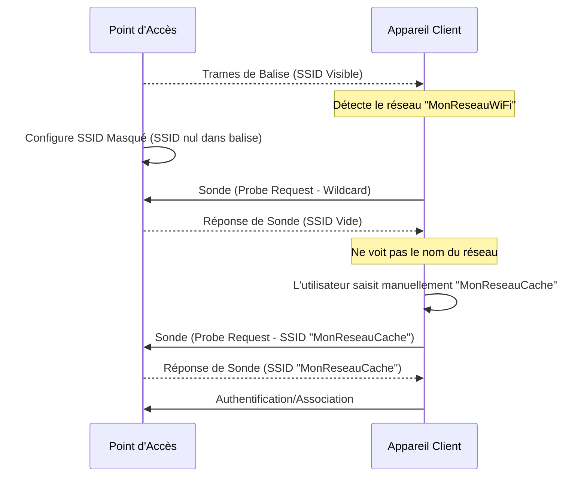

---
aliases:
  - Diffusion SSID
  - SSID Broadcast
  - Hidden SSID
  - Masquer le SSID
archetype: concept-reseau
cssclasses:
  - max
couche_osi:
  - "Couche 1 - Physique"
  - "Couche 2 - Liaison"
technologie:
  - Wi-Fi
  - 802.11
tags:
  - protocole/ieee-802-11
  - identifiant/ssid
  - wifi
  - reseau/sans-fil
  - reseau/point-acces
  - protocole/ieee-802-11/trame-balise
  - protocole/ieee-802-11/trame-sonde
  - wifi/ssid-masque
  - securite/par-obscurite
  - vulnerabilite
  - encapsulation
---

# SSID Broadcast

> [!abstract] Définition
> La **diffusion SSID** (Service Set Identifier) est le mécanisme par lequel un point d'accès (AP) ou un routeur sans fil annonce sa présence et le nom de son réseau Wi-Fi aux appareils environnants. Ce nom, l'SSID, est ce que les utilisateurs voient lorsqu'ils recherchent des réseaux Wi-Fi disponibles.

## ⚙️ Mécanisme & Fonctionnement
Les réseaux Wi-Fi utilisent la norme IEEE 802.11, où les points d'accès diffusent constamment des *trames de balise* (beacon frames) pour annoncer les réseaux sans fil disponibles. Ces trames contiennent des informations essentielles sur le réseau, y compris l'SSID.

### Modes de Diffusion
1.  **SSID Visible (Broadcast Activé)**: Le point d'accès envoie des trames de balise qui incluent l'SSID du réseau en texte clair. Les appareils clients peuvent alors facilement détecter et afficher le nom du réseau dans leur liste des réseaux disponibles.

2.  **SSID Masqué (Broadcast Désactivé)**: Dans ce mode, le point d'accès configure les trames de balise pour omettre ou laisser vide le champ SSID (un SSID "nul" ou "générique"). Le réseau n'apparaît pas dans la liste des réseaux visibles. Pour s'y connecter, un utilisateur doit connaître l'SSID exact et le saisir manuellement, en plus du mot de passe.

### Différences entre SSID Visible et Caché
*   **Visibilité**: Un SSID visible est facilement découvrable, tandis qu'un SSID masqué ne l'est pas par une simple analyse de réseau.
*   **Connexion Client**: Pour un SSID visible, la connexion est directe après sélection et saisie du mot de passe. Pour un SSID masqué, le client doit manuellement entrer l'SSID et les informations de sécurité.
*   **Trames de Sonde (Probe Requests)**: Lorsqu'un appareil client tente de se connecter à un réseau à SSID masqué qu'il connaît, il envoie activement des *trames de sonde dirigées* (directed probe requests) contenant l'SSID du réseau qu'il recherche. Ces trames de sonde sont envoyées *même lorsque l'appareil est en dehors de la portée du point d'accès*, révélant potentiellement l'SSID à des attaquants qui surveillent le trafic. Les points d'accès répondent à ces requêtes par des trames de réponse de sonde (probe response frames), dont le contenu est similaire aux trames de balise.

### Encapsulation / Traitement
*   **Entrée** : Trame de gestion (Beacon Frame ou Probe Request).
*   **Action** :
    *   **Diffusion SSID** : Le point d'accès inclut l'SSID dans les trames de balise pour annoncer le réseau.
    *   **Masquage SSID** : Le point d'accès omet l'SSID dans les trames de balise (champ SSID défini sur nul ou vide).
    *   **Requêtes de Sonde** : Les clients envoient des requêtes de sonde (avec ou sans SSID spécifié) pour découvrir ou confirmer la présence de réseaux. Les APs répondent par des trames de réponse de sonde.
*   **Sortie** : Trame de gestion (Beacon Frame ou Probe Response) envoyée sur la couche physique sans fil.

## 💡 Cas d'Usage Typique
1.  **Facilité de Connexion (SSID Visible)** : La diffusion du SSID est le mode par défaut et le plus courant, facilitant la découverte et la connexion des utilisateurs légitimes au réseau. C'est idéal pour les réseaux d'entreprise ou domestiques où la commodité est privilégiée.
2.  **Tentative de "Sécurité par Obscurité" (SSID Masqué)** : Bien que souvent inefficace en termes de sécurité réelle, masquer le SSID est parfois utilisé pour décourager les utilisateurs occasionnels de tenter de se connecter à un réseau, ou pour réduire l'encombrement visuel des réseaux disponibles. Certains administrateurs l'utilisent dans l'espoir de limiter la visibilité à des clients configurés spécifiquement.

## ⚠️ Limitations & Problèmes

> [!warning] Points d'attention
> *   **Sécurité** :
    *   **Fausse Sécurité** : Masquer le SSID n'est pas une mesure de sécurité efficace et offre une *fausse impression de sécurité*. Des outils d'analyse de réseau (sniffers Wi-Fi, outils de pénétration) peuvent facilement détecter les SSIDs masqués en capturant les trames de sonde/réponse, même si l'SSID n'est pas diffusé.
    *   **Fuite d'informations par les clients** : Les appareils clients configurés pour se connecter à un SSID masqué envoient constamment des requêtes de sonde contenant l'SSID même lorsqu'ils sont hors de portée du point d'accès, divulguant ainsi le nom du réseau. Cela peut rendre le réseau plus "ciblé" par les attaquants.
    *   **Attaques par "Rogue AP" (Point d'Accès Malveillant)** : Un attaquant peut créer un faux point d'accès avec le SSID masqué pour inciter les appareils légitimes à s'y connecter, ouvrant la voie à des attaques de type "man-in-the-middle".
*   **Performance et Connectivité** :
    *   **Problèmes de Connexion Client** : Masquer le SSID peut entraîner des problèmes de connectivité et une instabilité pour certains appareils, en particulier les anciens systèmes d'exploitation. Les clients doivent effectuer des analyses actives constantes, ce qui peut générer plus de "bruit" sur le réseau.
    *   **Complexité pour les Utilisateurs Légitimes** : Les utilisateurs doivent saisir manuellement l'SSID et le mot de passe, ce qui est moins pratique et peut créer des erreurs.

**Mesures de Protection Efficaces (à la place du masquage SSID)** :
Pour une sécurité réseau sans fil robuste, il est crucial de se concentrer sur des mesures réelles plutôt que sur la sécurité par l'obscurité. Les meilleures pratiques incluent :
1.  **Utilisation de protocoles d'authentification et de chiffrement robustes** : WPA2 ou, idéalement, WPA3.
2.  **Mots de passe forts et uniques** pour le réseau Wi-Fi et l'accès à l'interface d'administration du routeur.
3.  **Mises à jour régulières du firmware** du routeur/AP.
4.  **Segmentation du réseau** (par exemple, un réseau invité séparé).
5.  **Filtrage par adresse MAC** (bien que contournable, cela ajoute une couche de difficulté).