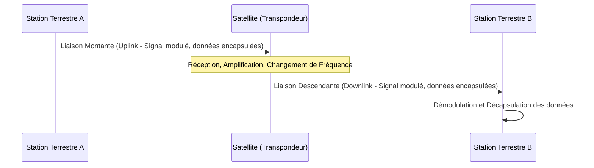

---
aliases:
  - Communication par Satellite
  - Satellite Communication
  - SatCom
archetype: concept-reseau
couche_osi:
  - "Couche 1 - Physique"
  - "Couche 2 - Liaison"
  - "Couche 3 - Réseau"
technologie:
  - GEO
  - MEO
  - LEO
cssclasses:
  - max
tags:
  - reseau/transmission/satellite
  - communication/reseau
  - telecommunications
  - infrastructure/reseau
  - definition
  - mecanisme
  - architecture
  - architecture/segment-spatial
  - architecture/segment-terrestre
  - architecture/segment-controle
  - radiofrequence
  - radiofrequence/bande-l
  - radiofrequence/bande-s
  - radiofrequence/bande-c
  - radiofrequence/bande-x
  - radiofrequence/bande-ku
  - radiofrequence/bande-ka
  - attenuation/atmospherique
  - attenuation/pluie
  - latence
  - encapsulation
  - modele-osi/couche-2
  - modele-osi/couche-3
  - protocole/ip
  - protocole/ethernet
  - connectivite
  - systeme/redondance
  - materiel/reseau
  - orbite
  - orbite/geostationnaire
  - orbite/meo
  - orbite/leo
  - transpondeur
  - liaison-montante
  - liaison-descendante
  - constellation/satellite
---

# Satellite Communication

> [!abstract] Définition
> La **communication par satellite** est une méthode de transmission de données, de voix et de vidéo via des signaux radiofréquence entre des stations terrestres et des satellites artificiels en orbite autour de la Terre. Ces satellites agissent comme des répéteurs, recevant les signaux d'une station au sol (liaison montante ou *uplink*), les amplifiant et les retransmettant vers une autre station au sol ou plusieurs stations (liaison descendante ou *downlink*). Le rôle principal de ce concept est de permettre une connectivité sur de longues distances, des zones reculées ou de fournir une redondance aux infrastructures terrestres.

## ⚙️ Mécanisme & Fonctionnement

Le principe fondamental de la communication par satellite repose sur la mise en place d'un lien de transmission radio entre deux ou plusieurs points terrestres via un satellite. Le processus implique plusieurs étapes clés :

1.  **Station Terrestre Émettrice (Uplink)** : Une station terrestre envoie un signal (modulé sur une fréquence porteuse spécifique) vers le satellite. Ce signal est appelé la liaison montante (*uplink*).
2.  **Satellite (Répéteur)** : Le satellite reçoit le signal de la station terrestre. À bord, un *transpondeur* amplifie le signal et le convertit à une fréquence différente avant de le retransmettre vers la Terre. La conversion de fréquence est essentielle pour éviter les interférences entre la liaison montante et la liaison descendante.
3.  **Station Terrestre Réceptrice (Downlink)** : Une ou plusieurs stations terrestres reçoivent le signal retransmis par le satellite. Ce signal est appelé la liaison descendante (*downlink*). La station démodule le signal pour extraire les données originales.

Les satellites sont généralement classés en fonction de leur orbite :
*   **Géostationnaire (GEO)** : Orbitent à environ 35 786 km au-dessus de l'équateur, à la même vitesse que la rotation de la Terre, apparaissant fixes dans le ciel. Ils couvrent de vastes zones, mais introduisent une latence significative (environ 250 ms aller simple).
*   **Orbites Terrestres Moyennes (MEO)** : Situés entre 2 000 et 35 786 km d'altitude. Ils offrent une latence plus faible que les GEO, mais nécessitent plus de satellites pour une couverture continue.
*   **Orbites Terrestres Basses (LEO)** : Orbitent entre 400 et 2 000 km. Ils offrent une très faible latence (inférieure à 50 ms) et nécessitent un grand nombre de satellites pour une couverture mondiale, formant des constellations (ex: Starlink, OneWeb).

### Architecture
L'architecture d'un système de communication par satellite comprend généralement trois segments principaux :
*   **Segment spatial** : Composé du ou des satellites en orbite, chacun équipé de transpondeurs, d'antennes, de panneaux solaires pour l'alimentation et de systèmes de contrôle d'attitude.
*   **Segment terrestre** : Inclut les stations terriennes (gateways) qui envoient et reçoivent des données, les terminaux utilisateurs (antennes paraboliques, VSATs, etc.), les centres de contrôle réseau (NOC) qui gèrent le trafic et les réseaux dorsaux terrestres qui connectent les passerelles aux utilisateurs finaux.
*   **Segment de contrôle** : Responsable du suivi, de la télémétrie et du contrôle (TT&C) des satellites, assurant leur positionnement correct et leur bon fonctionnement.

### Fréquences
La communication par satellite utilise diverses bandes de fréquences radio, chacune ayant des caractéristiques différentes en termes de propagation, de capacité et de sensibilité aux intempéries :
*   **Bandes L et S** : Fréquences plus basses (1-4 GHz), moins sensibles à l'atténuation atmosphérique, utilisées pour la téléphonie mobile par satellite et la navigation (GPS).
*   **Bande C** : (4-8 GHz) Largement utilisée pour les services de télévision et de données, moins affectée par la pluie que les bandes supérieures.
*   **Bande X** : (8-12 GHz) Principalement utilisée pour les applications militaires et gouvernementales.
*   **Bande Ku** : (12-18 GHz) Très populaire pour la télévision directe par satellite (DBS) et les communications VSAT. Plus sensible à l'atténuation par la pluie (*rain fade*).
*   **Bande Ka** : (26-40 GHz) Offre une bande passante plus élevée, idéale pour l'accès Internet haut débit et les communications vidéo. Très sensible à l'atténuation par la pluie.

### Encapsulation / Traitement
Dans le contexte de la communication par satellite, l'encapsulation et le traitement des données se déroulent à plusieurs niveaux, influençant principalement les couches physiques, de liaison de données et réseau du modèle OSI :

*   **Entrée** : Au niveau de la station terrestre, les données peuvent se présenter sous forme de paquets IP ou de trames Ethernet provenant d'un réseau terrestre.
*   **Action** :
    1.  **Couche Réseau (L3)** : Les routeurs au sein de la station terrestre acheminent les paquets vers l'interface satellite.
    2.  **Couche Liaison de Données (L2)** : Les données sont formatées en trames, et des mécanismes de contrôle d'erreurs (FEC - Forward Error Correction) et de gestion de l'accès au support (MAC) sont appliqués. Des protocoles spécifiques comme DVB-S2 (Digital Video Broadcasting - Satellite - Second Generation) pour la diffusion ou des protocoles propriétaires pour les constellations LEO peuvent être utilisés pour l'encapsulation des trames.
    3.  **Couche Physique (L1)** : Les trames sont modulées sur une porteuse radiofréquence (ex: QPSK, 8PSK, QAM) et amplifiées pour la transmission via l'antenne parabolique vers le satellite.
    4.  **Satellite** : Le transpondeur à bord du satellite reçoit le signal, le démodule, l'amplifie et le remodule sur une fréquence de liaison descendante différente avant de le retransmettre.
*   **Sortie** : À la station terrestre réceptrice, le processus est inversé. Le signal est démodulé, les erreurs corrigées (si possible), les trames dé-encapsulées pour reconstruire les paquets originaux, qui sont ensuite transférés vers le réseau terrestre destinataire.

## 💡 Cas d'Usage Typique
La communication par satellite est essentielle pour divers scénarios, particulièrement ceux nécessitant une couverture étendue ou une fiabilité dans des environnements difficiles :
1.  **Accès Internet Haut Débit** : Fournit une connectivité Internet aux zones rurales ou isolées où l'infrastructure terrestre est inexistante ou coûteuse à déployer. Les constellations LEO, en particulier, transforment cet usage grâce à leur faible latence.
2.  **Communications d'Urgence et de Catastrophe** : Permet de rétablir rapidement les communications après des catastrophes naturelles qui ont détruit les infrastructures terrestres, offrant une capacité de communication résiliente pour les services de secours.
3.  **Télévision et Radio Diffusion** : Largement utilisée pour la diffusion de programmes de télévision et de radio à l'échelle nationale ou mondiale, comme la télévision directe par satellite (DBS).
4.  **Connectivité Mobile et Maritime/Aéronautique** : Assure la communication pour les navires en mer, les avions en vol et les véhicules terrestres dans des régions sans couverture cellulaire, garantissant la sécurité et les services à bord.
5.  **Applications Militaires et Gouvernementales** : Essentielle pour la surveillance, la communication sécurisée et la navigation pour les opérations militaires et les services de renseignement mondiaux.
6.  **Services IoT et M2M** : Permet la collecte de données de capteurs distants dans des environnements tels que l'agriculture, l'énergie ou le suivi d'actifs.

## ⚠️ Limitations & Problèmes
> [!warning] Points d'attention
> *   **Latence** : Les satellites GEO introduisent une latence de l'ordre de 500 ms (aller-retour), ce qui peut impacter les applications sensibles à la latence comme la voix sur IP (VoIP), les jeux en ligne ou les transactions financières en temps réel. Les constellations LEO réduisent considérablement cette latence.
> *   **Affaiblissement des Signaux (*Rain Fade*)** : Les fréquences plus élevées (bandes Ku et Ka) sont sujettes à l'atténuation due aux précipitations (pluie, neige), ce qui peut entraîner une dégradation du signal, voire une interruption du service.
> *   **Coût** : Le déploiement et la maintenance des infrastructures satellites (lancement, satellites, stations au sol) sont très coûteux. Le coût des terminaux utilisateurs peut également être plus élevé que les alternatives terrestres.
> *   **Bande Passante Limitée par Satellite** : Bien que les technologies évoluent, la bande passante disponible par satellite individuel est une ressource finie et partagée entre de nombreux utilisateurs.
> *   **Sécurité** : Les signaux satellites sont susceptibles d'être interceptés ou brouillés, nécessitant des mesures de chiffrement robustes et des techniques d'anti-brouillage.
> *   **Alignement et Obstruction** : Les antennes paraboliques nécessitent un alignement précis avec le satellite et une ligne de vue dégagée. Les obstructions (arbres, bâtiments) peuvent bloquer le signal.
