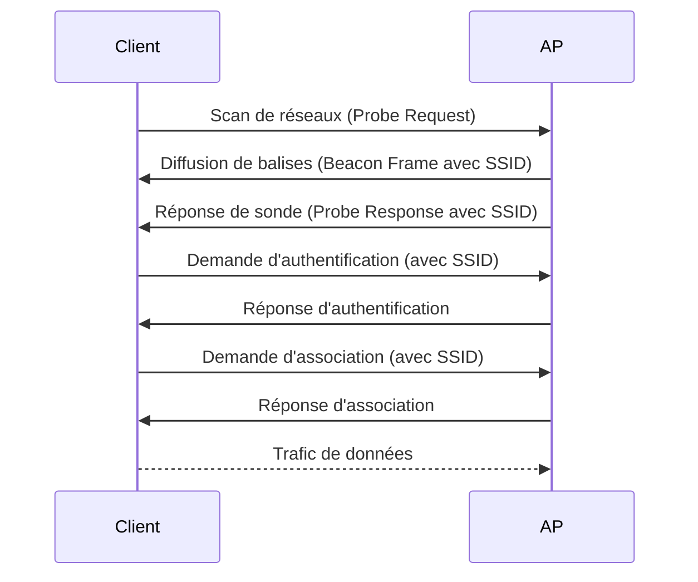

---
aliases:
  - Identifiant de Service Sans Fil
  - Nom de réseau Wi-Fi
  - Service Set Identifier
  - SSID
archetype: concept-reseau
couche_osi:
  - Couche 2 - Liaison
technologie:
  - Wi-Fi
  - IEEE 802.11
cssclasses:
  - max
tags:
  - identifiant/ssid
  - reseau/sans-fil/wi-fi
  - reseau/point-acces
  - materiel/routeur
  - vulnerabilite/mauvaise-configuration
  - attaque/evil-twin
  - attaque/reconnaissance
  - securite/reseau
  - definition
---

# Service Set Identifier (SSID)

> [!abstract] Définition
> Le **Service Set Identifier (SSID)** est un nom unique, d'une longueur maximale de 32 caractères, qui identifie un réseau sans fil (Wi-Fi). Il permet aux appareils de distinguer et de se connecter au réseau souhaité lorsque plusieurs réseaux indépendants opèrent dans la même zone physique. Le SSID est couramment appelé le "nom du réseau Wi-Fi".

## ⚙️ Mécanisme & Fonctionnement
Le SSID est fondamental pour l'établissement et le maintien des connexions sans fil. Les routeurs et points d'accès sans fil diffusent le SSID pour annoncer la présence du réseau aux appareils à proximité.

### Encapsulation / Traitement
*   **Diffusion de balises (Beacons)** : Un point d'accès (AP) ou un routeur sans fil diffuse périodiquement des trames de gestion appelées "balises" (beacon frames). Ces balises contiennent le SSID, le BSSID (MAC de l'AP), les capacités de sécurité (par ex., WPA2, WPA3), le canal utilisé et d'autres informations sur le réseau. Chaque SSID sur chaque bande (ex: 2.4 GHz, 5 GHz) diffuse sa propre trame de balise unique.
*   **Sondes (Probes)** : Lorsqu'un appareil client recherche des réseaux, il peut envoyer des trames de "sonde" (probe requests) pour découvrir les SSIDs disponibles. Les points d'accès répondent avec des trames de "réponse de sonde" (probe responses) contenant le SSID et les détails du réseau.
*   **Association** : Une fois qu'un appareil client a identifié le SSID souhaité, il initie un processus d'association avec le point d'accès. Le SSID est inclus dans les trames d'authentification et d'association pour établir la connexion.

## 💡 Cas d'Usage Typique
1.  **Identification de réseau** : Le cas d'usage le plus fondamental est de permettre aux utilisateurs d'identifier et de sélectionner le réseau Wi-Fi auquel ils souhaitent se connecter parmi une liste d'options disponibles.
2.  **Segmentation de réseau d'entreprise** : Dans les environnements d'entreprise, les SSIDs sont essentiels pour organiser et contrôler l'accès aux réseaux sans fil. Les entreprises créent souvent plusieurs SSIDs pour différents groupes d'utilisateurs (employés, invités, appareils IoT) afin de segmenter le trafic, d'améliorer la sécurité et de gérer l'utilisation de la bande passante.
3.  **Faciliter la reconnexion automatique** : Les appareils conservent les SSIDs des réseaux auxquels ils se sont précédemment connectés, ce qui leur permet de se reconnecter automatiquement lorsqu'ils sont à nouveau à portée.

## ⚠️ Limitations & Problèmes
> [!warning] Points d'attention
>  *   **Sécurité (Vulnérabilité aux attaques)** :
> 	 *   **SSID par défaut** : Laisser le SSID par défaut du fabricant rend le réseau plus prévisible et peut indiquer le type de routeur, permettant à des attaquants d'exploiter des vulnérabilités connues associées à ce modèle. Il est recommandé de changer le SSID par défaut en un nom unique.
> 	 *   **Divulgation d'informations personnelles** : Éviter d'inclure des informations personnelles (nom, adresse) dans le SSID, car cela peut exposer des détails sensibles aux attaquants.
> 	 *   **SSID masqué (Hidden SSID)** : Masquer le SSID (désactiver la diffusion) est souvent perçu comme une mesure de sécurité, mais cela n'offre qu'une sécurité limitée par l'obscurcissement. Les outils d'analyse de réseau peuvent facilement découvrir les SSIDs masqués. De plus, cela peut entraîner des problèmes de compatibilité et de connectivité pour les utilisateurs légitimes. La NSA et CISA recommandent de ne pas masquer le SSID car cela n'ajoute pas de sécurité significative et peut causer des problèmes de compatibilité.
> 	 *   **Attaques "Evil Twin"** : Un attaquant peut créer un point d'accès malveillant avec le même SSID qu'un réseau légitime (un "Evil Twin"). Les utilisateurs peuvent alors se connecter involontairement au faux réseau, exposant leurs données à des risques de vol d'informations ou d'interception.
> 	 *   **Sniffing de SSID** : Un attaquant peut utiliser un analyseur de réseau sans fil pour scanner les réseaux disponibles et leurs SSIDs, recueillant des informations pouvant servir à des tentatives d'infiltration.
> 	 *   **Absence de sécurité intrinsèque** : Le SSID en lui-même ne fournit aucune sécurité. Il s'agit uniquement d'un identifiant. La sécurité du réseau dépend des protocoles de chiffrement (WPA2, WPA3) et des mots de passe robustes.
> 	 *   **Performance** : Si le masquage du SSID peut réduire la visibilité, il peut également affecter les performances. Les appareils qui recherchent des réseaux masqués doivent scanner activement, ce qui peut entraîner des temps de connexion plus lents et des problèmes de reconnexion automatique.

## 🔗 Notes Connexes
*   **Protocole lié** : *IEEE 802.11*
*   **Mécanismes de sécurité** : *WPA2*, *WPA3*, *Chiffrement*
*   **Matériel** : *Point d'Accès (AP)*, *Routeur Sans Fil*
*   **Concept de réseau** : *Basic Service Set (BSS)*, *Extended Service Set (ESS)*