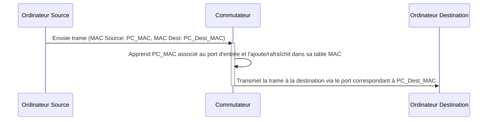

---
aliases:
  - "Adresse MAC Source"
  - "Source MAC Address"
  - "MAC Source"
archetype: concept-reseau
couche_osi:
  - "Couche 2 - Liaison"
technologie:
  - "Ethernet"
cssclasses:
  - max
tags:
  - reseau/adressage/mac
  - modele-osi/couche-2
  - reseau/couche-2
  - protocole/ethernet
  - materiel/reseau/switch
  - cam-table
  - mecanisme/encapsulation
  - protocole/arp
  - attaque/mac-spoofing
  - attaque/cam-table-overflow
  - reseau/trame
  - reseau
  - informatique/fondamentaux
---

# Source Mac Address

> [!abstract] Définition
> L'**adresse MAC (Media Access Control) source** est l'identifiant physique unique d'une interface réseau (carte réseau) qui émet une trame de données sur un réseau local. Elle est stockée dans la carte réseau et est unique au monde, attribuée par le fabricant. Elle opère à la couche 2 (liaison de données) du modèle OSI et est essentielle pour la communication au sein d'un segment de réseau local.

## ⚙️ Mécanisme & Fonctionnement
Lorsqu'un périphérique envoie des données sur un réseau Ethernet, il encapsule ces données dans une trame. Cette trame contient, entre autres, l'adresse MAC source de l'émetteur et l'adresse MAC de destination du récepteur.

### Encapsulation / Traitement
*   **Entrée** : Un paquet de données (provenant des couches supérieures, par exemple, couche IP) est reçu par la couche de liaison.
*   **Action** : La couche de liaison encapsule ce paquet dans une trame Ethernet. L'adresse MAC de l'interface d'émission est insérée dans le champ "Adresse MAC Source" de l'en-tête de la trame Ethernet. Simultanément, l'adresse MAC de destination est ajoutée (celle du prochain saut sur le réseau local ou de la machine finale si elle est sur le même segment).
*   **Sortie** : La trame Ethernet complète est transmise sur le support physique (câble, ondes radio).

## 💡 Cas d'Usage Typique
1.  **Transmission de Données Locale** : L'adresse MAC source permet aux périphériques d'un même réseau local (LAN) de s'identifier comme l'expéditeur d'une trame. Lorsque la trame atteint sa destination, le périphérique récepteur sait qui a envoyé la trame.
2.  **Apprentissage de la Table MAC des Switches (CAM Table)** : Les commutateurs (switches) de couche 2 utilisent l'adresse MAC source pour construire et maintenir leur table d'adresses MAC, également appelée table CAM (Content Addressable Memory).
    *   Lorsqu'un switch reçoit une trame sur un de ses ports, il examine l'adresse MAC source de cette trame.
    *   Si l'adresse MAC source n'est pas déjà présente dans sa table, le switch l'associe au port par lequel la trame est entrée et l'ajoute à sa table MAC.
    *   Si l'adresse MAC source est déjà connue et associée au même port, le switch rafraîchit l'ancienneté de l'entrée.
    *   Si l'adresse MAC est déjà connue mais associée à un autre port, le switch met à jour son entrée pour refléter la nouvelle association port-MAC.
    *   Cette table permet ensuite au switch de prendre des décisions de commutation efficaces : plutôt que d'inonder toutes les interfaces avec les trames (sauf celle d'origine) pour une adresse MAC de destination inconnue, il peut directement acheminer la trame vers le port où se trouve le périphérique de destination une fois son adresse MAC apprise.

## ⚠️ Limitations & Problèmes
> [!warning] Points d'attention
> *   **Spoofing d'Adresses MAC (MAC Spoofing)** : L'adresse MAC source peut être falsifiée (spoofée) par un attaquant. Cela peut être utilisé pour contourner des contrôles d'accès basés sur l'adresse MAC, usurper l'identité d'un autre périphérique, ou mener des attaques comme le "MAC flooding" pour saturer la table CAM d'un switch, le forçant ainsi à agir comme un hub (en diffusant toutes les trames) et permettant l'interception de trafic.
> *   **Taille de la Table MAC** : Les tables MAC des switches ont une taille finie. Une attaque de "MAC flooding" peut viser à remplir cette table avec de fausses adresses MAC, ce qui peut entraîner une dégradation des performances du switch, le forçant à diffuser des trames à toutes les interfaces jusqu'à ce que des entrées plus anciennes expirent.
> *   **Non-routable** : Les adresses MAC sont des identifiants de couche 2 et ne sont pas routables au-delà du réseau local. Pour la communication entre différents réseaux IP, les adresses IP (couche 3) sont utilisées, et une conversion entre adresses IP et MAC est effectuée via des protocoles comme ARP (Address Resolution Protocol).