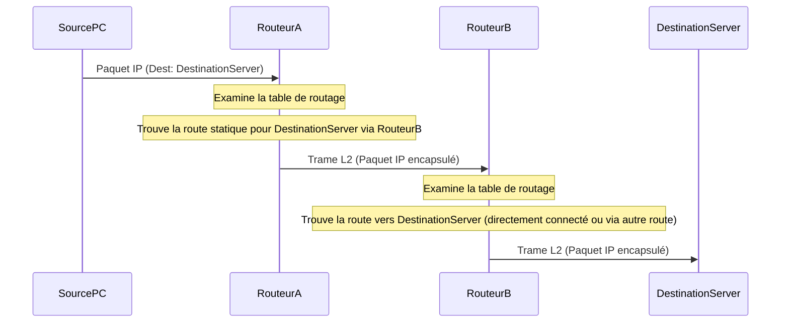

---
aliases:
  - Routage Statique
  - Static Routing
  - Route Statique
archetype: concept-reseau
couche_osi:
  - "Couche 3 - Réseau"
technologie:
  - Routage IP
cssclasses:
  - max
tags:
  - routage/statique
  - routage
  - reseau
  - modele-osi/couche-3
  - encapsulation
  - routage/table
  - routage/dynamique
  - gestion/reseau
  - infrastructure/reseau
---

# Static Routing

> [!abstract] Définition
> Le **routage statique** est une méthode de configuration manuelle des tables de routage par un administrateur réseau. Contrairement au routage dynamique, où les routeurs échangent des informations de routage pour apprendre les chemins vers les destinations, les routes statiques sont définies de manière explicite pour diriger le trafic vers des réseaux spécifiques ou des passerelles par défaut. Ces routes restent inchangées jusqu'à ce qu'un administrateur les modifie manuellement.

## ⚙️ Mécanisme & Fonctionnement
Le fonctionnement du routage statique repose sur la consultation des tables de routage par le routeur. Lorsqu'un routeur reçoit un paquet IP, il examine l'adresse IP de destination du paquet et la compare aux entrées de sa table de routage.

Une entrée de routage statique contient généralement les informations suivantes :
*   **Adresse réseau de destination** : Le réseau vers lequel le trafic doit être acheminé.
*   **Masque de sous-réseau** : Définit la portée de l'adresse réseau de destination.
*   **Adresse IP du prochain saut (Next-Hop)** : L'adresse IP du routeur voisin auquel le paquet doit être envoyé pour atteindre la destination.
*   **Interface de sortie (Egress Interface)** : L'interface physique ou logique du routeur par laquelle le paquet doit être transmis.

Si une correspondance est trouvée, le routeur achemine le paquet vers le prochain saut ou l'interface de sortie spécifiée. Si aucune correspondance spécifique n'est trouvée, le routeur peut utiliser une **route statique par défaut** (route de dernier recours) pour envoyer le trafic vers une passerelle prédéfinie, généralement vers Internet.

### Encapsulation / Traitement
*   **Entrée** : Un paquet IP (couche 3) arrive sur une interface d'entrée du routeur. Le paquet contient l'adresse IP source et de destination.
*   **Action** :
    1.  Le routeur examine l'adresse IP de destination du paquet.
    2.  Il consulte sa table de routage pour trouver la meilleure correspondance pour cette destination. Pour une route statique, cette entrée a été configurée manuellement.
    3.  Une fois la route trouvée (next-hop ou interface de sortie), le routeur décrémente le champ *Time To Live* (TTL) du paquet IP.
    4.  Si le TTL atteint zéro, le paquet est abandonné. Sinon, le routeur recalcule le checksum de l'en-tête IP.
    5.  Le routeur prépare le paquet pour la transmission sur l'interface de sortie désignée. Cela implique l'encapsulation du paquet IP dans une nouvelle trame de couche 2 (par exemple, Ethernet) adaptée au support physique de l'interface de sortie. Les adresses MAC source et destination de la trame sont déterminées (l'adresse MAC source est celle de l'interface de sortie du routeur, et l'adresse MAC de destination est celle du prochain saut ou du destinataire final si directement connecté).
*   **Sortie** : Une trame de couche 2 contenant le paquet IP encapsulé est transmise via l'interface de sortie vers le prochain saut ou le destinataire final.



## 💡 Cas d'Usage Typique
1.  **Petits réseaux ou réseaux périphériques (Stub Networks)** : Le routage statique est idéal pour les réseaux simples avec peu de routes ou pour les réseaux finaux (stub networks) qui n'ont qu'une seule sortie vers le reste du réseau. C'est souvent plus simple à configurer et moins gourmand en ressources CPU que le routage dynamique pour ces cas.
2.  **Routes par défaut (Default Routes)** : Très couramment utilisé pour acheminer tout le trafic destiné à des réseaux non explicitement connus vers un routeur de sortie unique, typiquement vers Internet. Par exemple, `ip route 0.0.0.0 0.0.0.0 [adresse_du_FAI]`.
3.  **Routes de secours (Backup Routes)** : On peut configurer une route statique flottante (avec une distance administrative plus élevée) qui prendra le relais si une route dynamique ou une route statique principale tombe en panne.
4.  **Accès sécurisé ou contrôlé** : Permet de dicter précisément les chemins de données, ce qui peut être utile dans des environnements où le contrôle strict du flux de trafic est une exigence de sécurité.

### Configuration du Routage Statique (Exemples)

Les règles de routage statique sont configurées à l'aide de commandes spécifiques au système d'exploitation du routeur. Voici des exemples pour les équipements Cisco IOS et Juniper Junos.

#### Cisco IOS
La commande principale est `ip route`.

Syntaxe générale : `ip route [adresse_reseau_destination] [masque_sous_reseau] [next-hop_ip | interface_de_sortie]`

*   **Route statique vers un réseau via l'IP du prochain saut :**
    ```
    Router> enable
    Router# configure terminal
    Router(config)# ip route 192.168.2.0 255.255.255.0 10.0.0.2
    ```
    *   Explication : Tout le trafic destiné au réseau `192.168.2.0/24` sera envoyé au routeur ayant l'adresse IP `10.0.0.2`.
*   **Route statique vers un réseau via l'interface de sortie (pour les interfaces point-à-point, ex: série) :**
    ```
    Router(config)# ip route 192.168.3.0 255.255.255.0 Serial0/0/0
    ```
    *   Explication : Tout le trafic destiné au réseau `192.168.3.0/24` sera envoyé via l'interface série `Serial0/0/0`. Notez que pour les interfaces Ethernet multi-accès, il est préférable d'utiliser l'adresse IP du prochain saut pour éviter des problèmes d'ARP.
*   **Route statique par défaut :**
    ```
    Router(config)# ip route 0.0.0.0 0.0.0.0 203.0.113.1
    ```
    *   Explication : Tous les paquets dont la destination n'est pas explicitement listée dans la table de routage seront envoyés à l'adresse IP `203.0.113.1` (le routeur du FAI, par exemple).
*   **Route statique flottante (avec distance administrative) :**
    ```
    Router(config)# ip route 192.168.4.0 255.255.255.0 10.0.0.6 100
    ```
    *   Explication : Une route vers `192.168.4.0/24` via `10.0.0.6` avec une distance administrative de `100`. Si une route dynamique (ex: OSPF, AD=110) ou une route statique par défaut (AD=1) est déjà présente avec une meilleure distance, celle-ci sera utilisée en priorité. Cette route `100` ne sera active que si la route principale échoue.

#### Juniper Junos OS
La commande principale est `set routing-options static route`.

Syntaxe générale : `set routing-options static route [adresse_reseau_destination]/[longueur_du_prefixe] next-hop [next-hop_ip]`

*   **Route statique vers un réseau via l'IP du prochain saut :**
    ```
    user@router# set routing-options static route 192.168.2.0/24 next-hop 10.0.0.2
    user@router# commit
    ```
    *   Explication : Le trafic pour `192.168.2.0/24` est acheminé vers `10.0.0.2`.
*   **Route statique par défaut :**
    ```
    user@router# set routing-options static route 0.0.0.0/0 next-hop 203.0.113.1
    user@router# commit
    ```
    *   Explication : Tous les paquets non acheminés autrement sont envoyés à `203.0.113.1`.
*   **Route statique avec préférence (équivalent à la distance administrative) :**
    ```
    user@router# set routing-options static route 192.168.4.0/24 next-hop 10.0.0.6 preference 100
    user@router# commit
    ```
    *   Explication : Une route vers `192.168.4.0/24` via `10.0.0.6` avec une préférence de `100`. Une valeur de préférence plus faible est préférée. Si une route avec une préférence de `5` existe, elle sera utilisée en priorité.

## ⚠️ Limitations & Problèmes
> [!warning] Points d'attention
> *   **Scalabilité** : Le routage statique ne s'adapte pas bien aux grands réseaux ou aux topologies complexes. Chaque nouvelle route doit être ajoutée manuellement sur chaque routeur pertinent, ce qui est fastidieux et source d'erreurs.
> *   **Maintenance** : Toute modification de la topologie (ajout ou suppression de routeurs, changement de liaisons) nécessite une mise à jour manuelle des routes statiques sur tous les routeurs affectés. Cela peut entraîner des erreurs de configuration et des pannes.
> *   **Tolérance aux pannes** : Les routes statiques ne détectent pas automatiquement les pannes de liaison ou de routeurs. Si un chemin configuré statiquement devient indisponible, le trafic continuera d'être envoyé vers ce chemin défaillant jusqu'à ce qu'un administrateur mette à jour manuellement la table de routage. Des mécanismes comme les routes statiques flottantes ou des protocoles de détection de défaillance (bidirectional forwarding detection - BFD) peuvent atténuer ce problème, mais ajoutent de la complexité.
> *   **Charge administrative** : La gestion d'un grand nombre de routes statiques peut consommer beaucoup de temps et de ressources pour l'équipe réseau.