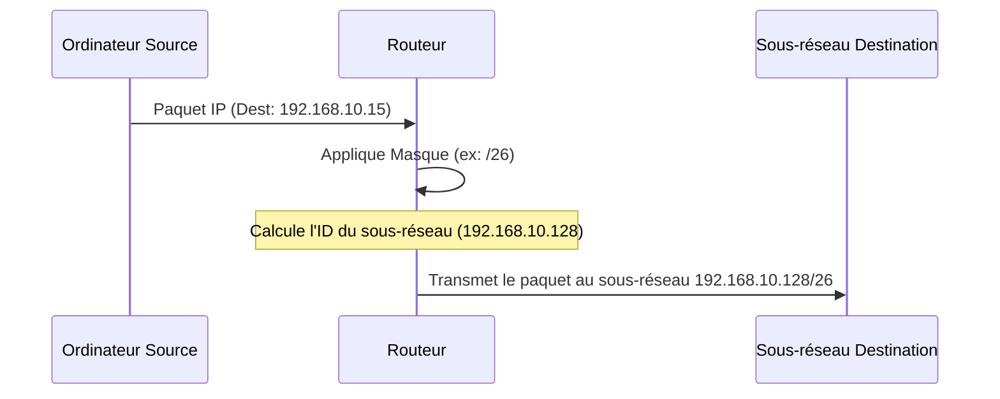

---
aliases:
  - Sous-réseautage
  - Subnetting Calculation
  - CIDR
  - VLSM
  - Classless Inter-Domain Routing
  - Variable Length Subnet Masking
cssclasses:
  - max
archetype: concept-reseau
couche_osi:
  - "Couche 3 - Réseau"
technologie:
  - IP Addressing
  - Routing
tags:
  - reseau
  - reseau/sous-reseautage
  - reseau/adressage/ip
  - reseau/masque-de-sous-reseau
  - reseau/adressage/ip/classes
  - reseau/cidr
  - reseau/vlsm
  - segmentation/reseau
  - reseau/domaine-de-diffusion
  - routage/table
  - securite/reseau
  - pare-feu
  - listes-controle-acces
  - routeur
---

# Subnetting

> [!abstract] Définition
> Le **sous-réseautage** (*subnetting*) est la pratique de diviser un réseau IP unique de grande taille en plusieurs sous-réseaux plus petits et logiquement distincts. Cette technique permet une gestion plus efficace des adresses IP et une meilleure organisation du réseau.

## ⚙️ Mécanisme & Fonctionnement
Le sous-réseautage repose sur l'extension de la partie réseau d'une adresse IP en empruntant des bits à la partie hôte. Un *masque de sous-réseau* est utilisé pour déterminer la limite entre la partie réseau (y compris le sous-réseau) et la partie hôte d'une adresse IP. Tous les appareils d'un même sous-réseau partagent le même identifiant de sous-réseau.

### Classes d'adresses IP
Historiquement, les adresses IPv4 étaient divisées en classes (A, B, C) définissant la taille par défaut des parties réseau et hôte :
*   **Classe A** : Le premier bit est 0. Masque par défaut : 255.0.0.0 (/8). Permet de très grands réseaux.
*   **Classe B** : Les deux premiers bits sont 10. Masque par défaut : 255.255.0.0 (/16). Adaptée aux réseaux de taille moyenne.
*   **Classe C** : Les trois premiers bits sont 110. Masque par défaut : 255.255.255.0 (/24). Conçue pour de petits réseaux.

### Calcul du Masque de Sous-réseau
Pour calculer un masque de sous-réseau, on détermine d'abord le nombre de bits à emprunter à la partie hôte de l'adresse IP. Ces bits supplémentaires, mis à 1, étendent l'ID réseau. Les bits restants, mis à 0, représentent les hôtes.

Exemple : Pour diviser un réseau de Classe C (192.168.1.0/24) en 4 sous-réseaux, il faut emprunter 2 bits (2^2 = 4 sous-réseaux). Le masque par défaut est 255.255.255.0 (24 bits réseau). En empruntant 2 bits, le nouveau masque sera /26, soit 255.255.255.192.

*   Bits réseau : 24 + 2 = 26
*   Bits hôte : 32 - 26 = 6
*   Nombre d'hôtes par sous-réseau : 2^6 - 2 = 62 (on soustrait 2 pour l'adresse réseau et l'adresse de broadcast).

### CIDR (Classless Inter-Domain Routing)
Le **CIDR** a remplacé le système de classes d'adresses pour une allocation plus flexible. Il utilise une notation de longueur de préfixe (par exemple, /24, /26) pour indiquer le nombre de bits de la partie réseau/sous-réseau, rendant les masques de sous-réseau de longueur variable. Cela permet de créer des sous-réseaux de tailles diverses sans être contraint par les limites des classes d'adresses traditionnelles.

### VLSM (Variable Length Subnet Masking)
Le **VLSM** est une technique qui permet d'utiliser des masques de sous-réseau de différentes longueurs au sein du même réseau principal. Il s'agit d'une application directe du CIDR, optimisant l'utilisation de l'espace d'adressage IP en allouant des sous-réseaux de taille appropriée aux besoins spécifiques de chaque segment du réseau, réduisant ainsi le gaspillage d'adresses.

### Encapsulation / Traitement
*   **Entrée** : Un paquet IP arrive sur une interface de routeur avec une *adresse IP de destination* et un *masque de sous-réseau local*.
*   **Action** : Le routeur effectue une opération **ET logique bit à bit** entre l'adresse IP de destination du paquet et son propre masque de sous-réseau pour déterminer l'adresse réseau du paquet. Cette adresse réseau est ensuite comparée aux entrées de la table de routage du routeur. Si l'adresse réseau correspond à un de ses sous-réseaux directement connectés, le paquet est acheminé localement. Sinon, il est transmis à la passerelle par défaut ou à un autre routeur selon la table de routage.
*   **Sortie** : Le paquet est acheminé vers le sous-réseau correct ou transféré à un routeur suivant pour atteindre sa destination finale.

## 💡 Cas d'Usage Typique
Pourquoi l'utilise-t-on ?
1.  **Optimisation de l'utilisation des adresses IP** : Le VLSM, en particulier, permet de minimiser le gaspillage d'adresses en adaptant la taille des sous-réseaux aux besoins réels de chaque segment.
2.  **Réduction des domaines de diffusion (Broadcast Domains)** : En divisant un grand réseau en sous-réseaux plus petits, la taille des domaines de diffusion est réduite, ce qui diminue le trafic de diffusion inutile et améliore les performances du réseau.
3.  **Amélioration de la sécurité** : Le sous-réseautage permet de segmenter un réseau, isolant ainsi certains segments critiques et facilitant la mise en œuvre de politiques de sécurité (pare-feu, listes de contrôle d'accès) entre les sous-réseaux.
4.  **Facilitation de la gestion et de la résolution des problèmes** : Un réseau segmenté est plus facile à gérer et à dépanner car les problèmes sont isolés à des sous-réseaux spécifiques.

## ⚠️ Limitations & Problèmes
> [!warning] Points d'attention
> *   **Complexité de la planification** : Une mauvaise planification du sous-réseautage peut entraîner des chevauchements d'adresses, un gaspillage d'adresses ou une insuffisance d'adresses pour la croissance future.
> *   **Augmentation des tables de routage** : Un nombre excessif de sous-réseaux peut potentiellement augmenter la taille des tables de routage, bien que l'agrégation de routes (route summarization) puisse atténuer cela.
> *   **Besoin de routage inter-sous-réseaux** : Pour que les sous-réseaux puissent communiquer entre eux, des routeurs sont nécessaires, ce qui ajoute une couche de complexité et de potentiel point de défaillance.