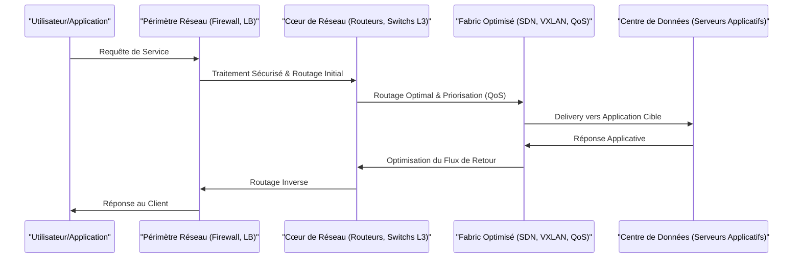

---
aliases:
  - "Super-Réseautage"
  - "Super Networking"
  - "Advanced Networking"
  - "Optimized Networking"
archetype: concept-reseau
couche_osi:
  - "Couche 2 - Liaison"
  - "Couche 3 - Réseau"
  - "Couche 4 - Transport"
  - "Couche 7 - Application"
technologie:
  - "Architectures Réseau Avancées"
  - "Optimisation de Performance Réseau"
  - "Sécurité Réseau Intégrée"
cssclasses:
  - max
tags:
  - architecture/reseau
  - reseau
  - performance
  - resilience
  - securite
  - scalabilite
  - modele-osi
  - ingenierie/reseau
  - qos
  - routage/avance
  - virtualisation/reseau
  - segmentation/micro-segmentation
  - equilibrage-charge
  - optimisation/wan
  - defense/defense-en-profondeur
  - modele-osi/couche-2
  - modele-osi/couche-3
  - modele-osi/couche-4
  - modele-osi/couche-7
  - automatisation
  - cloud
  - infrastructure/data-center
  - sdn
  - nfv
  - agilite
  - reseau/entreprise
  - cybersecurite/avance
  - reseau/ot
  - reseau/ics
  - outil/ndr
  - segmentation/industrielle
  - zero-trust
  - pare-feu/ngfw
  - dpi
  - complexite
  - economie/cout
  - latence
  - vecteur-attaque
  - vulnerabilite
  - gestion-acces
  - conformite
  - expertise
  - investissement
  - cout/traitement
---

# Super Networking

> [!abstract] Définition
> Le *Super Networking* représente une [[HolisticApproach|approche holistique]] et avancée de la conception, de la mise en œuvre et de la gestion des infrastructures réseau. Il vise à maximiser la *performance*, la *résilience*, la *sécurité* et l'*évolutivité* d'un réseau en intégrant des technologies et des pratiques d'optimisation à travers l'ensemble du modèle OSI, bien au-delà des fonctionnalités de base.

## ⚙️ Mécanisme & Fonctionnement
Le Super Networking ne repose pas sur un protocole unique, mais plutôt sur une *philosophie d'ingénierie réseau* qui combine et optimise diverses technologies et mécanismes à plusieurs couches du modèle OSI pour atteindre des objectifs de performance et de sécurité supérieurs.

### Encapsulation / Traitement
*   **Entrée** : Une *exigence métier complexe* (ex: faible latence pour applications critiques, haute disponibilité, forte sécurité périmétrique).
*   **Action** : Conception d'une architecture réseau intégrant plusieurs *mécanismes d'optimisation* (QoS, routage avancé, virtualisation réseau, micro-segmentation, équilibrage de charge intelligent, optimisation WAN) et des principes de *défense en profondeur* à travers les couches 2, 3, 4 et 7.
*   **Sortie** : Un réseau hautement *performant*, *résilient*, *sécurisé* et *automatisé*, capable de répondre aux demandes dynamiques des applications et des utilisateurs.

## 💡 Cas d'Usage Typique
L'implémentation du Super Networking est cruciale dans des environnements où les exigences réseau sont élevées et critiques :
1.  **Infrastructures Cloud et Data Centers Hyperscale** : Permet de gérer des millions de connexions simultanées, d'assurer une *micro-segmentation* efficace pour la sécurité et d'optimiser la latence pour les services distribués. Cela inclut l'utilisation intensive de *SDN (Software-Defined Networking)* et de *NFV (Network Function Virtualization)* pour l'agilité et l'automatisation.
2.  **Réseaux d'Entreprise Hautes Performances** : Supporte des applications critiques telles que la vidéoconférence en temps réel, les bases de données distribuées, le calcul haute performance (HPC) et les systèmes financiers transactionnels, en garantissant une *qualité de service (QoS)* stricte et une *résilience* face aux pannes.
3.  **Cybersécurité Avancée et Réseaux OT/ICS** : Intègre des capacités de *détection et de réponse aux incidents (NDR)*, de *segmentation industrielle* et de *Zéro Trust* dès la conception de l'architecture pour protéger les actifs critiques contre les menaces persistantes et les attaques ciblées, souvent en utilisant des technologies comme les *pare-feux de nouvelle génération (NGFW)* et l'*inspection approfondie des paquets (DPI)*.

## ⚠️ Limitations & Problèmes
> [!warning] Points d'attention
> *   **Complexité et Coût** : La mise en œuvre d'une stratégie de Super Networking requiert une expertise poussée, des investissements significatifs en équipement et en logiciels, ainsi qu'une gestion complexe des configurations et des interdépendances entre les couches et les technologies.
> *   **Performance** : Si mal conçu, l'excès de mécanismes d'optimisation ou de sécurité (ex: inspection approfondie, chaînage de services) peut introduire une latence imprévue ou un surcoût de traitement qui annule les bénéfices attendus. Une analyse et une planification rigoureuses sont indispensables.
> *   **Sécurité** : L'intégration de nombreuses couches et technologies peut créer de nouvelles surfaces d'attaque ou des vecteurs de vulnérabilité si les configurations ne sont pas auditées et sécurisées de manière exhaustive. La gestion des accès et la conformité deviennent des défis accrus.