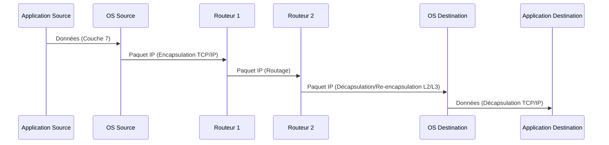

---
aliases:
  - Débit
  - Throughput
  - Débit réseau
  - Network Throughput
  - Débit effectif
archetype: concept-reseau
couche_osi:
  - "Couche 1 - Physique"
  - "Couche 2 - Liaison"
  - "Couche 3 - Réseau"
  - "Couche 4 - Transport"
technologie:
  - Ethernet
  - Wi-Fi
  - Fibre Optique
  - DSL
tags:
  - debit
  - reseau/performance
  - performance
  - reseau
  - bande-passante
  - latence
  - reseau/congestion
  - reseau/perte-paquets
  - protocole/tcp
  - protocole/udp
  - mecanisme/encapsulation
  - modele-osi
  - materiel/reseau
  - unite-mesure
  - performance/evaluation
  - infrastructure/conception
  - reseau/depannage
---

# Throughput

> [!abstract] Définition
> Le **débit** (ou *throughput* en anglais) est la quantité réelle de données transférées avec succès d'un point à un autre sur un réseau de communication pendant une période donnée. Il représente la vitesse effective de livraison des messages et est généralement mesuré en bits par seconde (bps), kilobits par seconde (Kbps), mégabits par seconde (Mbps) ou gigabits par seconde (Gbps). Contrairement à la **bande passante**, qui représente la capacité théorique maximale d'un lien réseau, le débit mesure la performance réelle en tenant compte des conditions du réseau.

## ⚙️ Mécanisme & Fonctionnement
Le débit quantifie le volume de données numériques qui sont non seulement transmises, mais *effectivement reçues* à destination dans un intervalle de temps donné. C'est une mesure de la performance réseau en conditions réelles, influencée par de nombreux facteurs.

Les principaux facteurs qui influencent le débit incluent :
*   La **bande passante** disponible : Le débit ne peut jamais excéder la bande passante maximale du support de transmission.
*   La **latence** : Le délai de transmission des données impacte directement le débit, car des délais plus longs signifient que moins de données peuvent être envoyées et accusées réception dans le même laps de temps.
*   La **perte de paquets** : Les paquets perdus nécessitent une retransmission, ce qui réduit le volume de données utiles transférées et, par conséquent, le débit effectif.
*   La **congestion du réseau** : Un trafic important ou un nombre élevé d'utilisateurs et d'applications en concurrence pour la bande passante peut entraîner une dégradation significative du débit.
*   La **qualité du matériel réseau** : Les performances des routeurs, commutateurs, cartes d'interface réseau (NIC) et câblages affectent directement la capacité du réseau à traiter et transmettre les données.
*   Le **protocole utilisé** : Les protocoles de transport comme TCP (qui inclut des mécanismes de contrôle de flux et de congestion) peuvent limiter le débit pour assurer la fiabilité, tandis que UDP (sans contrôle de flux) peut potentiellement offrir un débit plus élevé mais sans garantie de livraison.
*   Le **traitement des données** : L'ajout d'en-têtes et de pieds de trame par les différents protocoles (overhead protocolaire) réduit la quantité de données utiles (goodput) par rapport au débit brut.

La mesure du débit est souvent réalisée en transférant un fichier de grande taille entre deux systèmes et en calculant la quantité de données livrées par seconde, ou à l'aide d'outils de test de performance réseau comme iPerf/iPerf3.

### Encapsulation / Traitement
Le débit est la résultante du processus d'encapsulation, de transmission et de décapsulation des données à travers les différentes couches du modèle OSI. Chaque étape doit être réussie pour que les bits soient comptabilisés dans le débit effectif.

*   **Entrée** : Données de l'application (Couche 7) sur l'hôte source.
*   **Action** : Les données sont segmentées, encapsulées avec des en-têtes de protocole à chaque couche (transport, réseau, liaison) et converties en signaux physiques (bits) sur la couche physique. Elles sont ensuite transmises via le support réseau, traversent des équipements intermédiaires (commutateurs, routeurs) où des processus de décapsulation/ré-encapsulation et de routage/commutation ont lieu, avant d'être décapsulées par l'hôte destinataire.
*   **Sortie** : Données applicatives livrées avec succès et intégralement à l'application destinataire.

## 💡 Cas d'Usage Typique
Le débit est une métrique fondamentale pour diverses applications en entreprise :

1.  **Évaluation des performances réseau** : Il est essentiel pour comprendre la performance réelle des applications sensibles au réseau, telles que la vidéoconférence, le streaming haute définition, le transfert de fichiers volumineux, et les bases de données distribuées. Un débit insuffisant peut entraîner des latences, des coupures ou des échecs de transfert.
2.  **Conception et optimisation d'infrastructure** : Les ingénieurs réseau utilisent le débit pour dimensionner correctement les liens (WAN, LAN), choisir les équipements adéquats (routeurs, commutateurs, points d'accès Wi-Fi) et s'assurer que l'infrastructure peut supporter la charge de trafic prévue.
3.  **Surveillance et dépannage** : La surveillance continue du débit permet d'identifier les goulots d'étranglement, de détecter les problèmes de congestion, de perte de paquets ou de défaillance matérielle en temps réel, facilitant ainsi la résolution proactive des problèmes de performance.
4.  **Planification de capacité** : En analysant les tendances de débit, les entreprises peuvent anticiper les besoins futurs en bande passante et planifier les mises à niveau d'infrastructure pour éviter les dégradations de service.

## ⚠️ Limitations & Problèmes
> [!warning] Points d'attention
> *   **Performance** : Un faible débit a un impact direct sur la **productivité** et l'expérience utilisateur, entraînant des applications lentes, des téléchargements qui prennent du temps et des communications de mauvaise qualité. Il est souvent le symptôme de problèmes sous-jacents comme une bande passante insuffisante, une latence élevée, ou une perte de paquets.
> *   **Sécurité** : Les attaques par déni de service (DoS/DDoS) visent à saturer le débit d'une connexion ou d'un service, le rendant inaccessible aux utilisateurs légitimes.
> *   **Overhead protocolaire** : L'ajout d'en-têtes à chaque couche du modèle OSI, bien que nécessaire, réduit la proportion de données utiles (goodput) par rapport au débit total. Ce phénomène est d'autant plus marqué avec des paquets de petite taille.
> *   **Facteurs environnementaux** : Pour les réseaux sans fil (Wi-Fi), des éléments comme la distance, les obstacles physiques (murs), les interférences d'autres appareils ou réseaux peuvent considérablement réduire le débit.
> *   **Équipements obsolètes ou mal configurés** : Des équipements réseau anciens ou une configuration incorrecte peuvent devenir des goulots d'étranglement majeurs, limitant le débit global du réseau.

## 🔗 Notes Connexes
*   **Protocole lié** : TCP (Transmission Control Protocol), UDP (User Datagram Protocol)
*   **Matériel** : Router, Switch, Network Interface Card (NIC), Cabling
*   **Concepts** : Bandwidth, Latency, Packet Loss, Network Congestion, Goodput