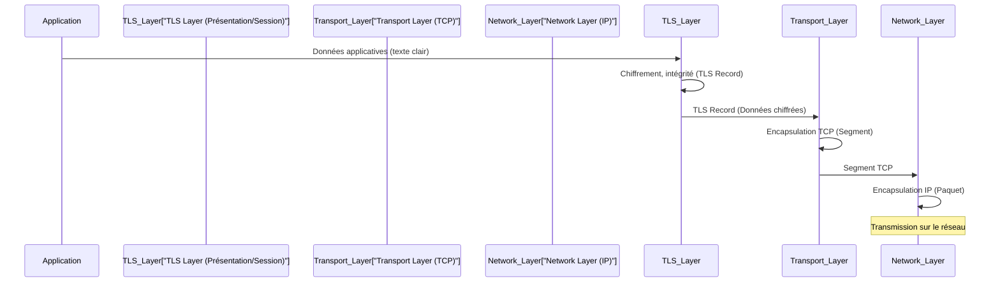

---
aliases:
  - "Sécurité de la Couche Transport"
  - "Transport Layer Security"
  - "TLS"
  - "SSL"
archetype: concept-reseau
couche_osi:
  - "Couche 5 - Session"
  - "Couche 6 - Présentation"
technologie:
  - "TLS"
  - "SSL"
cssclasses:
  - max
tags:
  - protocole/ssl-tls
  - chiffrement
  - cryptographie
  - authentification
  - confidentialite
  - integrite
  - securite
  - communication/handshake
  - encapsulation
  - protocole/https
  - email
  - reseau/vpn
  - iot
  - vulnerabilite
  - performance
  - latence
  - certificat/ssl-tls
  - chiffrement/diffie-hellman
  - modele-osi/couche-4
  - protocole/tcp
---

# Transport Layer Security (TLS)

> [!abstract] Définition
> Le *Transport Layer Security* (TLS) est un protocole cryptographique conçu pour fournir des communications sécurisées sur un réseau informatique. Il s'assure de l'authentification, de la confidentialité et de l'intégrité des données échangées entre deux applications communicantes. TLS opère au-dessus de la couche de transport (généralement TCP), agissant comme une couche de présentation et de session, pour protéger les données applicatives.

## ⚙️ Mécanisme & Fonctionnement
TLS fonctionne en établissant une session sécurisée entre un client et un serveur. Ce processus se décompose en deux phases principales : le *handshake* TLS et le protocole d'enregistrement TLS.

### Encapsulation / Traitement
1.  **Handshake TLS** : Le client et le serveur s'authentifient mutuellement (via des certificats X.509), négocient les algorithmes cryptographiques à utiliser (suites de chiffrement) et génèrent des clés de session uniques. Ce processus est public et permet d'établir un canal de communication sécurisé.
    *   **Entrée** : Requête de connexion client.
    *   **Action** : Échange de certificats, vérification de l'identité, négociation des algorithmes de chiffrement et génération des clés de session via un échange de clés (ex: Diffie-Hellman éphémère).
    *   **Sortie** : Session TLS établie avec des clés de chiffrement partagées et validées.

2.  **Protocole d'Enregistrement TLS** : Une fois la session établie, les données applicatives sont fragmentées, compressées (optionnel), chiffrées à l'aide des clés de session, et un code d'authentification de message (MAC) est ajouté pour garantir l'intégrité. Ces "enregistrements" TLS sont ensuite passés à la couche de transport sous-jacente (TCP).
    *   **Entrée** : Données applicatives claires (provenant de la couche Application).
    *   **Action** : Fragmentation des données, chiffrement symétrique avec les clés de session négociées, ajout d'un Message Authentication Code (MAC) pour l'intégrité.
    *   **Sortie** : Enregistrements TLS chiffrés et authentifiés, prêts à être encapsulés dans des segments TCP.

## 💡 Cas d'Usage Typique
TLS est un pilier de la sécurité sur internet et dans les réseaux d'entreprise :
1.  **Sécurisation du trafic Web (HTTPS)** : Le cas d'usage le plus répandu, où TLS est utilisé pour sécuriser les communications entre les navigateurs web et les serveurs, protégeant ainsi les transactions bancaires, les informations personnelles et la navigation générale.
2.  **Sécurité des e-mails** : Les protocoles de messagerie tels que SMTP, IMAP et POP3 sont souvent sécurisés par TLS (ex: SMTPS, IMAPS, POP3S) pour protéger le contenu des e-mails et les informations d'identification lors de leur transmission.
3.  **VPNs et accès à distance** : De nombreuses solutions de *Virtual Private Network* (VPN), notamment OpenVPN, utilisent TLS pour établir des tunnels sécurisés et chiffrer le trafic entre les utilisateurs distants et le réseau de l'entreprise.
4.  **Sécurisation des API** : Les *Application Programming Interfaces* (API) modernes utilisent largement TLS pour assurer la confidentialité et l'intégrité des échanges de données entre services, essentiel pour les microservices et les architectures cloud.
5.  **Communications IoT** : Dans l'Internet des Objets, TLS est utilisé pour sécuriser les communications entre les appareils connectés et les plateformes cloud, protégeant ainsi les données sensibles collectées.

## ⚠️ Limitations & Problèmes
> [!warning] Points d'attention
> *   **Performance** : Le chiffrement et le déchiffrement, ainsi que le processus de *handshake*, introduisent une charge de calcul (CPU) et une latence réseau supplémentaires. Bien que les implémentations modernes soient très optimisées, cela reste un facteur à considérer pour les applications à haute performance.
> *   **Vulnérabilités logicielles** : Des failles dans les implémentations de TLS ou dans les bibliothèques cryptographiques sous-jacentes (ex: Heartbleed dans OpenSSL) peuvent compromettre la sécurité, permettant l'accès à des clés privées ou à des données.
> *   **Attaques sur les versions obsolètes (SSL/TLS)** : L'utilisation de versions anciennes et vulnérables de SSL (toutes les versions) et de TLS (TLS 1.0, TLS 1.1) peut exposer les communications à des attaques telles que POODLE, BEAST ou CRIME, exploitant des faiblesses dans les algorithmes ou les modes opératoires du chiffrement. Il est crucial d'utiliser au minimum TLS 1.2, voire TLS 1.3.
> *   **Mauvaise configuration** : Une mauvaise configuration des serveurs (suites de chiffrement faibles, certificats mal gérés, absence de validations) peut affaiblir la protection offerte par TLS, rendant les systèmes vulnérables aux attaques par *Man-in-the-Middle* (MitM) ou à la divulgation d'informations.
> *   **Gestion des certificats** : La validité, le renouvellement et le stockage sécurisé des certificats X.509 sont essentiels. Un certificat expiré, révoqué ou non fiable peut rompre la chaîne de confiance et invalider la sécurité de la communication.