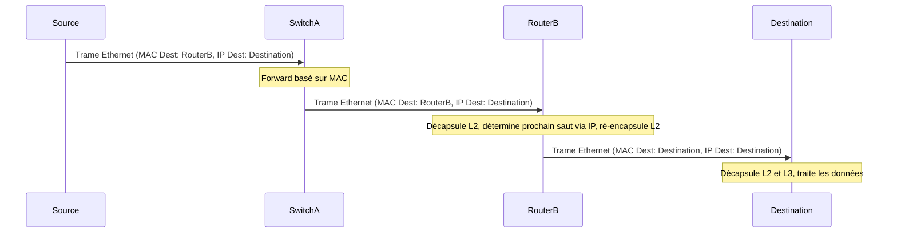

---
aliases:
  - Communication Unicast
  - Unicast Communication
archetype: concept-reseau
couche_osi:
  - "Couche 3 - Réseau"
  - "Couche 4 - Transport"
technologie:
  - TCP/IP
cssclasses:
  - max
tags:
  - reseau/unicast
  - reseau/communication
  - reseau/fonctionnement
  - reseau/adressage
  - adresse-ip
  - adresse-mac
  - reseau/routage
  - paquet
  - trame
  - routeur
  - switch
  - encapsulation
  - decapsulation
  - modele-osi/couche-2
  - modele-osi/couche-3
  - http
  - https
  - ftp
  - sftp
  - smtp
  - pop3
  - imap
  - ssh
  - rdp
  - performance/reseau
  - reseau/scalabilite
  - securite/reseau
  - chiffrement
  - ssl-tls
---

# Unicast Communication

> [!abstract] Définition
> La *communication unicast* est une méthode de transmission de données où un paquet est envoyé d'un **expéditeur unique** à un **destinataire unique** sur un réseau. C'est le modèle de communication le plus courant, permettant une transmission directe et exclusive entre deux points spécifiques.

## ⚙️ Mécanisme & Fonctionnement
Le principe de la communication unicast repose sur l'adressage direct d'un hôte spécifique. Lorsqu'un dispositif souhaite envoyer des données en unicast, il utilise l'adresse unique du destinataire (par exemple, une adresse IP au niveau de la couche réseau ou une adresse MAC au niveau de la couche liaison de données). Le paquet de données est alors acheminé à travers le réseau, passant par différents équipements (routeurs, commutateurs) qui lisent les informations d'adressage pour déterminer le chemin optimal vers la destination finale.

Chaque routeur ou commutateur sur le chemin examine l'adresse de destination et transfère le paquet vers l'interface appropriée qui mène au destinataire. Si le destinataire est local, le commutateur utilise son adresse MAC pour délivrer la trame directement. Si le destinataire est distant, le routeur achemine le paquet vers le réseau suivant jusqu'à ce qu'il atteigne le segment de réseau du destinataire. Ce processus garantit que les données n'arrivent qu'à l'hôte visé, évitant ainsi la charge inutile sur d'autres dispositifs du réseau.

### Encapsulation / Traitement
*   **Entrée** : Un dispositif source génère des données et les encapsule avec l'adresse IP de destination (unicast) au niveau de la couche réseau et l'adresse MAC du prochain saut (ou du destinataire final sur le même segment) au niveau de la couche liaison de données.
*   **Action** :
    *   Au niveau de l'expéditeur, les données sont segmentées, encapsulées dans des paquets IP avec l'adresse IP de destination.
    *   Ces paquets sont ensuite encapsulés dans des trames de couche 2 avec l'adresse MAC du destinataire (si sur le même segment) ou du routeur de passerelle (si sur un segment différent).
    *   Les routeurs et commutateurs intermédiaires décapsulent la trame de couche 2 pour lire l'adresse MAC, puis l'adresse IP pour décider du prochain saut, avant de ré-encapsuler les données dans une nouvelle trame pour la transmission.
*   **Sortie** : Le paquet de données est reçu et décapsulé par le dispositif de destination, qui traite les informations jusqu'à la couche application.

## 💡 Cas d'Usage Typique
La communication unicast est omniprésente dans les réseaux modernes en raison de sa nature directe et efficace pour les échanges point à point.

1.  **Navigation Web (HTTP/HTTPS)** : Lorsqu'un utilisateur accède à un site web, son navigateur envoie une requête HTTP unicast au serveur web hébergeant le site, et le serveur répond avec la page demandée, également en unicast.
2.  **Transfert de Fichiers (FTP/SFTP)** : Le téléchargement ou l'envoi d'un fichier entre un client et un serveur FTP est une communication unicast, car les données sont échangées exclusivement entre ces deux entités.
3.  **Messagerie Électronique (SMTP/POP3/IMAP)** : L'envoi et la réception d'e-mails entre un client de messagerie et un serveur de messagerie, ou entre deux serveurs de messagerie, utilisent la communication unicast.
4.  **Sessions SSH/RDP** : Les connexions sécurisées pour l'accès à distance à des serveurs ou des postes de travail sont des exemples classiques de communication unicast, garantissant une interaction privée et directe.

## ⚠️ Limitations & Problèmes
> [!warning] Points d'attention
> *   **Performance** : Pour la diffusion de contenu à un grand nombre de destinataires *simultanément*, le unicast peut être inefficace. Chaque destinataire nécessite une connexion et un flux de données distincts, ce qui peut saturer la bande passante de l'expéditeur et du réseau.
> *   **Sécurité** : Bien que la communication soit point à point, les paquets peuvent être interceptés ou modifiés en transit si les protocoles de sécurité (comme SSL/TLS pour l'encryption) ne sont pas correctement mis en œuvre.
> *   **Scalabilité** : La diffusion de contenu à des milliers ou millions d'utilisateurs via unicast peut entraîner une charge serveur et réseau prohibitive, rendant le multicast ou le anycast plus adaptés pour ces scénarios.