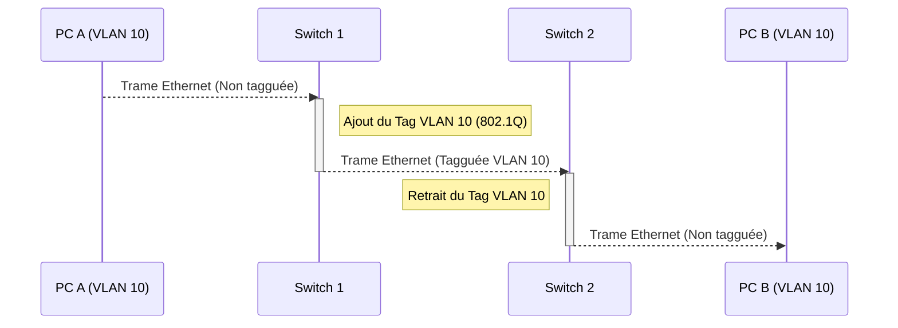

---
aliases:
  - "Réseau Local Virtuel"
  - "VLAN"
  - "Virtual Local Area Network"
  - "802.1Q"
archetype: concept-reseau
couche_osi:
  - "Couche 2 - Liaison"
technologie:
  - "VLAN"
cssclasses:
  - max
tags:
  - reseau/vlan
  - segmentation/reseau
  - segmentation/logique
  - protocole/ieee-802-1q
  - protocole/ieee-802-1q/vid
  - modele-osi/couche-2
  - reseau/domaine-de-diffusion
  - reseau/trunk-port
  - reseau/access-port
  - routage
  - materiel/reseau/switch
  - securite/reseau
  - attaque/vlan-hopping
  - qos
---

# Virtual Local Area Network (VLAN)

> [!abstract] Définition
> Un **Réseau Local Virtuel (VLAN)** est une méthode de segmentation logique d'un réseau Ethernet physique en plusieurs réseaux de diffusion indépendants. Il permet de regrouper des périphériques sur un même réseau logique, indépendamment de leur emplacement physique, améliorant ainsi la gestion, la sécurité et les performances du réseau.

## ⚙️ Mécanisme & Fonctionnement
Les VLANs fonctionnent principalement à la couche 2 du modèle OSI (couche liaison de données) en utilisant la norme IEEE 802.1Q pour l'identification des trames. Cette norme ajoute une étiquette (tag) de 4 octets à l'en-tête Ethernet, contenant notamment un **VLAN ID (VID)** qui identifie le VLAN auquel la trame appartient.

### Segmentation Logique et Isolation des Broadcasts
Le principe fondamental du VLAN est de diviser un unique domaine de diffusion physique en plusieurs domaines de diffusion logiques. Chaque VLAN constitue un domaine de diffusion distinct.
*   **Segmentation Logique** : Au lieu de dépendre de la topologie physique (un switch = un domaine de diffusion), les VLANs permettent de regrouper des ports de switch ou des utilisateurs situés sur différents switches dans le même segment logique. Par exemple, tous les utilisateurs du service "Comptabilité" peuvent être dans le VLAN 10, même si leurs postes sont connectés à des switches différents.
*   **Isolation des Broadcasts** : Lorsqu'un périphérique envoie une trame de diffusion (broadcast) au sein d'un VLAN, cette trame est uniquement transmise aux autres périphériques membres du *même* VLAN. Les trames de diffusion ne traversent pas les limites d'un VLAN, ce qui réduit significativement la taille des domaines de diffusion, améliore les performances du réseau en limitant le trafic inutile, et augmente la sécurité en isolant les communications. Pour que les VLANs communiquent entre eux, un [[InterVLANRouting|routage inter-VLAN]] (généralement via un routeur ou un switch de couche 3) est nécessaire.

### Encapsulation / Traitement
*   **Entrée** : Une trame Ethernet arrive sur un port d'accès d'un switch configuré pour un VLAN spécifique (par exemple, VLAN 10). La trame est initialement non tagguée.
*   **Action** : Le switch ajoute une étiquette (tag 802.1Q) à la trame, y insérant le VLAN ID correspondant au port d'entrée. Si la trame est destinée à un autre switch via un port trunk (qui transporte le trafic de plusieurs VLANs), la trame tagguée est transmise telle quelle. Si la trame doit être envoyée à un périphérique final via un port d'accès du même VLAN sur un autre switch, le tag sera retiré avant l'envoi.
*   **Sortie** : Une fois la trame tagguée reçue par un autre switch via un port trunk, si elle est destinée à un périphérique final connecté à un port d'accès configuré pour le même VLAN, le switch retire le tag 802.1Q et envoie la trame non tagguée au périphérique.

## 💡 Cas d'Usage Typique
Les VLANs sont largement utilisés dans les réseaux d'entreprise pour diverses raisons :
1.  **Segmentation Départementale** : Isoler le trafic des différents départements (ex: Comptabilité, Marketing, IT) pour améliorer la sécurité et réduire la congestion. Le trafic d'un département reste au sein de son VLAN, sauf si routé intentionnellement.
2.  **Réseaux Invités (Guest Networks)** : Créer un réseau séparé pour les invités avec un accès Internet restreint, sans leur donner accès aux ressources internes de l'entreprise.
3.  **Trafic Sensible** : Séparer le trafic vocal (VoIP) ou vidéo du trafic de données standard pour garantir la Qualité de Service (QoS) et la priorité.
4.  **Sécurité Améliorée** : Isoler les serveurs critiques ou les zones démilitarisées (DMZ) dans leurs propres VLANs pour limiter l'impact d'une compromission.
5.  **Gestion Simplifiée** : Faciliter les déménagements et les changements d'organisation sans re-câblage physique.

## ⚠️ Limitations & Problèmes
> [!warning] Points d'attention
> *   **Performance** : L'ajout et le retrait des tags 802.1Q sur les trames entraînent une légère surcharge de traitement pour les switches. Cependant, les équipements modernes sont optimisés et cet impact est généralement négligeable sur les performances du réseau.
> *   **Sécurité** :
    *   **VLAN Hopping** : Une attaque de sécurité où un attaquant tente d'accéder à un VLAN auquel il n'est pas autorisé. Cela peut se produire par des techniques comme le "double tagging" ou l'usurpation de rôle de switch sur un port trunk.
    *   **Mauvaise Configuration** : Une configuration incorrecte des ports de switch ou des VLANs peut entraîner des fuites de trafic entre VLANs ou un manque d'isolation, compromettant la sécurité.
> *   **Complexité** : La conception et la gestion de nombreux VLANs peuvent ajouter une certaine complexité à l'administration du réseau, nécessitant une planification rigoureuse et une documentation à jour.