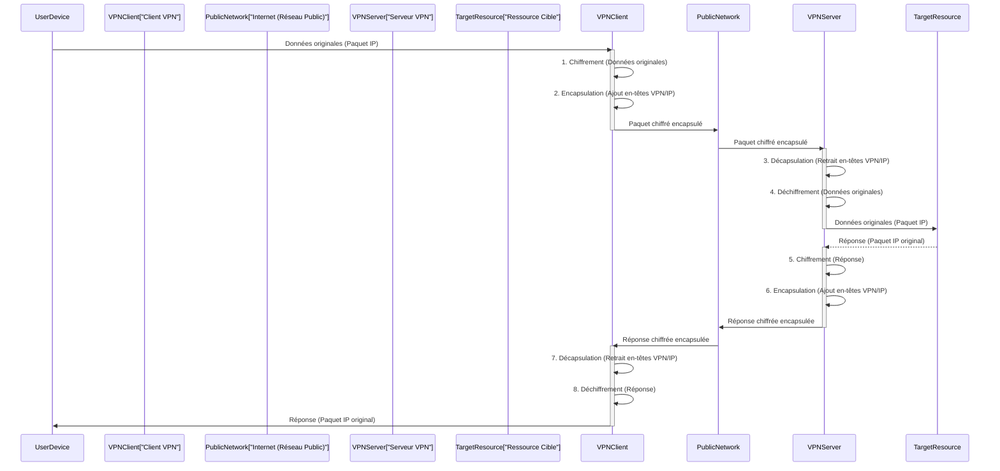

---
tags:
  - réseau/vpn/virtual-private-network
  - cybersécurité/confidentialité/chiffrement
  - cybersécurité/accès-distant/sécurisé
  - réseau/tunneling/encapsulation
  - cybersécurité/anonymat/masquage-ip
  - protocole/vpn/ipsec
  - infrastructure/architecture-réseau/overlay-network
aliases:
  - Réseau Privé Virtuel
  - VPN
  - Virtual Private Network
archetype: concept-reseau
couche_osi:
  - "Couche 3 - Réseau"
  - "Couche 4 - Transport"
  - "Couche 7 - Application"
technologie:
  - IPsec
  - OpenVPN
  - WireGuard
  - L2TP/IPsec
  - SSL/TLS
cssclasses:
  - max
---

# Virtual Private Network (VPN)

> [!abstract] Définition
> Un Réseau Privé Virtuel (VPN) est un réseau superposé (overlay network) qui étend un réseau privé à travers un réseau public, comme Internet, en utilisant le chiffrement et des protocoles de tunneling. Il crée une connexion sécurisée et chiffrée entre un appareil et un serveur distant, masquant l'adresse IP de l'utilisateur et protégeant les données personnelles des interceptions par des tiers.

## ⚙️ Mécanisme & Fonctionnement
Un VPN fonctionne en établissant un "tunnel" chiffré entre le périphérique de l'utilisateur (client VPN) et un serveur VPN. Tout le trafic Internet de l'utilisateur est acheminé à travers ce tunnel sécurisé. Ce processus implique trois étapes principales : le chiffrement des données, l'encapsulation et le tunneling, ainsi que l'authentification.

1.  **Chiffrement** : Avant d'envoyer les données, le client VPN les chiffre, les rendant illisibles pour quiconque tenterait de les intercepter. Des algorithmes robustes comme AES-256 sont couramment utilisés.
2.  **Encapsulation et Tunneling** : Les données chiffrées sont ensuite encapsulées, c'est-à-dire enveloppées dans un paquet supplémentaire qui contient les informations d'acheminement nécessaires pour traverser le réseau public. Ce paquet est transmis via un protocole de tunneling (comme IPsec, OpenVPN, WireGuard) qui crée le "tunnel virtuel".
3.  **Redirection du trafic** : Le paquet encapsulé est envoyé au serveur VPN, qui le décapsule et le déchiffre, puis le transmet à sa destination finale sur Internet ou sur un réseau privé. Pour le monde extérieur, il semble que le trafic provienne du serveur VPN, masquant ainsi l'adresse IP réelle de l'utilisateur.

### Encapsulation / Traitement
*   **Entrée** : Données originales (paquets IP) du dispositif utilisateur.
*   **Action** :
    1.  Le client VPN chiffre les données originales.
    2.  Les données chiffrées sont encapsulées avec des en-têtes de protocole VPN (ex: IPsec, OpenVPN) et un nouvel en-tête IP source/destination pointant vers le serveur VPN. Cela crée le paquet du "tunnel".
*   **Sortie** : Paquet IP encapsulé et chiffré, prêt à être acheminé sur le réseau public.

*Note sur les couches OSI :* Les VPN opèrent principalement à la **Couche 3 - Réseau** pour la création du tunnel IP, mais les protocoles de sécurité sous-jacents comme IPsec peuvent utiliser des services de la Couche 4 (Transport), et les VPN basés sur SSL/TLS sont souvent considérés comme opérant à la **Couche 7 - Application**.

## 💡 Cas d'Usage Typique
Les VPN sont largement utilisés dans plusieurs scénarios pour améliorer la sécurité, la confidentialité et l'accès aux ressources.
1.  **Télétravail et accès distant sécurisé** : Les entreprises utilisent des VPN (VPN d'accès distant) pour permettre aux employés de se connecter en toute sécurité au réseau de l'entreprise et d'accéder aux ressources internes depuis n'importe quel endroit via Internet. Cela protège les données sensibles même sur des réseaux Wi-Fi publics non sécurisés.
2.  **Connexion de réseaux (Site-à-Site)** : Les VPN site-à-site connectent deux ou plusieurs réseaux locaux (LAN) distincts sur Internet, par exemple, entre un siège social et ses succursales, les faisant apparaître comme un seul réseau privé.
3.  **Protection de la vie privée et anonymat en ligne** : Les utilisateurs individuels emploient des VPN pour masquer leur adresse IP, chiffrer leur trafic Internet et empêcher les fournisseurs d'accès Internet (FAI), les annonceurs ou d'autres entités de surveiller leurs activités en ligne.
4.  **Contournement des géo-restrictions et de la censure** : En acheminant le trafic via un serveur situé dans un autre pays, les VPN permettent d'accéder à du contenu soumis à des restrictions géographiques ou de contourner la censure Internet.

## ⚠️ Limitations & Problèmes
> [!warning] Points d'attention
> *   **Performance** : L'encapsulation, le chiffrement et l'acheminement du trafic via un serveur intermédiaire peuvent entraîner une réduction de la vitesse de connexion Internet. Cet impact peut varier en fonction du protocole VPN utilisé, de la distance par rapport au serveur et de la charge du serveur.
> *   **Complexité de configuration et de gestion** : La mise en place et la maintenance de solutions VPN, en particulier les VPN site-à-site ou d'entreprise, peuvent être complexes et nécessitent une expertise technique.
> *   **Coût** : Les services VPN payants de qualité ont un coût. Les VPN gratuits peuvent présenter des inconvénients majeurs, comme la vente de données utilisateur, des vitesses réduites, des limites de données ou l'inclusion de logiciels malveillants.
> *   **Sécurité** : Bien que les VPN améliorent la sécurité, ils ne protègent pas contre toutes les menaces. Une mauvaise configuration, des protocoles obsolètes ou des vulnérabilités dans le logiciel VPN peuvent créer des failles de sécurité. De plus, le fournisseur VPN lui-même a accès aux données chiffrées qui traversent ses serveurs, soulignant l'importance de choisir un fournisseur fiable avec une politique de non-journalisation ("no-logs policy").
> *   **Blocage et détection** : Certains services en ligne ou pays peuvent tenter de détecter et de bloquer le trafic VPN, limitant ainsi son efficacité pour contourner les restrictions.

## 🔗 Notes Connexes
*   **Protocoles liés** :
    *   IPsec (Internet Protocol Security)
    *   OpenVPN
    *   WireGuard
    *   L2TP/IPsec (Layer 2 Tunneling Protocol / IPsec)
    *   SSL/TLS (Secure Sockets Layer / Transport Layer Security)
    *   GRE (Generic Routing Encapsulation)
*   **Matériel** :
    *   Router
    *   Pare-feu (Firewall)
    *   Passerelle VPN (VPN Gateway)
    *   Serveur VPN (logiciel ou matériel dédié)
---