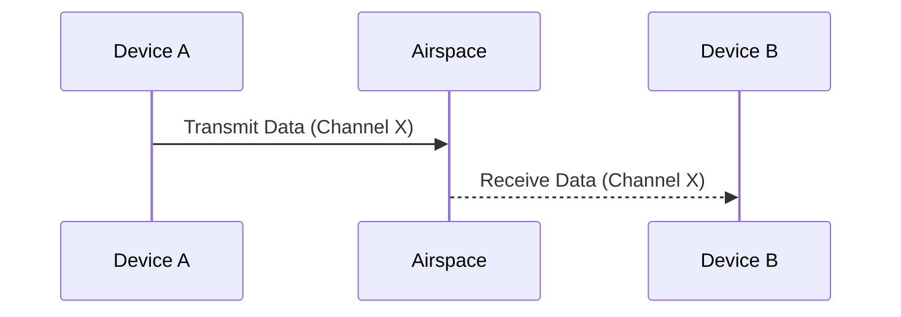

---
aliases:
  - Canal Wi-Fi
  - Wi-Fi Channel
  - WLAN Channel
  - RF Channel
  - Canaux Wi-Fi
archetype: concept-reseau
couche_osi:
  - "Couche 1 - Physique"
  - "Couche 2 - Liaison"
technologie:
  - Wi-Fi
  - IEEE 802.11
cssclasses:
  - max
tags:
  - wifi
  - wifi/canal
  - protocole/ieee-802-11
  - radiofrequence/2-4-ghz
  - radiofrequence/5-ghz
  - interferences
  - interferences/co-canal
  - reseau/congestion
  - wifi/dfs
  - modele-osi/couche-1
  - modele-osi/couche-2
  - modulation
  - encapsulation
  - signal/radiofrequence
---

# WiFi Channel

> [!abstract] Définition
> Un **canal Wi-Fi** est une bande de fréquences radio spécifique au sein d'une bande de fréquences plus large (comme 2.4 GHz ou 5 GHz) utilisée pour la communication sans fil par les périphériques Wi-Fi. Il permet aux points d'accès (AP) et aux clients de communiquer sur une portion définie du spectre radio, évitant ainsi les interférences avec d'autres transmissions Wi-Fi ou d'autres technologies sans fil.

## ⚙️ Mécanisme & Fonctionnement
Les réseaux Wi-Fi opèrent sur des bandes de fréquences radioélectriques, principalement 2.4 GHz et 5 GHz, définies par la norme **IEEE 802.11**. Ces bandes sont subdivisées en plusieurs canaux numérotés, chacun occupant une plage de fréquences spécifique.

### Bandes de Fréquences et Canaux
*   **Bande 2.4 GHz (2400-2483.5 MHz)** : Offre une portée plus longue et une meilleure pénétration des obstacles que la bande 5 GHz, mais est plus sujette aux interférences en raison de sa congestion (utilisée par le Bluetooth, les fours à micro-ondes, etc.). Elle dispose de 11 à 14 canaux, chacun ayant une largeur de 20 MHz. Cependant, seuls trois canaux sont réellement *non-chevauchants* en Amérique du Nord (canaux 1, 6 et 11), car les canaux adjacents se superposent partiellement en fréquence, provoquant des interférences.
*   **Bande 5 GHz (5150-5825 MHz)** : Offre des débits plus élevés et une plus grande capacité en raison de la disponibilité d'un plus grand nombre de canaux non-chevauchants. Elle est moins sujette aux interférences que la bande 2.4 GHz, mais sa portée est plus courte et sa capacité à traverser les obstacles est réduite. Elle comporte de nombreux canaux de 20 MHz, et les normes 802.11n, 802.11ac et 802.11ax peuvent agréger plusieurs canaux (40 MHz, 80 MHz, 160 MHz) pour augmenter la bande passante et le débit.

Le choix d'un canal non-chevauchant est crucial pour minimiser les *interférences co-canal* entre les points d'accès voisins ou multiples dans le même environnement, améliorant ainsi la performance globale du réseau.

### Encapsulation / Traitement
*   **Entrée** : Données numériques provenant des couches supérieures du modèle OSI, prêtes pour la transmission sans fil.
*   **Action** : Les données sont formatées en trames 802.11 (Couche 2), puis modulées sur une fréquence porteuse spécifique au canal Wi-Fi sélectionné. Le signal est ensuite amplifié et transmis via l'antenne sous forme d'ondes radio.
*   **Sortie** : Signal radiofréquence modulé, émis sur le canal Wi-Fi choisi.

## 💡 Cas d'Usage Typique
L'utilisation et l'optimisation des canaux Wi-Fi sont essentielles pour la performance des réseaux sans fil.

1.  **Réduction des Interférences** : En sélectionnant des canaux non-chevauchants, notamment les canaux 1, 6 et 11 dans la bande 2.4 GHz, on minimise les interférences avec les réseaux Wi-Fi voisins ou d'autres dispositifs émettant sur des fréquences similaires, améliorant ainsi la stabilité et le débit.
2.  **Optimisation des Performances en Entreprise** : Dans les déploiements Wi-Fi denses (par exemple, dans les bureaux ou les centres commerciaux), une planification minutieuse des canaux est effectuée. Les administrateurs réseau attribuent stratégiquement différents canaux non-chevauchants aux points d'accès adjacents pour éviter les interférences co-canal et maximiser la capacité du réseau. L'utilisation de canaux plus larges (40/80/160 MHz) dans la bande 5 GHz est privilégiée pour les applications nécessitant un débit élevé.

## ⚠️ Limitations & Problèmes
> [!warning] Points d'attention
> *   **Interférences** : Les interférences co-canal (deux AP utilisant le même canal dans la même zone) et les interférences adjacentes (AP utilisant des canaux qui se chevauchent partiellement) peuvent gravement dégrader les performances, augmenter la latence et réduire le débit.
> *   **Congestion** : Dans les environnements à forte densité d'utilisateurs ou d'appareils, même un canal non-chevauchant peut devenir congestionné, entraînant une diminution de la vitesse et de la fiabilité des connexions Wi-Fi.
> *   **Capacité limitée de la bande 2.4 GHz** : Le nombre restreint de canaux non-chevauchants dans la bande 2.4 GHz rend difficile l'optimisation dans les environnements à forte densité, poussant les déploiements modernes vers la bande 5 GHz.
> *   **Sélection de canal dynamique (DFS)** : Dans la bande 5 GHz, certains canaux peuvent être soumis à la **DFS** pour éviter les interférences avec les radars météorologiques ou militaires, ce qui peut entraîner des interruptions temporaires du service lorsque l'AP doit changer de canal.