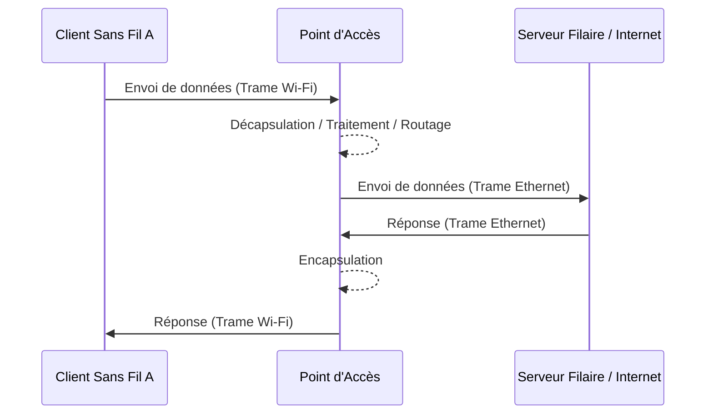

---
aliases:
  - "Modes Réseau Wi-Fi"
  - "Wi-Fi Network Modes"
  - "WiFi Modes"
  - "Wireless Network Modes"
  - "Modes de fonctionnement Wi-Fi"
archetype: concept-reseau
couche_osi:
  - "Couche 1 - Physique"
  - "Couche 2 - Liaison"
technologie:
  - "Wi-Fi"
  - "IEEE 802.11"
cssclasses:
  - max
tags:
  - wifi
  - reseau/sans-fil
  - protocole/ieee/802-11
  - reseau/topologie
  - reseau/point-acces
  - mode-fonctionnement/infrastructure
  - mode-fonctionnement/ad-hoc
  - wifi/wi-fi-direct
  - mode-fonctionnement/partage-connexion
  - reseau/topologie/maillee
  - modele-osi/couche-1
  - modele-osi/couche-2
  - encapsulation
  - decapsulation
  - reseau/adressage/mac
  - gestion-acces/csma-ca
  - p2p
  - nat
---

# WiFi Network Modes

> [!abstract] Définition
> Les **modes de fonctionnement Wi-Fi** décrivent les différentes manières dont les appareils peuvent se connecter et communiquer au sein d'un réseau sans fil, conformément aux normes **IEEE 802.11**. Ces modes définissent la topologie du réseau et le rôle des différents équipements (clients, points d'accès) dans l'établissement des liaisons et le transfert de données.

## ⚙️ Mécanisme & Fonctionnement

Les réseaux Wi-Fi opèrent principalement au niveau des couches physique (Couche 1) et liaison de données (Couche 2) du modèle OSI.

### Encapsulation / Traitement (Général)
*   **Entrée** : Données provenant des couches supérieures du modèle OSI.
*   **Action** : La couche liaison de données (MAC) encapsule les paquets IP en trames Wi-Fi (802.11), ajoutant des en-têtes pour l'adressage MAC, le contrôle d'accès au support (CSMA/CA) et la gestion de la liaison. La couche physique convertit ces trames en signaux radio (ondes électromagnétiques) modulés.
*   **Sortie** : Signaux radio transmis sur une fréquence et un canal spécifiques.

### Modes de Fonctionnement Détaillés

#### 1. Mode Infrastructure
C'est le mode le plus courant. Il implique un **point d'accès** (AP - Access Point) ou un routeur sans fil qui agit comme un concentrateur central.

*   **Rôle** : Les clients sans fil (stations) se connectent à l'AP, qui à son tour est généralement connecté à un réseau filaire (système de distribution). L'AP gère les associations, l'authentification et le transfert du trafic entre les clients et le réseau filaire, ou entre les clients eux-mêmes.
*   **Flux de données** :
    *   **Entrée** : Trame Wi-Fi d'un client (STA).
    *   **Action** : L'AP reçoit la trame, la décapsule (enlève l'en-tête Wi-Fi), la traite (par exemple, routage ou commutation), et la ré-encapsule si elle doit être envoyée à un autre client sans fil ou la transmet sur le réseau filaire.
    *   **Sortie** : Trame Wi-Fi vers un autre client via l'AP, ou trame Ethernet sur le réseau filaire.

#### 2. Mode Ad-hoc (IBSS - Independent Basic Service Set)
Dans ce mode, les appareils Wi-Fi se connectent directement les uns aux autres sans nécessiter de point d'accès centralisé.

*   **Rôle** : Chaque appareil agit à la fois comme client et comme routeur potentiel, gérant sa propre communication. C'est une connexion de type pair-à-pair (P2P).
*   **Flux de données** :
    *   **Entrée** : Trame Wi-Fi d'un appareil source.
    *   **Action** : L'appareil source envoie directement la trame à l'appareil de destination s'il est à portée. Chaque nœud doit maintenir une table de routage si le réseau est plus complexe.
    *   **Sortie** : Trame Wi-Fi directement reçue par l'appareil de destination.

#### 3. Wi-Fi Direct
Ce mode permet une connexion directe entre appareils Wi-Fi sans point d'accès, mais offre des fonctionnalités de découverte et de sécurité améliorées par rapport au mode Ad-hoc.

*   **Rôle** : L'un des appareils Wi-Fi Direct agit comme un "propriétaire de groupe" (Group Owner), assumant le rôle d'un AP simplifié pour la connexion, la gestion et la sécurité des autres appareils.
*   **Flux de données** :
    *   **Entrée** : Données d'un appareil client Wi-Fi Direct.
    *   **Action** : Les appareils se découvrent et négocient la connexion. Le propriétaire de groupe gère la session et le transfert direct des données entre les appareils connectés, souvent à des vitesses Wi-Fi standard.
    *   **Sortie** : Données transmises directement aux autres appareils Wi-Fi Direct.

#### 4. Partage de connexion (Tethering / Mobile Hotspot)
Un appareil mobile (smartphone, tablette) utilise sa connexion de données cellulaire pour créer un point d'accès Wi-Fi portable, partageant ainsi l'accès à Internet avec d'autres appareils.

*   **Rôle** : Le mobile agit comme un routeur Wi-Fi miniature, convertissant le signal de données cellulaire en un signal Wi-Fi local.
*   **Flux de données** :
    *   **Entrée** : Trame Wi-Fi d'un client connecté au hotspot.
    *   **Action** : Le mobile décapsule la trame, effectue généralement de la traduction d'adresses réseau (NAT) et transfère les paquets sur le réseau cellulaire.
    *   **Sortie** : Paquets de données vers le réseau cellulaire ; réponses acheminées via le mobile vers le client Wi-Fi.

#### 5. Réseau Maillé (Mesh Network Mode)
Un réseau maillé Wi-Fi se compose de plusieurs points d'accès (nœuds) qui travaillent ensemble pour former un réseau sans fil unique et étendu.

*   **Rôle** : Les nœuds Wi-Fi (routeur maillé et satellites) communiquent entre eux pour étendre la couverture et acheminer le trafic de manière dynamique. Si un nœud tombe en panne, le réseau peut se "réparer" automatiquement en reroutant le trafic par d'autres chemins.
*   **Flux de données** :
    *   **Entrée** : Trame Wi-Fi d'un client vers un nœud maillé.
    *   **Action** : Le nœud reçoit la trame et la transmet au nœud suivant le long du chemin optimal vers le routeur principal (passerelle) ou la destination. Les données peuvent "sauter" d'un nœud à l'autre.
    *   **Sortie** : Trame Wi-Fi transmise au nœud suivant dans le maillage.

## 💡 Cas d'Usage Typique

1.  **Mode Infrastructure** :
    *   **Domicile et Bureau** : Permet à plusieurs appareils de se connecter à Internet et entre eux via un routeur Wi-Fi.
    *   **Réseaux Publics (Hotspots Wi-Fi fixes)** : Cafés, aéroports, hôtels, bibliothèques, où un accès centralisé et sécurisé est fourni à de nombreux utilisateurs.
2.  **Mode Ad-hoc** :
    *   **Partage de fichiers temporaire** : Échange rapide de documents ou de photos entre quelques appareils à proximité sans accès réseau.
    *   **Jeu multijoueur local** : Connexion directe entre consoles ou ordinateurs pour des sessions de jeu sans infrastructure.
    *   **Situations d'urgence** : Établir une communication minimale là où aucune infrastructure n'est disponible.
3.  **Wi-Fi Direct** :
    *   **Impression sans fil** : Envoyer un document d'un téléphone ou PC directement à une imprimante compatible.
    *   **Partage d'écran (Casting)** : Diffuser du contenu d'un appareil mobile vers une TV compatible.
    *   **Transfert de fichiers volumineux** : Partager rapidement des vidéos ou des photos entre appareils avec des débits Wi-Fi.
4.  **Partage de connexion (Tethering)** :
    *   **Accès Internet en déplacement** : Fournir une connexion Internet à un ordinateur portable ou une tablette via le smartphone dans les zones sans Wi-Fi public.
    *   **Travail sécurisé à distance** : Utiliser la connexion de données mobile pour des tâches sensibles (ex: banque) plutôt que des réseaux Wi-Fi publics non sécurisés.
5.  **Réseau Maillé** :
    *   **Grandes habitations et entreprises** : Assurer une couverture Wi-Fi complète et homogène sur une grande surface, éliminant les "zones mortes".
    *   **Déploiements complexes** : Réseaux dans des environnements avec des obstacles où la résilience et l'auto-réparation sont cruciales.

## ⚠️ Limitations & Problèmes

> [!warning] Points d'attention
> *   **Performance** :
    *   **Ad-hoc** : Vitesse et portée limitées, pas toujours compatible avec les appareils modernes. Peut souffrir d'une gestion moins efficace du médium d'accès.
    *   **Infrastructure** : La performance peut être affectée par le nombre de clients connectés à un AP et par les interférences.
    *   **Tethering** : Dépend de la qualité du signal cellulaire et peut entraîner une consommation rapide de la batterie et des données mobiles.
    *   **Mesh** : Bien qu'améliorant la couverture, un grand nombre de sauts entre les nœuds peut introduire de la latence.
> *   **Sécurité** :
    *   **Ad-hoc** : Souvent considéré comme moins sécurisé, avec des options de chiffrement limitées (parfois uniquement WEP) et une absence de contrôle centralisé.
    *   **Infrastructure et Hotspots Publics** : Risques d'interception de données si le réseau n'est pas correctement chiffré (WPA3 recommandé) ou si des réseaux non fiables sont utilisés.
> *   **Compatibilité et Standardisation** :
    *   **Wi-Fi Direct** : Malgré la norme, des problèmes de compatibilité peuvent survenir entre appareils de fabricants différents. Les appareils Apple, par exemple, utilisent des solutions propriétaires comme AirDrop.
> *   **Coût** :
    *   **Infrastructure** : Nécessite l'achat d'un ou plusieurs points d'accès.
    *   **Mesh** : Coût initial plus élevé que les solutions à AP unique.
> *   **Gestion et Évolutivité** :
    *   **Ad-hoc** : Non évolutif pour de grands réseaux ou des besoins permanents.
    *   **Infrastructure** : Plus évolutif, mais l'ajout d'AP peut nécessiter une planification pour éviter les interférences et assurer une bonne couverture.