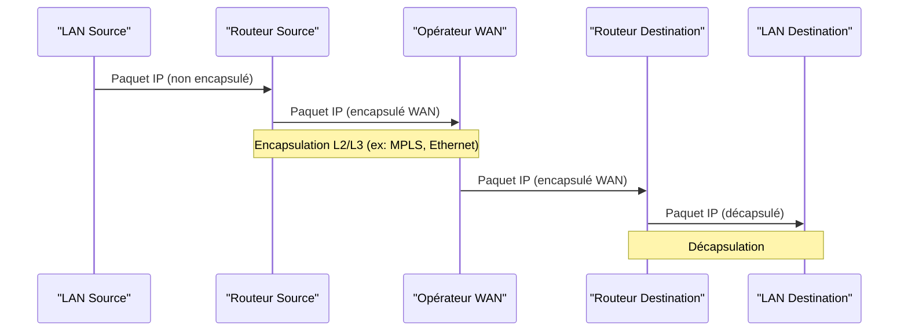

---
aliases:
  - Réseau étendu
  - Wide Area Network
  - WAN
archetype: concept-reseau
couche_osi:
  - "Couche 1 - Physique"
  - "Couche 2 - Liaison"
  - "Couche 3 - Réseau"
technologie:
  - MPLS
  - SD-WAN
  - Fibre Optique
  - xDSL
  - 4G/5G
cssclasses:
  - max
tags:
  - reseau/wan
  - architecture-reseau
  - interconnexion-reseau
  - routage-reseau
  - protocoles-reseau/wan
  - telecommunications
---

# Wide Area Network

> [!abstract] Définition
> Un *Wide Area Network* (WAN) est un réseau de télécommunications qui s'étend sur une vaste zone géographique, telle qu'une ville, une région, un pays ou même le monde entier. Il permet de connecter des réseaux locaux (LAN) géographiquement éloignés, facilitant ainsi la communication et le partage de ressources entre des sites distants d'une même organisation ou entre différentes entités.

## ⚙️ Mécanisme & Fonctionnement
Les WANs fonctionnent en interconnectant des LANs via des lignes de communication dédiées ou partagées fournies par des opérateurs de télécommunications. Ces connexions peuvent utiliser diverses technologies physiques et protocoles pour transporter les données sur de longues distances. Le routage est une fonction clé des WANs, permettant aux paquets de données de trouver leur chemin à travers les différents segments du réseau étendu.

### Encapsulation / Traitement
*   **Entrée** : Paquets IP (souvent issus d'un réseau local) acheminés vers une interface de routeur WAN.
*   **Action** : Le routeur encapsule les paquets IP dans le protocole de couche 2 spécifique à la technologie WAN utilisée (ex: MPLS, Frame Relay, PPP, Ethernet). Ces paquets encapsulés sont ensuite transmis sur la liaison WAN. Les routeurs intermédiaires du fournisseur de services utilisent ces informations d'encapsulation pour acheminer les données vers la destination appropriée.
*   **Sortie** : À l'extrémité de destination, le routeur WAN décapsule les paquets, retirant l'en-tête du protocole WAN, et achemine les paquets IP d'origine vers le réseau local de destination.

## 💡 Cas d'Usage Typique
Pourquoi l'utilise-t-on ?
1.  **Interconnexion de Filiales** : Une entreprise avec plusieurs bureaux à travers le monde utilise un WAN pour permettre à ses employés de communiquer, d'accéder aux mêmes ressources centralisées (serveurs, applications) et de partager des fichiers, comme l'accès à un ERP hébergé au siège.
2.  **Accès aux Services Cloud** : Les organisations se connectent aux fournisseurs de services cloud (IaaS, PaaS, SaaS) via des liens WAN dédiés ou via Internet pour garantir une performance et une sécurité optimales pour leurs applications et données hébergées dans le cloud.
3.  **Télétravail et Accès Distant** : Les employés à distance ou en déplacement peuvent se connecter de manière sécurisée au réseau d'entreprise via un VPN (Virtual Private Network) qui transite par le WAN public (Internet), leur donnant accès aux ressources comme s'ils étaient au bureau.

## ⚠️ Limitations & Problèmes
> [!warning] Points d'attention
> *   **Coût** : Les liaisons WAN, surtout dédiées, peuvent être très coûteuses en raison de la complexité de l'infrastructure et de la distance à couvrir.
> *   **Latence et Bande Passante** : La distance physique et les technologies utilisées peuvent introduire une latence significative et limiter la bande passante disponible, affectant la performance des applications sensibles au temps.
> *   **Sécurité** : Le transit des données sur des réseaux d'opérateurs ou sur Internet expose les informations à des risques d'interception ou d'attaques. La mise en place de VPNs et d'autres mesures de sécurité est cruciale.
> *   **Complexité de Gestion** : La gestion d'un WAN peut être complexe, impliquant la configuration de multiples routeurs, la gestion de contrats avec des opérateurs divers et la surveillance des performances sur de larges étendues.

## 🔗 Notes Connexes
*   **Protocole lié** : IP
*   **Matériel** : Routeur, Firewall