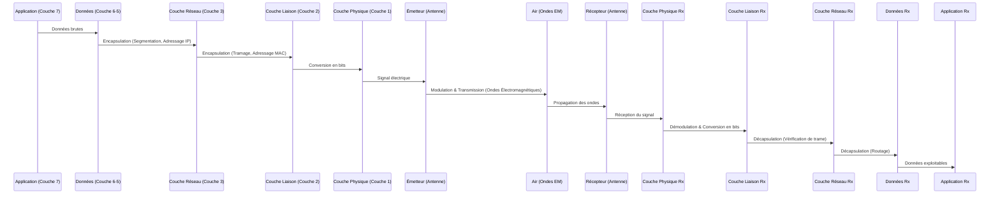

---
aliases:
  - Principes de la Communication Sans Fil
  - Wireless Communication Principles
  - Wireless Comm
archetype: concept-reseau
couche_osi:
  - "Couche 1 - Physique"
  - "Couche 2 - Liaison"
technologie:
  - Wi-Fi
  - Bluetooth
  - 5G
  - LTE
  - Zigbee
  - UWB
cssclasses:
  - max
tags:
  - communication/sans-fil
  - ondes-electromagnetiques
  - modulation
  - demodulation
  - mecanisme/encapsulation
  - materiel/antenne
  - modele-osi/couche-1
  - modele-osi/couche-2
  - modele-osi/couche-3
  - reseau/sans-fil/wi-fi
  - reseau/cellulaire
  - connectivite/bluetooth
  - nfc
  - iot
  - protocole/zigbee
  - protocole/z-wave
  - protocole/thread
  - interferences
---

# Wireless Communication Principles

> [!abstract] Définition
> La communication sans fil est un mode de transmission de données ou d'informations à distance, sans l'aide de fils ou de câbles physiques, en utilisant des *ondes électromagnétiques modulées* comme vecteur. Elle permet de connecter des appareils et de partager des informations avec une flexibilité et une mobilité accrues par rapport aux systèmes câblés traditionnels.

## ⚙️ Mécanisme & Fonctionnement
La transmission sans fil repose sur la conversion de données en signaux électromagnétiques, leur envoi via un médium (l'air ou l'espace libre), et leur reconversion en données exploitables par le récepteur. Ce processus implique plusieurs étapes clés :

### Encapsulation / Traitement

*   **Entrée** : Données numériques (bits, paquets) provenant d'une application ou d'une couche réseau supérieure.
*   **Action** :
    1.  **Conversion des données** : Les données numériques sont converties en signaux électriques.
    2.  **Modulation** : Le signal électrique module une *onde porteuse* (une onde sinusoïdale de haute fréquence) en faisant varier ses paramètres (amplitude, fréquence ou phase) pour encoder l'information. Il existe divers types de modulation (AM, FM, PSK, QAM) adaptés aux besoins spécifiques de débit et de résistance au bruit.
    3.  **Transmission du signal** : L'onde porteuse modulée est émise dans l'air sous forme d'ondes électromagnétiques par une *antenne*. Ces ondes se propagent sur une bande de fréquence spécifique, leur portée et leur pénétration des obstacles étant influencées par cette fréquence.
*   **Sortie** : Ondes électromagnétiques se propageant dans le médium.

Le processus inverse, la *démodulation*, est effectué par le récepteur pour extraire les informations des ondes porteuses et les reconvertir en données exploitables. La couche physique est responsable de la transmission des bits bruts sur le canal de communication et de la conversion des signaux en quelque chose que les couches supérieures peuvent utiliser. La couche de liaison de données, elle, gère le transfert d'informations sur le même réseau et assure le contrôle des erreurs et du flux.

## 💡 Cas d'Usage Typique
Les communications sans fil sont omniprésentes et permettent une grande variété d'applications:
1.  **Réseaux Locaux Sans Fil (Wi-Fi)** : Permettent la connectivité internet et le partage de ressources dans les maisons, bureaux et lieux publics sans câblage physique.
2.  **Communications Mobiles (GSM, 3G, 4G, 5G)** : Fondamentales pour la téléphonie et l'accès à internet en déplacement, couvrant de vastes zones géographiques grâce à des réseaux cellulaires.
3.  **Connexion d'Appareils à Courte Portée (Bluetooth, BLE, NFC)** : Utilisées pour connecter des périphériques (casques, claviers, souris, objets connectés) ou faciliter les paiements sans contact sur de courtes distances.
4.  **Internet des Objets (IoT)** : Des technologies comme Zigbee, Z-Wave, Thread et BLE permettent aux capteurs et appareils intelligents de communiquer efficacement et avec une faible consommation d'énergie, essentiel pour la domotique et l'industrie.
5.  **Télévision et Radio Diffusion** : La transmission des signaux audio et vidéo par ondes radio et micro-ondes est un cas d'usage historique et toujours pertinent de la communication sans fil.

## ⚠️ Limitations & Problèmes
> [!warning] Points d'attention
> *   **Interférences** : Les ondes électromagnétiques sont sensibles aux interférences provenant d'autres signaux sans fil (Wi-Fi, Bluetooth, micro-ondes) ou d'obstacles physiques, ce qui peut affaiblir ou dégrader le signal.
> *   **Bande Passante Limitée** : Le spectre des fréquences radio est une ressource finie et réglementée. La gestion de cette bande passante est cruciale pour éviter l'encombrement et assurer une qualité de service adéquate.
> *   **Sécurité** : Les ondes hertziennes sont difficiles à confiner, rendant les transmissions sans fil potentiellement vulnérables à l'interception et aux écoutes. Le cryptage (ex: WPA2, AES) est essentiel pour sécuriser les données.
> *   **Portée et Fiabilité** : La portée des transmissions sans fil est limitée par la puissance de l'émetteur, la fréquence utilisée, et les obstacles environnementaux. La perte de chemin (path loss) est un facteur important dans la conception et le déploiement des réseaux.
> *   **Consommation Énergétique** : La transmission de signaux sans fil peut être énergivore, un défi particulier pour les appareils alimentés par batterie dans l'IoT. Des technologies comme BLE sont développées pour minimiser cette consommation.