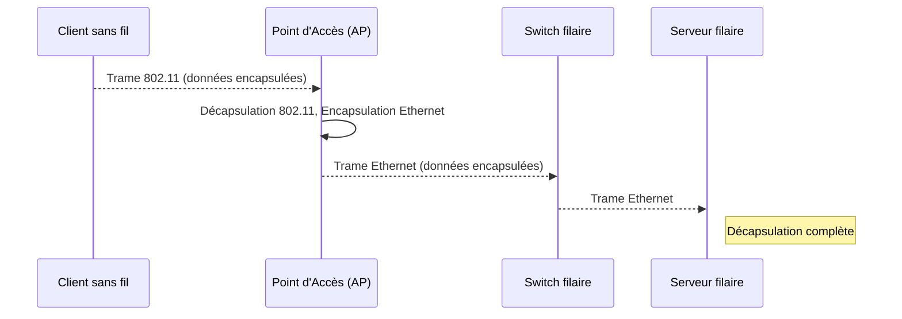

---
aliases:
  - Réseau Local Sans Fil
  - Wireless Local Area Network
  - Wi-Fi
  - 802.11
archetype: concept-reseau
couche_osi:
  - "Couche 1 - Physique"
  - "Couche 2 - Liaison"
technologie:
  - Wi-Fi
  - 802.11
  - WPA2
  - WPA3
cssclasses:
  - max
tags:
  - reseau/sans-fil
  - protocole/ieee/802-11
  - reseau/point-acces
  - modele/osi/couche-physique
  - modele/osi/couche-liaison
  - mecanisme/encapsulation
---

# Wireless Local Area Network (WLAN)

> [!abstract] Définition
> Un **Réseau Local Sans Fil (WLAN)** est un type de réseau local (LAN) qui utilise des ondes radiofréquence au lieu de câbles physiques pour connecter des appareils et transmettre des données sur une zone géographique limitée, telle qu'une maison, un bureau, un bâtiment ou un campus. Il étend un réseau local filaire en offrant aux utilisateurs la mobilité de se déplacer tout en restant connectés au réseau. Le **Wi-Fi** est une technologie spécifique, basée sur les standards IEEE 802.11, utilisée pour créer des réseaux WLAN.

## ⚙️ Mécanisme & Fonctionnement
Un WLAN fonctionne en connectant les appareils à un **Point d'Accès (AP)**, qui agit comme un pont entre le réseau sans fil et le réseau filaire. L'AP diffuse et reçoit des signaux sans fil vers et depuis les appareils connectés, tels que les ordinateurs portables, les smartphones et les imprimantes, qui sont équipés d'une carte réseau sans fil (adaptateur Wi-Fi).

Le protocole **IEEE 802.11** opère principalement aux **couches 1 (Physique)** et **2 (Liaison de données)** du modèle OSI.

### Encapsulation / Traitement
*   **Entrée (Côté émetteur)** : Données des couches supérieures (Couches 3 à 7) destinées à être transmises sans fil.
*   **Action** :
    1.  **Couche 3 (Réseau)**: Les données sont encapsulées dans des paquets IP avec des adresses IP source et destination.
    2.  **Couche 2 (Liaison de données)**: Le sous-couche **Logical Link Control (LLC)** reçoit les informations des couches supérieures. La sous-couche **Media Access Control (MAC)** ajoute les informations d'adresse MAC (source, destination et BSSID dans le cas du 802.11) et encadre les données pour former une **trame**.
    3.  **Couche 1 (Physique)**: Le sous-couche **Physical Layer Convergence Procedure (PLCP)** ajoute un préambule et un en-tête physique (PHY) pour la synchronisation. La sous-couche **Physical Medium Dependent (PMD)** convertit ensuite les données en bits (0s et 1s) et les module en signaux radiofréquences pour la transmission sans fil.
*   **Sortie (Côté émetteur)** : Signaux radiofréquences modulés émis dans l'air par l'adaptateur sans fil du client ou le Point d'Accès.

### Décapsulation / Traitement
*   **Entrée (Côté récepteur)** : Signaux radiofréquences reçus.
*   **Action** :
    1.  **Couche 1 (Physique)**: Le récepteur démodule les signaux radio en bits et les transmet à la couche Liaison de données.
    2.  **Couche 2 (Liaison de données)**: La sous-couche MAC supprime les en-têtes et les informations MAC. La sous-couche LLC transfère ensuite les données à la couche Réseau.
    3.  **Couche 3 (Réseau)**: L'en-tête IP est supprimé, et le paquet est transmis aux couches supérieures pour un traitement ultérieur.
*   **Sortie (Côté récepteur)** : Données originales prêtes à être traitées par les applications de la couche supérieure.

## 💡 Cas d'Usage Typique
Les WLAN sont largement adoptés en raison de leurs nombreux avantages, notamment en entreprise :
1.  **Mobilité et Flexibilité** : Permet aux utilisateurs d'accéder aux ressources réseau depuis n'importe quel endroit de la zone de couverture sans être attachés par des câbles, améliorant la productivité et la commodité.
2.  **Déploiement en Entreprise (Enterprise Wi-Fi)** : Les WLAN d'entreprise sont conçus pour gérer des centaines ou des milliers de connexions simultanées, offrant une plus grande capacité, densité, sécurité, fiabilité et évolutivité que les configurations Wi-Fi domestiques. Ils sont essentiels pour supporter les initiatives de transformation numérique, le **BYOD (Bring Your Own Device)**, l'**IoT (Internet of Things)** et les environnements de travail hybrides.
3.  **Facilité d'Installation et Évolutivité** : L'installation d'un WLAN est généralement plus rapide et plus simple que celle d'un réseau câblé, car elle ne nécessite pas de tirer des câbles à travers les murs ou les plafonds. L'ajout de nouveaux appareils ou l'extension de la couverture est également plus facile.
4.  **Connectivité en Situation de Crise** : Les réseaux sans fil peuvent être vitaux dans des situations de catastrophe (tremblement de terre, incendie) où l'infrastructure câblée est endommagée, permettant la communication d'urgence.

## ⚠️ Limitations & Problèmes
> [!warning] Points d'attention
> *   **Performance** :
    *   **Interférence** : La performance du WLAN peut être affectée par les interférences d'autres appareils sans fil (micro-ondes, téléphones sans fil, Bluetooth) ou de réseaux Wi-Fi voisins, entraînant des vitesses plus lentes et des déconnexions.
    *   **Portée limitée** : La portée effective d'un WLAN est limitée, et les obstacles physiques comme les murs et les planchers peuvent affaiblir ou bloquer le signal.
    *   **Congestion et bande passante** : Dans les zones densément peuplées, les réseaux Wi-Fi peuvent être encombrés, ce qui réduit les vitesses et augmente la latence, car la bande passante est partagée entre tous les appareils connectés. Les connexions sans fil sont généralement plus lentes et ont une latence plus élevée que les connexions Ethernet filaires.
*   **Sécurité** : Les WLAN sont intrinsèquement plus vulnérables aux failles de sécurité que les réseaux filaires en raison de la nature de la transmission par ondes radio, qui peut être interceptée par des tiers non autorisés.
    *   **Menaces courantes** : Interception illégale, écoute clandestine, usurpation d'identité (spoofing), attaques par déni de service (DoS), et points d'accès non autorisés (rogue APs).
    *   **Protocoles obsolètes** : Des protocoles de sécurité comme le **WEP (Wired Equivalent Privacy)** se sont avérés inefficaces et sont vulnérables aux attaques. Il est crucial d'utiliser des protocoles modernes comme **WPA2** ou **WPA3** avec des mots de passe forts et une authentification robuste (ex: 802.1X).
*   **Coût** : Les points d'accès WLAN peuvent être plus chers que les concentrateurs et câbles pour les réseaux filaires.
*   **Consommation électrique** : L'utilisation de transmetteurs peut entraîner une consommation d'énergie plus élevée, affectant la durée de vie de la batterie des appareils mobiles.

## 🔗 Notes Connexes
*   **Protocole lié** : IEEE 802.11 (standards Wi-Fi), WPA2, WPA3, EAP (Extensible Authentication Protocol), RADIUS.
*   **Matériel** : Point d'Accès (AP), Contrôleur WLAN, Routeur sans fil, Carte réseau sans fil.
*   **Concepts liés** : LocalAreaNetwork, OSIModel, EncapsulationDecapsulation