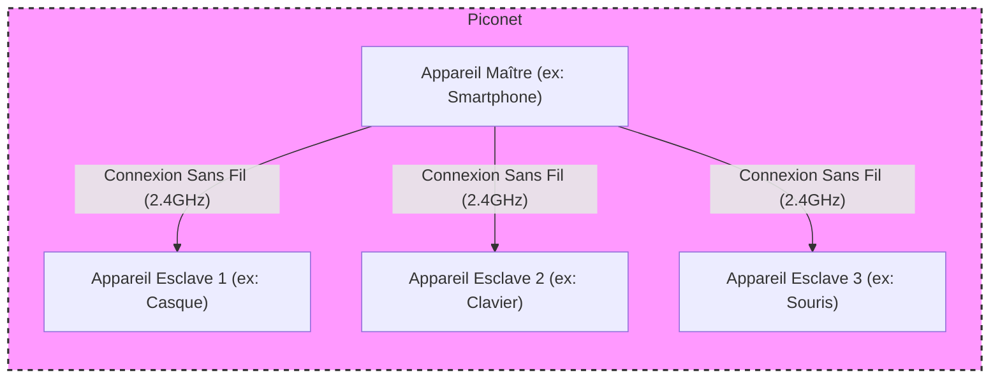

---
tags:
  - technologie/bluetooth
  - communication/sans-fil
  - reseau/personnel
  - materiel/peripherique
  - securite/sans-fil
  - radiofrequence/uhf
  - cybersecurite/menace
aliases:
  - Bluetooth
  - Technologie Bluetooth
  - BT
archetype: materiel
cssclasses:
  - max
---

# Bluetooth

> [!info] Rôle Principal
> Le Bluetooth est une technologie de communication sans fil à courte portée conçue pour l'échange de données entre appareils fixes et mobiles, créant des réseaux personnels (PAN - Personal Area Networks). Il sert principalement de remplacement aux connexions câblées, permettant de connecter des périphériques tels que des casques, claviers, souris, haut-parleurs à des ordinateurs et des appareils mobiles.

## 🛠️ Spécifications Techniques
| Caractéristique | Valeur |
|---|---|
| **Type** | Protocole de communication sans fil, WPAN (Wireless Personal Area Network) |
| **Fréquence** | Bande ISM 2.400 GHz à 2.4835 GHz (2.402 GHz à 2.480 GHz pour les canaux de données) |
| **Débit Max** | Variable selon la version. Jusqu'à 3 Mbps (EDR), ou 24 Mbps (avec Wi-Fi HS pour Bluetooth 3.0+HS), ou 50 Mbps (Bluetooth 5.0). |
| **Portée Typique** | Class 2: Environ 10 mètres (33 pieds). Class 1: Jusqu'à 100 mètres (328 pieds). Bluetooth 5.0: Jusqu'à 240 mètres ou plus. |
| **Connecteurs** | Sans fil (radiofréquence) |
| **Couche OSI** | Couches 1 (Physique) et 2 (Liaison de Données) principalement. Le protocole Bluetooth couvre l'ensemble de la pile OSI jusqu'à la couche application. |

## ⚙️ Fonctionnement Interne
Bluetooth utilise des ondes radio UHF dans la bande ISM de 2.4 GHz. La technologie emploie une technique appelée *Frequency-Hopping Spread Spectrum* (FHSS), où les données sont divisées en paquets et transmises sur 79 canaux Bluetooth désignés, chacun ayant une bande passante de 1 MHz. Les appareils changent de canal de manière pseudo-aléatoire, effectuant généralement 1600 sauts par seconde, ce qui aide à éviter les interférences avec d'autres signaux radio.

Les appareils Bluetooth forment des réseaux ad-hoc appelés *piconets*. Dans un piconet, un appareil agit comme maître et peut communiquer avec jusqu'à sept appareils esclaves actifs dans un rayon d'environ 10 mètres, bien que des portées plus longues soient possibles avec des classes de puissance supérieures et des versions plus récentes. La communication maître-esclave peut être de un-à-un ou de un-à-plusieurs. Le maître détermine le modèle de saut de fréquence.

Lors de l'établissement d'une connexion, les appareils entrent en mode de "pairing" (appairage), où ils échangent des informations et se "souviennent" des adresses physiques uniques de chacun. Pour la sécurité, un code PIN est souvent requis.

## 🛡️ Sécurité & Risques
> [!warning] Menaces Physiques
> *   **Accès non autorisé** : Les appareils laissés en mode découvrable ou connectés à des appareils non sécurisés peuvent être exposés à des attaquants. L'appairage sans vérification (PIN ou mot de passe) peut permettre des connexions cachées.
> *   **Écoute clandestine (Eavesdropping)** : Les connexions Bluetooth, bien qu'encrypées, peuvent potentiellement être interceptées, surtout si la sécurité est faible.
> *   **Détournement d'appareil (Device Hijacking)** : Un attaquant à portée peut exploiter des faiblesses de sécurité pour prendre le contrôle d'un appareil, accéder à des fichiers, des informations d'identification ou intercepter des communications.
> *   **Attaques spécifiques** :
    *   *Bluejacking* : Envoi de messages non sollicités.
    *   *Bluesnarfing* : Vol de données à partir d'un appareil sans la connaissance de l'utilisateur.
    *   *Bluebugging* : Prise de contrôle à distance d'un appareil pour passer des appels, envoyer des messages ou écouter des conversations.
    *   *BlueBorne* : Attaques qui n'exigent pas d'appairage préalable et peuvent se propager via le réseau.
> *   **Suivi de localisation** : Les signaux Bluetooth émis en permanence peuvent être utilisés pour localiser un appareil et, par extension, son utilisateur.
> *   **Interférences** : Le Bluetooth partage la bande de 2.4 GHz avec d'autres technologies comme le Wi-Fi, ce qui peut entraîner des interférences et une dégradation du signal.

> [!tip] Bonnes Pratiques
> 1.  **Désactiver le Bluetooth** : Éteindre la fonction Bluetooth lorsque non utilisée, surtout dans les lieux publics, pour réduire la surface d'attaque et prévenir le suivi de localisation.
> 2.  **Appairage sécurisé** : Toujours utiliser un code PIN ou un mot de passe fort pour l'appairage afin d'authentifier les connexions et empêcher l'accès non désiré.
> 3.  **Mises à jour logicielles** : Maintenir les systèmes d'exploitation et les firmwares des appareils à jour pour bénéficier des derniers correctifs de sécurité.
> 4.  **Vérifier les connexions** : Toujours vérifier et confirmer l'identité de l'appareil auquel on se connecte pour éviter les connexions à des réseaux Bluetooth malveillants (phishing).
> 5.  **Limiter la découvrabilité** : Configurer les appareils pour qu'ils ne soient pas toujours découvrables.
> 6.  **Sécurité physique** : Garder les appareils Bluetooth hors de vue pour éviter d'attirer l'attention indésirable sur les connexions actives.

## 🔗 Notes Connexes
*   **Protocole utilisé** : ProtocoleReseau
*   **Alternative** : MaterielAlternatif
*   **Dépendance** : DependanceTechnique