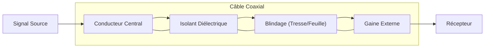

---
aliases:
  - Câble Coaxial
  - Coaxial Cable
  - Coax
archetype: materiel
couche_osi:
  - "Couche 1 - Physique"
cssclasses:
  - max
tags:
  - materiel
  - materiel/cable
  - cable/coaxial
  - modele-osi/couche-1
  - transmission-donnees
  - reseau
  - interferences
  - securite
  - risque
  - ethernet
  - internet
  - cable/attenuation
  - securite/bonnes-pratiques
  - cable/dommage-physique
  - materiel/connecteur
  - cable/impedance
  - cable/blindage
  - signal/video
  - signal/television
  - cable/rg-6
  - cable/rg-11
  - cable/rg-58
  - cable/rg-59
  - cable/rg-8
  - cable/rg-213
---

# Coaxial Cable

> [!info] Rôle Principal
> Le câble coaxial est un type de câble électrique utilisé pour transmettre des signaux à haute fréquence, tels que des signaux vidéo, des signaux de télévision, et des données internet, avec un minimum de pertes et d'interférences. Il est composé d'un conducteur central, d'une couche isolante, d'une tresse métallique (ou d'une feuille métallique) agissant comme blindage, et d'une gaine externe.

## 🛠️ Spécifications Techniques
| Caractéristique | Valeur |
|---|---|
| **Type** | Câble de transmission de signaux |
| **Impédance** | 50 Ohms (pour données), 75 Ohms (pour vidéo et TV) |
| **Débit Max** | Variable (dépend de la norme et de la longueur, ex: jusqu'à plusieurs Gbps pour certaines applications courtes) |
| **Connecteurs** | BNC, F-Type, N-Type, TNC |
| **Couche OSI** | Couche 1 - Physique |
| **Structure** | Conducteur central, isolant diélectrique, blindage, gaine extérieure |

## ⚙️ Fonctionnement Interne
Le câble coaxial fonctionne en transmettant des signaux électriques via son conducteur central. L'isolant diélectrique autour du conducteur central maintient une distance constante entre le conducteur et le blindage extérieur, ce qui est crucial pour maintenir une impédance uniforme sur toute la longueur du câble et minimiser la distorsion du signal. Le blindage, constitué d'une tresse ou d'une feuille métallique, protège le signal des interférences électromagnétiques externes (EMI) et radiofréquences (RFI), et empêche également le signal de s'échapper du câble, réduisant ainsi les émissions d'interférences. La gaine externe protège l'ensemble de la structure des dommages physiques et environnementaux.

Il existe plusieurs types de câbles coaxiaux, chacun adapté à des applications spécifiques :
*   **RG-6** : Utilisé principalement pour la télévision par câble et le haut débit internet. Il est plus épais et a un meilleur blindage que le RG-59, ce qui le rend idéal pour les transmissions à plus haute fréquence sur de plus longues distances.
*   **RG-11** : Un câble plus épais et plus rigide que le RG-6 et le RG-59, offrant une [[SignalAttenuation|atténuation du signal]] encore plus faible sur de très longues distances. Il est souvent utilisé pour les dorsales de distribution de signaux vidéo.
*   **RG-58** : Historiquement utilisé pour les réseaux Ethernet (ThinNet) et les applications radio. Il a une impédance de 50 Ohms.
*   **RG-59** : Principalement utilisé pour les installations de vidéosurveillance (CCTV) et les signaux vidéo à courte distance. Il est plus fin et plus flexible que le RG-6, mais avec une atténuation plus élevée sur de longues distances.
*   **RG-8/RG-213** : Câbles coaxiaux à faible perte, souvent utilisés dans les applications radioamateurs et les communications militaires pour leur capacité à gérer des puissances élevées et leur faible atténuation sur des fréquences plus élevées.

## 🛡️ Sécurité & Risques
> [!warning] Menaces Physiques
> *   **Dommage Physique** : Le pliage excessif, l'écrasement ou les coupures peuvent endommager la structure interne du câble, entraînant une perte de signal, des interférences ou des courts-circuits.
> *   **Interférences** : Bien que blindé, un blindage endommagé ou de mauvaise qualité peut rendre le câble vulnérable aux interférences électromagnétiques externes, affectant la qualité du signal.
> *   **Atténuation** : La longueur excessive du câble peut entraîner une atténuation significative du signal, nécessitant l'utilisation d'amplificateurs ou de répéteurs.
> *   **Déconnexions** : Des connecteurs mal fixés ou corrodés peuvent entraîner une perte intermittente ou totale du signal.
> *   **Humidité/Corrosion** : L'exposition à l'humidité, surtout aux points de connexion, peut provoquer de la corrosion et dégrader les performances du câble et des connecteurs.

> [!tip] Bonnes Pratiques
> 1.  **Installation Correcte** : Respecter le rayon de courbure minimal spécifié par le fabricant pour éviter d'endommager le diélectrique et le blindage.
> 2.  **Connectique de Qualité** : Utiliser des connecteurs de haute qualité et les installer correctement pour assurer une connexion stable et une bonne intégrité du blindage.
> 3.  **Protection Physique** : Protéger les câbles contre les dommages physiques (écrasement, coupures) en les acheminant dans des chemins de câbles ou des conduits.
> 4.  **Protection Environnementale** : Utiliser des câbles et connecteurs adaptés aux environnements extérieurs ou humides si nécessaire, avec une protection contre les intempéries.
> 5.  **Tests Réguliers** : Effectuer des tests de continuité et d'intégrité du signal, surtout après une nouvelle installation ou en cas de problèmes de performance.